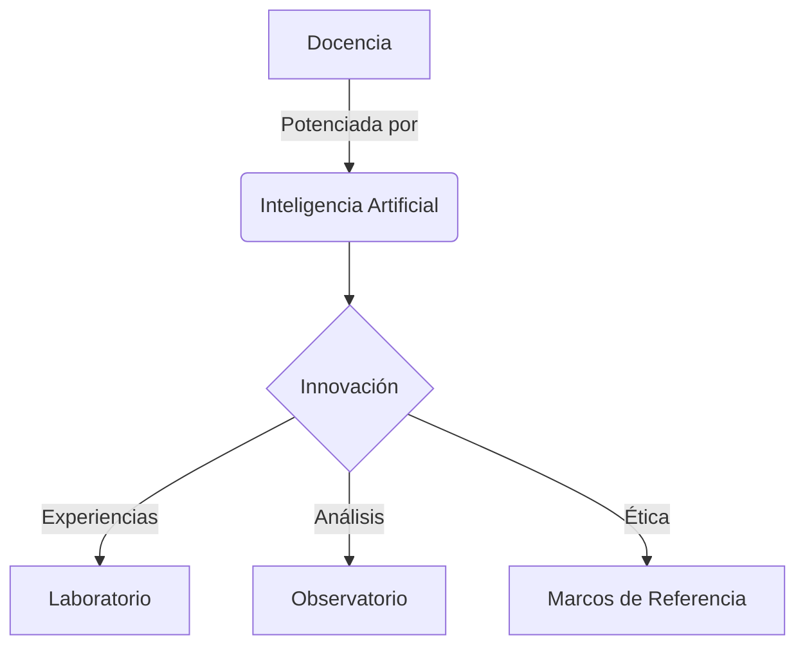

---
---

  

      <h1 class="display-4 fw-bold mb-4 text-primary">
        Aprendizaje Digital e IA
      </h1>
      

        Espacio de convergencia de la pedagogía y la tecnología para abordar la complejidad de la docencia actual.
      

  

<!-- Tarjetas (Cards) con Iconos -->

  
  
  
  
  


<!-- Logo Section (Moved Bottom & Resized) -->

  <!-- Light Mode Logo: Blue -->
  
  <!-- Dark Mode Logo: White -->
  

<!-- Sección de Estadísticas o Gráficas (Ejemplo con Mermaid) -->
## Ecosistema de Aprendizaje

