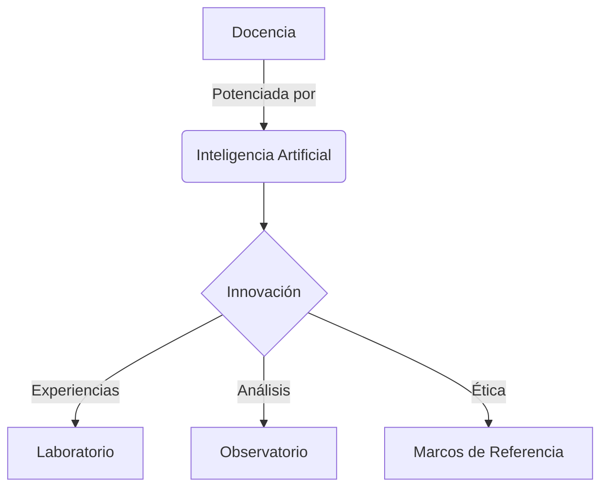

---
---

  
  <h1 class="text-4xl font-bold tracking-tight sm:text-6xl mb-6 font-montserrat uppercase text-[#002d4b] dark:text-[#93c5fd]">
    Aprendizaje Digital e IA
  </h1>
  

    Espacio de convergencia de la pedagogía y la tecnología para abordar la complejidad de la docencia actual.
  

<!-- Tarjetas (Cards) con Iconos -->

  
  
  
  
  


<!-- Logo Section (Moved Bottom & Resized) -->

  <!-- Light Mode Logo: Blue -->
  
  <!-- Dark Mode Logo: White -->
  

<!-- Sección de Estadísticas o Gráficas (Ejemplo con Mermaid) -->
## Ecosistema de Aprendizaje

