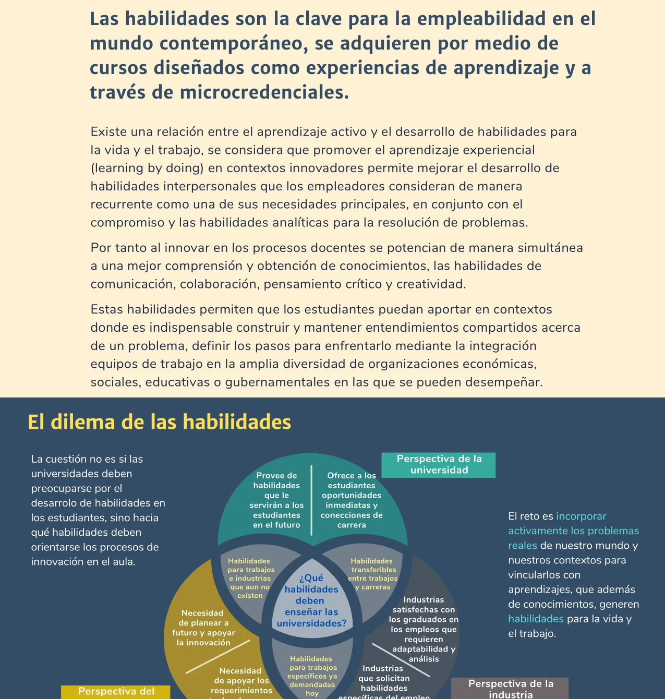


El aprendizaje activo promueve la participación, la colaboración y el pensamiento crítico, tanto en el aula presencial como en ambientes en línea. Los estudiantes dejan de ser receptores pasivos para convertirse en participantes de su proceso de aprendizaje.


## Fundamentos

El aprendizaje activo parte de la idea de que el proceso educativo debe ofrecer lo que John Dewey llamaba *experiencias de aprendizaje*: vínculos con problemas del mundo real que permiten "aprender haciendo" (*learning by doing*) y desarrollar procesos cognitivos superiores más allá de memorizar o recordar lo que expone el profesor (Baepler et al., 2016; Fornari & Poznanski, 2015).

Es aplicable a todas las áreas del saber y puede ser implementado directamente por los profesores, con la ayuda de apoyos institucionales técnicos y de formación docente que promuevan la autogestión del aprendizaje en los estudiantes. Estudios demuestran que el aprendizaje activo incrementa el desempeño en las áreas STEM (Mintzes & Walter, 2020; Ram et al., 2025; Malta et al., 2025).

Una estrategia de aprendizaje activo es cualquier tipo de actividad durante la clase (presencial, en línea o fuera de clase) que involucra a los estudiantes en una reflexión profunda sobre el tema de su curso. Más allá de que los estudiantes "reciban" pasivamente el contenido mediante conferencias, el aprendizaje activo requiere que se conviertan en participantes de su proceso de aprendizaje.

## Beneficios

El aprendizaje activo utiliza el tiempo liberado de las conferencias tradicionales del profesor para ampliar:

- **Colaboración**: construcción colectiva de los saberes mediante interacciones entre estudiantes.
- **Comunicación**: desarrollo de la capacidad de expresar y argumentar ideas.
- **Pensamiento crítico**: análisis, evaluación y síntesis de información.
- **Creatividad**: generación de nuevas conexiones y soluciones.

Las experiencias de aprendizaje generan interacciones que se convierten en espacios de construcción colectiva de los saberes, donde se resuelven rápidamente dudas y concepciones erróneas, además de generar confianza y autoestima en los estudiantes (Patiño et al., 2023).

## Catálogo de técnicas


  
  Los estudiantes reflexionan individualmente, discuten en parejas y luego comparten con el grupo.
  

  
  Escritos breves al final de la clase para sintetizar lo aprendido o plantear dudas.
  

  
  Herramientas para evaluar la comprensión en tiempo real y adaptar la enseñanza.
  

  
  Identificación de los conceptos que resultaron más difíciles para aclaración posterior.
  

  
  Análisis crítico y argumentación sobre posiciones contrapuestas.
  

  
  Aplicación del conocimiento a situaciones reales o simuladas.
  

  
  Colaboración y apoyo mutuo entre estudiantes para resolver problemas.
  

  
  Organización visual del conocimiento y sus relaciones.
  

  
  Gamificación para hacer el aprendizaje más interactivo y motivador.
  

  
  Evaluación constructiva del trabajo de otros compañeros.
  


Estas técnicas pueden implementarse con o sin tecnología. Herramientas como Mentimeter, Padlet, Miro o Canva facilitan su aplicación en entornos híbridos (Muzammal Ahmad Khan, 2025).

## Desarrollo de habilidades

### Relación con el desarrollo de habilidades

Existe una relación directa entre el aprendizaje activo y el desarrollo de habilidades para la vida y el trabajo. Promover el aprendizaje experiencial en contextos de innovación permite mejorar el desarrollo de habilidades interpersonales que los empleadores consideran como sus necesidades principales, junto con el compromiso y las habilidades analíticas para la resolución de problemas (Universidad de Guadalajara, 2022).

Al innovar en los procesos docentes, se potencian de manera simultánea una mejor comprensión y obtención de conocimientos y el desarrollo de habilidades de comunicación, colaboración, pensamiento crítico y creatividad. Estas habilidades permiten a los estudiantes aportar en contextos donde es indispensable construir y mantener entendimientos compartidos acerca de un problema y definir los pasos para enfrentarlo.

## Relación con otros enfoques

- El aprendizaje activo se integra en el marco del **[aprendizaje híbrido]()** como las técnicas concretas para las sesiones presenciales o sincrónicas.
- El **[aula invertida]()** libera el tiempo presencial para que estas técnicas puedan aplicarse.
- La **[taxonomía de Bloom]()** sirve como guía para seleccionar técnicas que alcancen niveles cognitivos superiores.
- El **[modelo ICAP]()** permite evaluar si las actividades realmente logran interactividad o se quedan en niveles pasivos o activos.

## Referencias

- Baepler, P.M., Walker, J.D., Brooks, D.C., Saichaie, K., & Petersen, C.I. (2016). *A Guide to Teaching in the Active Learning Classroom: History, Research, and Practice*. Stylus Publishing.
- Fornari, A., & Poznanski, A. (2015). *How-to Guide for Active Learning*.
- Malta, K., Glickman, C., Hunter, K., & McBride, A. (2025). Comparing the impact of online and in-person active learning in preclinical medical education. *BMC Medical Education*. https://doi.org/10.1186/s12909-025-06846-z
- Mintzes, J.J., & Walter, E.M. (Eds.). (2020). *Active Learning in College Science: The Case for Evidence-Based Practice*. Springer International Publishing.
- Muzammal Ahmad Khan. (2025). Mentimeter Tool for Enhancing Student Engagement and Active Learning: A Literature Review. *International Journal of Changes in Education*. https://doi.org/10.47852/bonviewijce52023801
- Patiño, A., Ramírez-Montoya, M.S., & Buenestado-Fernández, M. (2023). Active learning and education 4.0 for complex thinking training: Analysis of two case studies in open education. *Smart Learning Environments*, *10*(1), 8.
- Ram, I., Rosenberg-Kima, R.B., Lewin, D.R., Barzilai, A., Chumtonov, O., & Roll, I. (2025). Active learning and the development of 21st century skills in online STEM education – a large scale survey. *Online Learning*, *29*(1).
- Universidad de Guadalajara. (2022). *Aprendizaje Híbrido y Activo para el Éxito Estudiantil*. (Documento interno).
