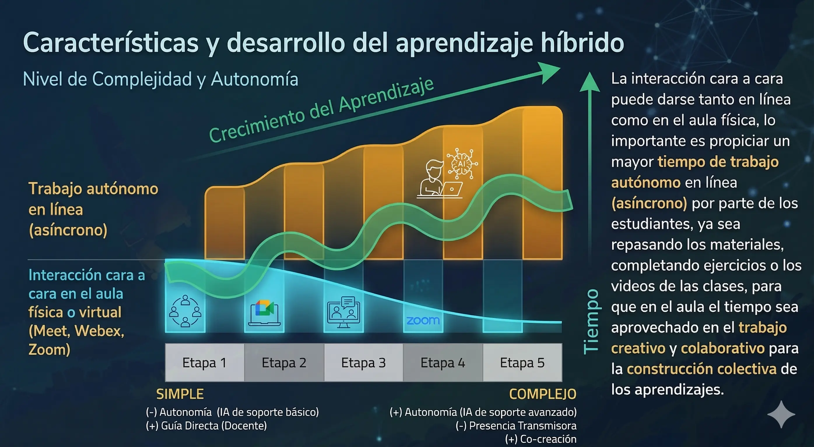
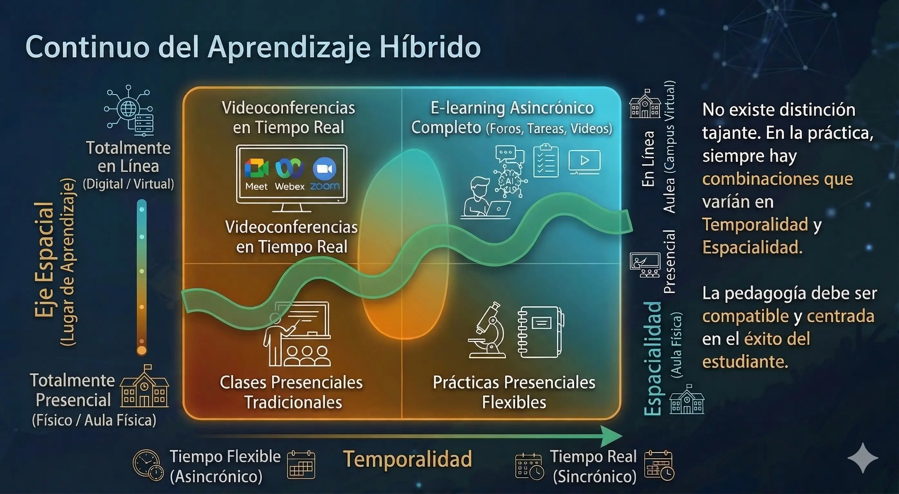


El aprendizaje híbrido (*blended learning*) combina la presencialidad y la educación en línea, sumando las ventajas de ambos modelos de manera flexible y centrada en el éxito del estudiante.


## Definición y principios

El aprendizaje híbrido combina la enseñanza presencial con recursos interactivos entregados en línea de manera asincrónica. Los estudiantes deciden en qué momento realizar las actividades en línea, ya que no son en tiempo real. Esto implica usar recursos tecnológicos que permitan nuevas formas de socialización y relación entre estudiantes y entre estos y los profesores (Universidad de Guadalajara, 2022; Nayar & Koul, 2020).

La implementación efectiva del aprendizaje híbrido debe ser flexible para permitir diferentes experiencias de aprendizaje en línea y presencial en función de las necesidades de cada disciplina o temática. Sus principios son:

- **Flexibilidad**: diferentes combinaciones de aprendizaje cara a cara y en línea según las necesidades del curso.
- **Autonomía progresiva**: promover que los estudiantes gestionen cada vez más su propio proceso de aprendizaje.
- **Interactividad**: cada actividad programada debe permitir la interacción y comunicación necesarias para la construcción colectiva del conocimiento.
- **Comunidades de práctica**: estudiantes y profesores interactúan bajo la premisa de que el aprendizaje ocurre en contextos vinculados con la vida real (Azukas, 2019; Hefetz & Ben-Zvi, 2020).

## Redefinición del rol docente

El profesor se convierte en un líder y diseñador de actividades de aprendizaje. Ya no solo dicta conferencias sino que refuerza, guía, apoya y promueve los procesos de comunicación e interacción que definen el ritmo de trabajo y afirman el aprendizaje de los estudiantes (Universidad de Guadalajara, 2022).

Cada tema del curso se convierte en una comunidad de aprendizaje con actividades de retroalimentación y evaluación orientadas colaborativamente al logro de los objetivos de aprendizaje.

## Características y desarrollo

El aprendizaje híbrido se desarrolla a lo largo de etapas que transitan de lo simple a lo complejo:


  
  * **Autonomía del estudiante:** Baja
  * **Tiempo cara a cara:** Alto
  * Mayor guía del profesor, actividades presenciales predominantes.
  

  
  * Introducción gradual de actividades asincrónicas.
  

  
  * **Autonomía del estudiante:** Media
  * **Tiempo cara a cara:** Medio
  * Equilibrio entre trabajo autónomo en línea y sesiones presenciales.
  

  
  * Mayor proporción de trabajo autónomo y colaborativo en línea.
  

  
  * **Autonomía del estudiante:** Alta
  * **Tiempo cara a cara:** Bajo
  * El tiempo presencial se reserva para trabajo creativo y colaborativo.
  


La interacción cara a cara puede darse tanto en línea (sincrónica) como en el aula física. Lo relevante es propiciar mayor tiempo de trabajo autónomo en línea (asincrónico) —revisando materiales, completando ejercicios, viendo videos— para que el tiempo presencial se aproveche en el trabajo creativo y la construcción colectiva de aprendizajes.

## El continuo del aprendizaje híbrido

Ya no existe una distinción tajante entre las modalidades en línea y presencial. En la práctica, siempre hay combinaciones de ambas que varían en dos dimensiones (Universidad de Guadalajara, 2022):

- **Temporalidad**: desde actividades en tiempo real (sincrónicas) hasta actividades asincrónicas como foros y tareas en línea.
- **Espacialidad**: desde la modalidad presencial hasta la modalidad completamente en línea.

Un mismo curso puede combinar actividades asincrónicas (foros, tareas, videos) con clases en tiempo real desarrolladas en línea (Meet, Webex, Zoom) o de manera presencial. La pedagogía en todas las combinaciones posibles debe ser compatible y centrarse en el éxito del estudiante.

## Relación con otros enfoques

El aprendizaje híbrido integra y se apoya en otras metodologías:

- El **[aula invertida]()** estructura la relación entre el trabajo fuera del aula (revisión de materiales) y el tiempo presencial (actividades de profundización).
- El **[aprendizaje activo]()** proporciona las técnicas concretas para que las sesiones presenciales o sincrónicas sean interactivas y participativas.
- Los **[modelos SAMR e ICAP]()** ofrecen marcos de referencia para evaluar y mejorar la integración tecnológica dentro del modelo híbrido.

En la medida en que nos movemos más allá de la distinción entre aprendizaje presencial y en línea, las comunidades de práctica se vuelven los espacios en los que se combinan talentos e innovaciones, se crean nuevas formas de expresión y se superan necesidades por la vía de la cooperación (Batchelor, 2018).

## Referencias

- Azukas, M.E. (2019). Cultivating Blended Communities of Practice to Promote Personalized Learning. *Journal of Online Learning Research*, *5*(3), 251–274.
- Batchelor, J. (2018). Learning Design Principles to Support Communities of Practice in a Blended Learning Programme. In *9th Annual UNISA ISTE Conference on Mathematics, Science and Technology Education* (Vol. 315).
- Hefetz, G., & Ben-Zvi, D. (2020). How Do Communities of Practice Transform Their Practices? *Learning, Culture and Social Interaction*, *26*, 100410.
- Nayar, B., & Koul, S. (2020). Blended Learning in Higher Education: A Transition to Experiential Classrooms. *International Journal of Educational Management*, *34*(9), 1357–1374.
- Universidad de Guadalajara. (2022). *Aprendizaje Híbrido y Activo para el Éxito Estudiantil*. (Documento interno).
