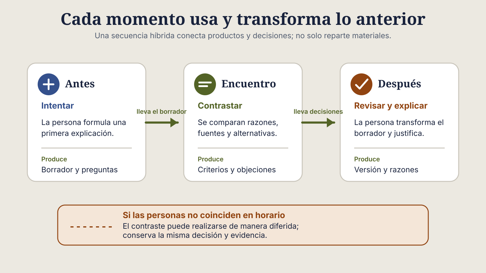

Una estudiante prepara antes de la clase una explicación breve sobre un problema de su
asignatura. Cuando llega al encuentro, el grupo escucha otra explicación del mismo tema, pero
nadie recupera lo que escribió. Después responde un cuestionario que tampoco utiliza la
discusión. Hubo plataforma, trabajo previo y sesión común. Sin embargo, las tres tareas no
llegaron a encontrarse.

Repartir contenidos entre el aula y la red puede describir una combinación de modalidades, pero
no garantiza una experiencia híbrida coherente. Un criterio para diseñarla es que cada momento
**reciba algo del anterior, lo transforme y prepare lo que sigue**. Esa continuidad permite que
una primera idea se convierta en contraste, decisión y revisión.

## Una secuencia es más que una suma de momentos

En un diseño híbrido pueden combinarse encuentros presenciales o en línea, actividades que
ocurren al mismo tiempo o en momentos diferentes —también llamadas síncronas y asíncronas— y
trabajo individual o compartido. Esas combinaciones describen dónde y cuándo ocurre una
actividad. Todavía falta decidir para qué sirve cada parte.

Imaginemos que, antes del encuentro, cada persona formula una explicación inicial y anota una
pregunta. Durante la sesión, el grupo compara explicaciones, examina objeciones y acuerda un
criterio. Después, cada persona vuelve a su texto, lo revisa y explica qué cambió. El borrador
prepara el contraste; el contraste prepara la revisión. La secuencia tiene continuidad porque
el trabajo no se desecha al cambiar de espacio o de horario.

<picture>
  <source media="(max-width: 700px)" srcset="muestra-aprendizaje-hibrido-mobile.svg">
  
</picture>

La figura muestra una posibilidad, no una receta. El contraste también puede realizarse de
manera asíncrona mediante comentarios entre pares, una colección de objeciones preparada por
el docente o una discusión con plazos amplios. La conexión importa más que el orden fijo: cada
parte debe utilizar y transformar algo producido antes.

## El mismo caso, paso a paso

Una estudiante necesita explicar por qué dos soluciones aparentemente correctas conducen a
resultados distintos. Su docente quiere que pueda identificar el supuesto que cambia entre
ellas y justificar qué solución corresponde al problema.

**Antes del encuentro**, la estudiante escribe un primer intento. No necesita que sea
perfecto. Señala cuál supuesto cree que cambia y anota una duda. Si la actividad permite IA,
puede pedir una objeción o un ejemplo contrario después de su intento; si no la utiliza,
trabaja con dos objeciones preparadas por el docente. En ambas rutas llega con una posición
inicial que puede revisarse.

**Durante el encuentro**, compara su explicación con otra. El grupo no vota únicamente por
la respuesta más convincente: identifica las diferencias, consulta la evidencia disponible y
formula un criterio común. La presencia de otras personas se aprovecha para responderse y
transformar ideas, no para repetir lo que ya estaba en una lectura.

**Después del encuentro**, la estudiante revisa su explicación y añade una nota breve: qué
cambió, qué evidencia influyó y por qué la nueva versión responde mejor al problema. Esa nota
no intenta registrar cada clic o conversación. Conserva el rastro mínimo que permite observar
una decisión relevante.

La secuencia puede adaptarse. Si no existe un encuentro común, el contraste puede realizarse
en un foro accesible o con comentarios diferidos. Si la conectividad es intermitente, las
explicaciones y objeciones pueden distribuirse en un archivo descargable. Lo que debe
permanecer equivalente es el aprendizaje: formular, contrastar, decidir y revisar con una
razón.

## Híbrido y activo responden preguntas diferentes

El diseño híbrido pregunta **cómo se conectan los momentos**. El aprendizaje activo pregunta
**qué hace la persona con el conocimiento en cada momento**.

Una clase presencial puede limitarse a escuchar. Una actividad asíncrona puede pedir que la
persona compare fuentes, construya una explicación o revise una decisión. También puede
ocurrir al revés. Por eso la modalidad no permite concluir, por sí sola, qué trabajo cognitivo
ocurre.

Esta distinción ayuda a evitar dos errores. El primero es llamar híbrido a cualquier curso que
sube materiales a una plataforma. El segundo es suponer que el encuentro común será activo
solo porque incluye conversación. Una discusión ofrece una oportunidad de construir en común
cuando sus participantes aportan, examinan y transforman ideas; el formato no garantiza el
aprendizaje y puede limitarse a turnarse para opinar.

## Antes de distribuir una actividad, revisa su conexión

Puedes probar la secuencia con cinco preguntas:

1. ¿Qué necesita poder hacer la persona al terminar?
2. ¿Qué primer intento le permitirá llegar con una idea propia?
3. ¿Cómo utilizará el siguiente momento ese intento?
4. ¿Qué producto o decisión se transformará después?
5. ¿De qué otra manera puede realizarse el mismo aprendizaje si cambia el acceso, el horario
   o el uso de IA?

No hace falta que todas las actividades tengan tres momentos. Si una tarea puede resolverse
bien en uno, añadir pasos solo aumenta la carga. Las preguntas sirven para descubrir si la
distribución aporta continuidad o si fragmenta una experiencia que era más clara de otra
manera.

## Una misma evidencia, con IA o sin ella

La herramienta no define la calidad de la ruta. En el ejemplo, la evidencia importante es la
explicación revisada y la razón del cambio. Una ruta puede utilizar una objeción producida por
IA; la otra, una objeción preparada por el docente o formulada por un par. Ambas deben ofrecer
tiempo, apoyo y una oportunidad comparables para formular, contrastar y decidir.

Si la actividad utiliza datos sensibles, una herramienta no ofrece garantías suficientes o
no existe acceso equitativo, la decisión razonable puede ser aplazarla o no incorporarla. La
alternativa sin IA no es un castigo ni una versión más pobre. Cambia el apoyo, no el
aprendizaje que se busca observar.

## Qué criterio desarrolla esta página

[La propuesta de Orientaciones]() es el documento de referencia que reúne estas decisiones;
todavía no es una norma institucional vigente. Distingue dos cuestiones complementarias: el
diseño híbrido conecta de forma deliberada momentos presenciales y en línea, síncronos y
asíncronos; el aprendizaje activo describe lo que hace la persona con el conocimiento en
cualquiera de ellos. También propone que cada ruta utilice el trabajo anterior y ofrezca una
alternativa accesible cuando la modalidad o la herramienta puedan convertirse en una barrera.

[La guía para el profesorado]() convierte ese criterio en una pregunta de diseño: ¿cómo utilizará
cada momento el trabajo producido en el anterior? Esa pregunta ayuda a adaptar una actividad
a una disciplina y a justificar dónde conviene usar, limitar o no usar IA. La página no
sustituye esa tarea; ofrece el caso y las distinciones que permiten realizarla.

En pocas palabras: una experiencia híbrida no se reconoce por la cantidad de tecnología ni
por cuánto trabajo ocurre fuera del aula. Se reconoce porque cada momento tiene una función,
usa lo que recibió y deja algo que el siguiente puede transformar.

## Cómo continuar

- Para avanzar, distingue **el cambio de la tarea y la implicación cognitiva** en [Dos
  preguntas distintas sobre una misma actividad]().
- Si necesitas volver a precisar **qué hará la persona con las ideas**, regresa a [Qué hace
  activa una experiencia de aprendizaje]().
