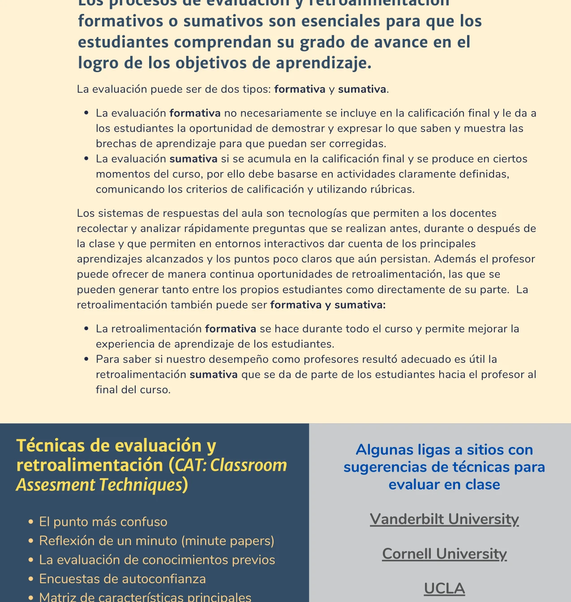


Los procesos de evaluación y retroalimentación formativos y sumativos permiten a los estudiantes comprender su grado de avance en el logro de los objetivos de aprendizaje. Son componentes del [aprendizaje activo]() que informan tanto al estudiante como al profesor.


## Evaluación formativa y sumativa

La evaluación puede ser de dos tipos (Universidad de Guadalajara, 2022; Holbeck et al., 2014):

### Evaluación formativa

No necesariamente se incluye en la calificación final. Su función es dar a los estudiantes la oportunidad de demostrar y expresar lo que saben, mostrar las brechas de aprendizaje para que puedan ser corregidas, y proporcionar al profesor información sobre el progreso del grupo en tiempo real.

### Evaluación sumativa

Se acumula en la calificación final y se produce en ciertos momentos del curso. Debe basarse en actividades con criterios definidos, comunicando las expectativas y utilizando rúbricas claras.

Ambas formas son complementarias. Un curso que solo usa evaluación sumativa pierde la oportunidad de corregir brechas durante el proceso. Un curso que solo usa evaluación formativa carece de mecanismos de certificación del aprendizaje.

## Técnicas de evaluación en el aula (CAT)

Las técnicas de evaluación en el aula (*Classroom Assessment Techniques*, CAT) son herramientas que permiten a los docentes recolectar y analizar rápidamente preguntas realizadas antes, durante o después de la clase. Permiten dar cuenta de los principales aprendizajes alcanzados y los puntos que aún persistan (Holbeck et al., 2014).


  
  Los estudiantes identifican el concepto que les resultó más difícil de entender.
  * **Momento de uso:** Al final de una sesión.
  

  
  Escritos breves para sintetizar lo aprendido o plantear dudas (*minute papers*).
  * **Momento de uso:** Al final de una sesión.
  

  
  Sondeo de lo que los estudiantes ya saben sobre un tema antes de abordarlo.
  * **Momento de uso:** Al inicio de un tema.
  

  
  Los estudiantes evalúan su nivel de confianza respecto a los conceptos trabajados.
  * **Momento de uso:** Durante o después de una unidad.
  

  
  Organización de conceptos clave en una tabla comparativa.
  * **Momento de uso:** Durante el desarrollo de un tema.
  

  
  Cuestionarios, foros y actividades de autoevaluación en la plataforma del curso.
  * **Momento de uso:** Antes, durante o después de clase.
  


## Retroalimentación

La retroalimentación es un elemento del proceso de aprendizaje que puede generarse tanto entre los propios estudiantes (retroalimentación entre pares) como directamente del profesor.

### Retroalimentación formativa

Se da a lo largo de todo el curso y permite mejorar la experiencia de aprendizaje de los estudiantes. Puede incluir:

- Comentarios del profesor sobre entregas parciales.
- Retroalimentación entre pares durante actividades colaborativas.
- Autoevaluaciones guiadas.
- Comentarios automáticos en cuestionarios en línea.

### Retroalimentación sumativa

Se da al final del curso o de una unidad. Es útil para que el profesor conozca el desempeño de su práctica docente desde la perspectiva de los estudiantes. Permite ajustar el curso para futuras iteraciones.

## Integración con el aprendizaje activo

En el contexto del [aula invertida](), la evaluación y retroalimentación se distribuyen a lo largo de todo el ciclo de aprendizaje:

1. **Antes de clase**: cuestionarios en línea y actividades de autoevaluación que verifican la revisión de materiales.
2. **Durante la clase**: técnicas CAT, encuestas rápidas, retroalimentación entre pares durante las actividades grupales.
3. **Después de clase**: entregas evaluadas con rúbricas, retroalimentación del profesor, autoevaluaciones.

Los sistemas de respuestas del aula (clickers, Mentimeter, Kahoot, formularios en línea) facilitan la recolección y el análisis rápido de las respuestas, permitiendo al profesor adaptar su enseñanza en tiempo real.

## Relación con el diseño de cursos

La evaluación y retroalimentación están directamente vinculadas al [diseño inverso de aprendizajes](). En el diseño inverso, el segundo paso (después de definir los objetivos) es determinar cómo se evaluarán los aprendizajes. Los métodos de evaluación deben ser coherentes con los niveles cognitivos de la [taxonomía de Bloom]() que se buscan desarrollar.

El [syllabus]() debe especificar las evaluaciones y rúbricas para cada semana del curso, de modo que los estudiantes conozcan desde el inicio cómo se medirá su progreso.

## Referencias

- Holbeck, R., Bergquist, E., & Lees, S. (2014). Classroom Assessment Techniques: Checking for Student Understanding in an Introductory University Success Course. *Journal of Instructional Research*, *3*, 38–42.
- Universidad de Guadalajara. (2022). *Aprendizaje Híbrido y Activo para el Éxito Estudiantil*. (Documento interno).
