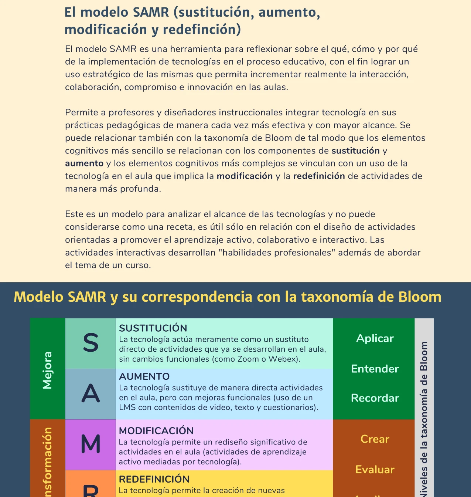
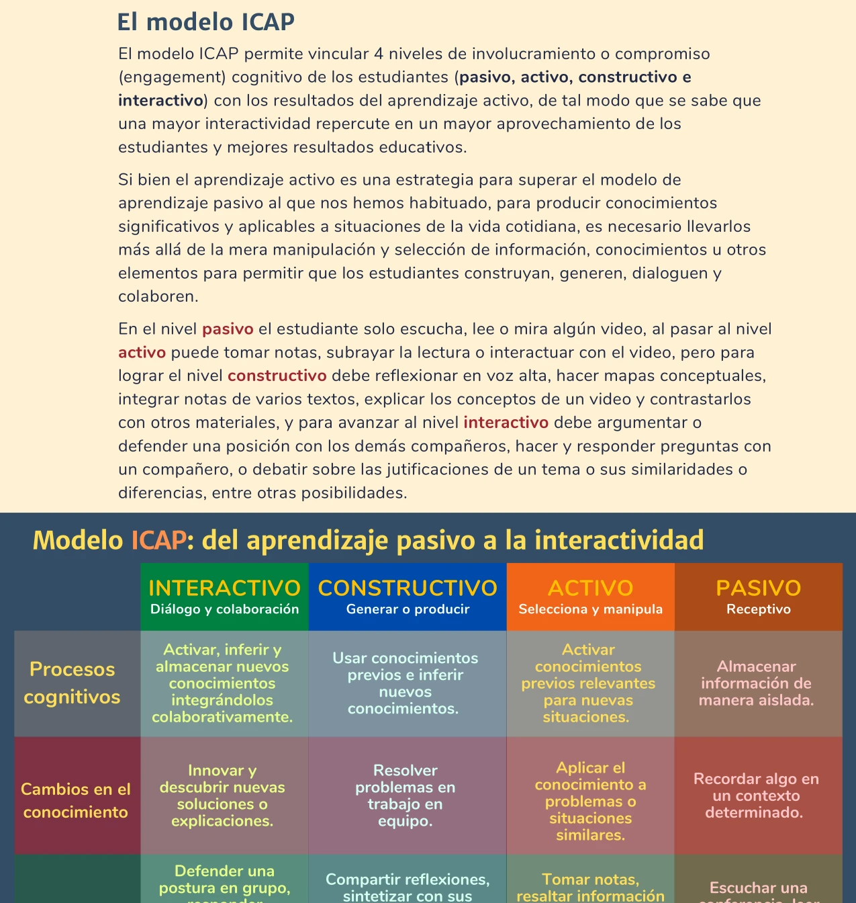


Integrar tecnología en el aula sin un marco de referencia puede resultar en un uso superficial que no transforma el aprendizaje. Los modelos SAMR e ICAP proporcionan herramientas para evaluar y mejorar la calidad de esa integración.


## El modelo SAMR

El modelo SAMR (Caukin & Trail, 2019) es una herramienta para reflexionar sobre el qué, cómo y por qué de la implementación de tecnologías en el proceso educativo. Su fin es lograr un uso estratégico que incremente la interacción, la colaboración, el compromiso y la innovación en las aulas.

Permite a profesores y diseñadores instruccionales integrar tecnología en sus prácticas pedagógicas de manera progresiva. Los cuatro niveles se agrupan en dos categorías:


  
  La tecnología actúa como un sustituto directo de actividades que ya se desarrollan en el aula, sin cambios funcionales.
  * **Ejemplo:** Usar Zoom o Webex para dar la misma conferencia que se daría presencialmente.
  

  
  La tecnología sustituye actividades del aula pero con mejoras funcionales.
  * **Ejemplo:** Usar un LMS con contenidos de video, texto y cuestionarios para complementar la clase.
  

  
  La tecnología permite un rediseño significativo de actividades en el aula.
  * **Ejemplo:** Actividades de [aprendizaje activo]() mediadas por tecnología que transforman la dinámica de clase.
  

  
  La tecnología permite la creación de actividades previamente imposibles.
  * **Ejemplo:** Actividades colectivas interactivas y de retroalimentación que no serían viables sin la tecnología.
  


### Correspondencia con la taxonomía de Bloom

Los niveles del modelo SAMR se relacionan con la [taxonomía de Bloom]():

- **Sustitución y aumento** → niveles de *recordar*, *entender* y *aplicar*.
- **Modificación y redefinición** → niveles de *analizar*, *evaluar* y *crear*.

Este modelo no puede considerarse como una receta. Es útil solo en relación con el diseño de actividades orientadas a promover el aprendizaje activo, colaborativo e interactivo. Las actividades interactivas desarrollan "habilidades profesionales" además de abordar el tema de un curso (Universidad de Guadalajara, 2022).

## El modelo ICAP

El modelo ICAP (Chi & Wylie, 2014) permite vincular cuatro niveles de involucramiento o compromiso (*engagement*) cognitivo de los estudiantes con los resultados del [aprendizaje activo](). Una mayor interactividad repercute en un mayor aprovechamiento de los estudiantes y mejores resultados educativos (Wiggins et al., 2017).


  
  * **Proceso cognitivo:** Activar, inferir y almacenar nuevos conocimientos integrándolos colaborativamente.
  * **Cambio en el conocimiento:** Innovar y descubrir nuevas soluciones o explicaciones.
  * **Ejemplo:** Defender una postura en grupo, responder preguntas en pares, debatir justificaciones.
  

  
  * **Proceso cognitivo:** Usar conocimientos previos e inferir nuevos conocimientos.
  * **Cambio en el conocimiento:** Resolver problemas en trabajo en equipo.
  * **Ejemplo:** Compartir reflexiones, sintetizar con sus propias palabras, hacer mapas de conceptos.
  

  
  * **Proceso cognitivo:** Activar conocimientos previos relevantes para nuevas situaciones.
  * **Cambio en el conocimiento:** Aplicar el conocimiento a problemas o situaciones similares.
  * **Ejemplo:** Tomar notas, resaltar información clave, definir su ritmo de aprendizaje.
  

  
  * **Proceso cognitivo:** Almacenar información de manera aislada.
  * **Cambio en el conocimiento:** Recordar algo en un contexto determinado.
  * **Ejemplo:** Escuchar una conferencia, leer un artículo, mirar un video.
  


### Del aprendizaje pasivo a la interactividad

Si bien el aprendizaje activo es una estrategia para superar el modelo de aprendizaje pasivo, para producir conocimientos significativos y aplicables a situaciones de la vida cotidiana es necesario llevar a los estudiantes más allá de la mera manipulación y selección de información. Se requiere que los estudiantes construyan, generen, dialoguen y colaboren (Universidad de Guadalajara, 2022).

- En el nivel **pasivo** el estudiante solo escucha, lee o mira algún video.
- Al pasar al nivel **activo** puede tomar notas, subrayar la lectura o interactuar con el video.
- Para lograr el nivel **constructivo** debe reflexionar en voz alta, hacer mapas conceptuales, integrar notas de varios textos, explicar los conceptos de un video y contrastarlos con otros materiales.
- Para avanzar al nivel **interactivo** debe argumentar o defender una posición con los demás compañeros, hacer y responder preguntas con un compañero, o debatir sobre las justificaciones de un tema o sus similaridades o diferencias.

## Aplicación práctica

Ambos modelos sirven como herramientas de autoevaluación para el docente:

1. **Diagnóstico**: ¿en qué nivel SAMR se encuentra mi uso actual de tecnología? ¿En qué nivel ICAP están las actividades de mis estudiantes?
2. **Planificación**: ¿cómo puedo diseñar actividades que muevan a mis estudiantes del nivel pasivo hacia el interactivo? ¿Cómo puedo usar la tecnología para modificar o redefinir mis actividades de aprendizaje?
3. **Evaluación**: después de implementar cambios, ¿han mejorado los niveles de interacción y los resultados de aprendizaje?

Estos marcos se complementan con el [diseño inverso de aprendizajes]() y con las técnicas de [evaluación y retroalimentación]() para conformar un ecosistema coherente de innovación pedagógica.

## Referencias

- Caukin, N., & Trail, L. (2019). SAMR: A Tool for Reflection for Ed Tech Integration. *International Journal of the Whole Child*, *4*(1), 47–54.
- Chi, M.T., & Wylie, R. (2014). The ICAP Framework: Linking Cognitive Engagement to Active Learning Outcomes. *Educational Psychologist*, *49*(4), 219–243.
- Universidad de Guadalajara. (2022). *Aprendizaje Híbrido y Activo para el Éxito Estudiantil*. (Documento interno).
- Wiggins, B.L., Eddy, S.L., Grunspan, D.Z., & Crowe, A.J. (2017). The ICAP Active Learning Framework Predicts the Learning Gains Observed in Intensely Active Classroom Experiences. *AERA Open*, *3*(2), 2332858417708567.
