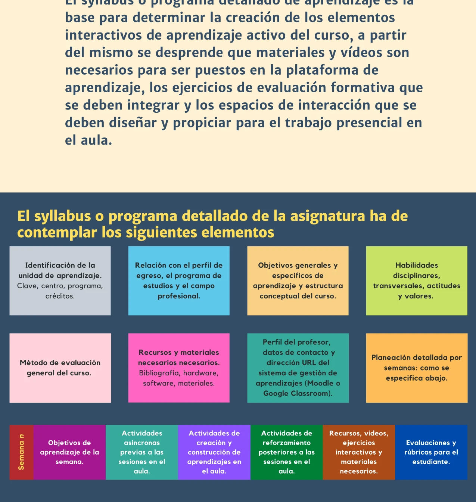
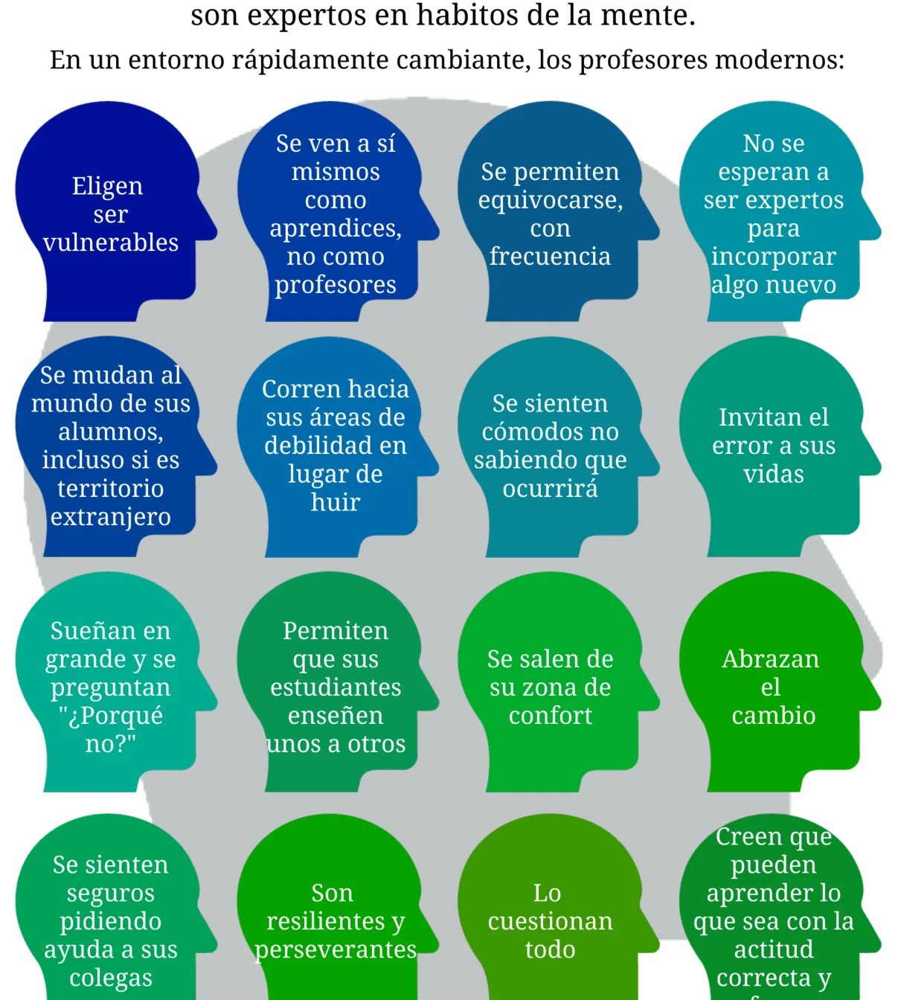


El syllabus es el programa detallado de aprendizaje: la base para determinar materiales, videos, ejercicios de evaluación y espacios de interacción en el curso. El portafolio de docencia permite a cada profesor reflexionar sobre y compartir sus prácticas.


## El syllabus en el aprendizaje híbrido

En el syllabus se plasman de manera estructurada todos los temas, objetivos generales de aprendizaje y las actividades de [aprendizaje activo](). El [diseño inverso]() de objetivos de aprendizaje permite vincular lógicamente de atrás hacia adelante los objetivos parciales de cada actividad con los objetivos generales del curso (Wiggins & McTighe, 2005; Bowen, 2017).

El syllabus debe mostrar con claridad lo que se va a aprender para las actividades de cada semana, los materiales y actividades a desarrollar. Para el [aprendizaje híbrido]() y el [aula invertida]() debe separar las actividades que se realizan fuera del aula (previas a la clase presencial) de las actividades dentro del aula (Universidad de Guadalajara, 2022).

## Elementos del syllabus

El syllabus o programa detallado de la asignatura debe contemplar los siguientes elementos:

### Información general


  
  Clave, centro, programa, créditos.
  

  
  Programa de estudios y relación con su campo profesional.
  

  
  Objetivos generales y específicos de aprendizaje y estructura conceptual del curso.
  

  
  Disciplinares, transversales, actitudes y valores.
  

  
  Criterios generales, ponderaciones y rúbricas.
  

  
  Bibliografía, hardware, software y otros materiales de apoyo.
  

  
  Datos de contacto y dirección URL del LMS (Moodle, Google Classroom).
  


### Planeación detallada por semanas

Cada semana del curso debe especificar:


  
  Qué deben lograr los estudiantes al finalizar la semana.
  

  
  Lecturas, videos, foros y cuestionarios requeridos antes de la sesión presencial.
  

  
  Actividades de aprendizaje activo colaborativo durante la sesión presencial.
  

  
  Tareas, ejercicios o foros de profundización para realizar después de la clase.
  

  
  Videos, ejercicios interactivos y materiales complementarios necesarios.
  

  
  Criterios de [evaluación]() claros para el estudiante y rúbricas aplicables.
  


El syllabus es la base para determinar la creación de los elementos interactivos de aprendizaje activo del curso: a partir de él se desprende qué materiales y videos son necesarios para la plataforma de aprendizaje, qué ejercicios de evaluación formativa integrar y qué espacios de interacción diseñar para el trabajo presencial en el aula (Universidad de Guadalajara, 2022).

## El portafolio de docencia

El portafolio docente es una herramienta para que cada profesora y profesor pueda reflexionar sobre sus prácticas docentes, compartir y sistematizar las experiencias de aprendizaje que ha creado y curado para orientar sus cursos al éxito de los estudiantes (Universidad de Guadalajara, 2022).

### Para qué sirve

- Reflexionar sobre la forma en que cada profesor concibe su actividad docente.
- Documentar las particularidades de su identidad disciplinar e individual como profesor.
- Compartir y socializar buenas prácticas con otros colegas.
- Identificar fortalezas y áreas de desarrollo futuro.

### Qué puede incluir

- Una lista de los cursos impartidos con una descripción general y los estudiantes atendidos.
- Listas de lectura específicas para temas relevantes.
- Los programas completos o syllabi de los cursos.
- Los exámenes y cuestionarios que aplica.
- Las tareas y actividades de aprendizaje activo diseñadas con técnicas de diseño inverso.
- Resúmenes y guías de aprendizaje.
- Materiales y presentaciones utilizados.
- Videos de clases.
- Técnicas usadas para evaluar y retroalimentar a los estudiantes.
- Evaluaciones del trabajo docente por parte de los estudiantes.
- Ensayos destacados de estudiantes.
- Notas de laboratorio.
- Diseño de nuevos cursos innovadores.
- Resultados de pruebas estandarizadas.

### La filosofía de enseñanza

Uno de los componentes centrales del portafolio es la filosofía de enseñanza. Esta implica la reflexión sobre la forma en que cada profesor concibe su actividad docente, incluyendo los enfoques de aprendizaje específicos que promueve, la forma en que fomenta la participación de los estudiantes y sus propias fortalezas y áreas de desarrollo futuro como académico.

## El perfil del profesor moderno

Los profesores del siglo XXI no son expertos en tecnología sino "expertos en hábitos de la mente" (Wilson, como se cita en Universidad de Guadalajara, 2022). En un entorno rápidamente cambiante, los profesores modernos:

- Se ven como aprendices, no solo como profesores.
- Se permiten equivocarse con frecuencia.
- No esperan a ser expertos para incorporar algo nuevo.
- Corren hacia sus áreas de debilidad en lugar de huir.
- Permiten que sus estudiantes enseñen unos a otros.
- Lo cuestionan todo.
- Son resilientes y perseverantes.
- Creen que pueden aprender lo que sea con la actitud correcta y esfuerzo.

Este perfil del profesor moderno es indispensable para liderar la [transformación pedagógica y digital](), ya que son los profesores quienes, desde el aula, implementarán las metodologías activas, integrarán la tecnología de manera significativa y guiarán a los estudiantes.

## Referencias

- Bowen, R.S. (2017). *Understanding by Design*. Vanderbilt University Center for Teaching.
- Universidad de Guadalajara. (2022). *Aprendizaje Híbrido y Activo para el Éxito Estudiantil*. (Documento interno).
- Wiggins, G., & McTighe, J. (2005). *Understanding By Design* (2nd ed., 2nd Expanded).
