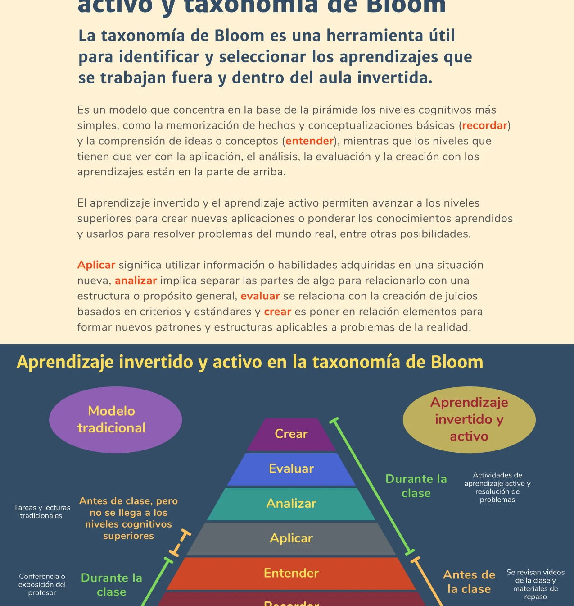


La taxonomía de Bloom es una herramienta para identificar y seleccionar los aprendizajes que se trabajan fuera y dentro del aula. El diseño inverso (*backward design*) parte de los resultados deseados para planear las experiencias de aprendizaje.


## La taxonomía de Bloom

La taxonomía de Bloom (revisada) es un modelo que organiza los procesos cognitivos en seis niveles jerárquicos, de menor a mayor complejidad:


  
  Memorización de hechos y conceptualizaciones básicas.
  * **Actividades:** Identificar, listar, definir.
  

  
  Comprensión de ideas o conceptos.
  * **Actividades:** Explicar, parafrasear, clasificar.
  

  
  Utilizar información o habilidades adquiridas en una situación nueva.
  * **Actividades:** Resolver un ejercicio, implementar un procedimiento.
  

  
  Separar las partes de algo para relacionarlo con una estructura o propósito general.
  * **Actividades:** Comparar, contrastar, diferenciar.
  

  
  Crear juicios basados en criterios y estándares.
  * **Actividades:** Argumentar, justificar, criticar.
  

  
  Poner en relación elementos para formar nuevos patrones y estructuras.
  * **Actividades:** Diseñar, construir, formular.
  


La base de la pirámide concentra los niveles cognitivos más simples (recordar, entender), mientras que los niveles superiores (aplicar, analizar, evaluar, crear) requieren procesos cognitivos más complejos.

## Bloom y el aula invertida

El [aprendizaje invertido]() y el [aprendizaje activo]() permiten a los estudiantes avanzar a los niveles cognitivos superiores para crear nuevas aplicaciones, ponderar los conocimientos aprendidos y usarlos para resolver problemas del mundo real.

### Modelo tradicional

En la enseñanza tradicional:
- **Durante la clase**: el profesor expone (niveles *recordar* y *entender*) mediante conferencias.
- **Fuera de clase**: tareas y lecturas que buscan niveles superiores pero sin la guía del profesor.

El resultado es que los niveles superiores de la taxonomía quedan como tarea doméstica, donde el estudiante no tiene apoyo para alcanzarlos.

### Modelo invertido y activo

En el aula invertida:
- **Antes de la clase** (en línea): los estudiantes revisan videos y materiales de repaso, trabajando los niveles de *recordar* y *entender*.
- **Durante la clase**: actividades de aprendizaje activo y resolución de problemas que abordan los niveles de *aplicar*, *analizar*, *evaluar* y *crear*, con la guía del profesor.

Esta reconfiguración permite que los niveles cognitivos superiores se trabajen con el apoyo del profesor y la colaboración entre pares.

## El diseño inverso de aprendizajes

El diseño inverso (*backward design*) es un enfoque de planificación curricular desarrollado por Wiggins y McTighe (2005, 2011) que parte del final —los resultados de aprendizaje deseados— y avanza hacia el inicio —las actividades y recursos. Se estructura en tres etapas:

### 1. Identificar los resultados de aprendizaje deseados

Definir qué deben aprender los estudiantes al finalizar el curso o la unidad. Los objetivos de aprendizaje deben reflejar lo que se requiere que aprendan para cada actividad de aprendizaje activo y para el contenido general del curso (Bowen, 2017).

### 2. Determinar la forma de evaluación

Establecer cómo se medirán los aprendizajes adquiridos. Los métodos de [evaluación]() deben ser coherentes con los objetivos y permitir evidenciar los niveles cognitivos que se buscan desarrollar.

### 3. Planear las experiencias de aprendizaje

Diseñar las actividades de aprendizaje activo que llevarán a los estudiantes a alcanzar los resultados deseados y demostrarlos en las evaluaciones planificadas.

 — Universidad de Guadalajara, 2022")

## Aplicación al syllabus

El [syllabus]() construido mediante objetivos de aprendizaje diseñados de manera inversa tiene como fin crear experiencias de aprendizaje que permitan a los estudiantes lograr aprendizajes de manera autónoma, creativa y en contacto con problemas del mundo real (Universidad de Guadalajara, 2022).

Para el [aprendizaje híbrido]() y el aula invertida, el syllabus debe separar las actividades que se realizan fuera del aula (previas a la clase presencial) de las actividades dentro del aula (aprendizaje activo, interacción, retroalimentación).

## Relación con los modelos SAMR e ICAP

Los niveles de la taxonomía de Bloom se corresponden con los niveles del [modelo SAMR]():

- **Sustitución y aumento** (mejora): se corresponden con *recordar*, *entender* y *aplicar*.
- **Modificación y redefinición** (transformación): se corresponden con *analizar*, *evaluar* y *crear*.

Esta correspondencia permite evaluar si la tecnología utilizada en un curso realmente contribuye a alcanzar niveles cognitivos superiores o se queda en un uso superficial.

## Referencias

- Bowen, R.S. (2017). *Understanding by Design*. Vanderbilt University Center for Teaching.
- Harvard / The Derek Bok Center for Teaching and Learning. (2022). Designing Your Course. https://bokcenter.harvard.edu/designing-your-course
- Universidad de Guadalajara. (2022). *Aprendizaje Híbrido y Activo para el Éxito Estudiantil*. (Documento interno).
- Wiggins, G., & McTighe, J. (2005). *Understanding By Design* (2nd ed., 2nd Expanded).
- Wiggins, G., & McTighe, J. (2011). *The Understanding by Design: Guide to Creating High-Quality Units*. Association for Supervision & Curriculum Development.
