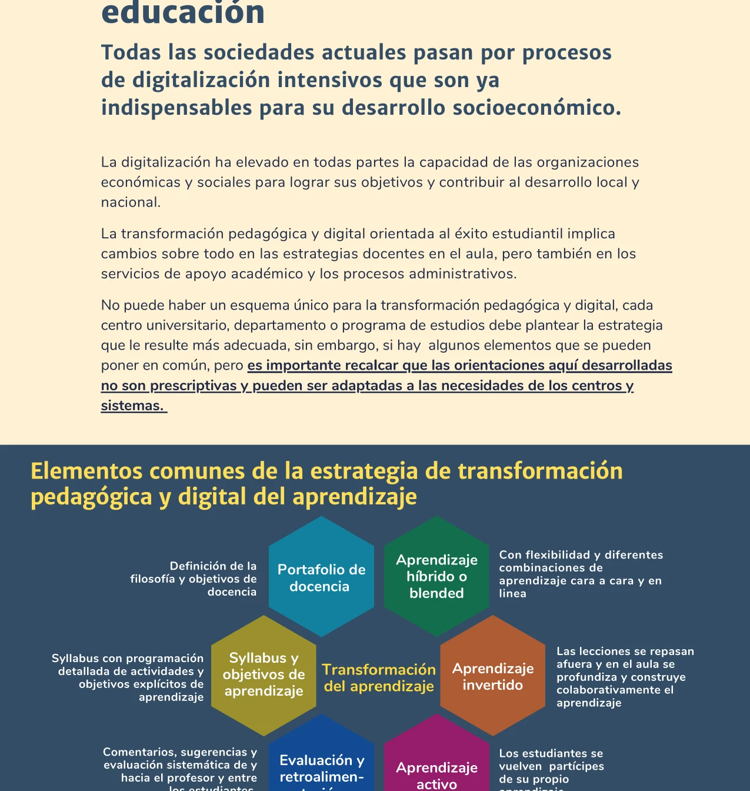
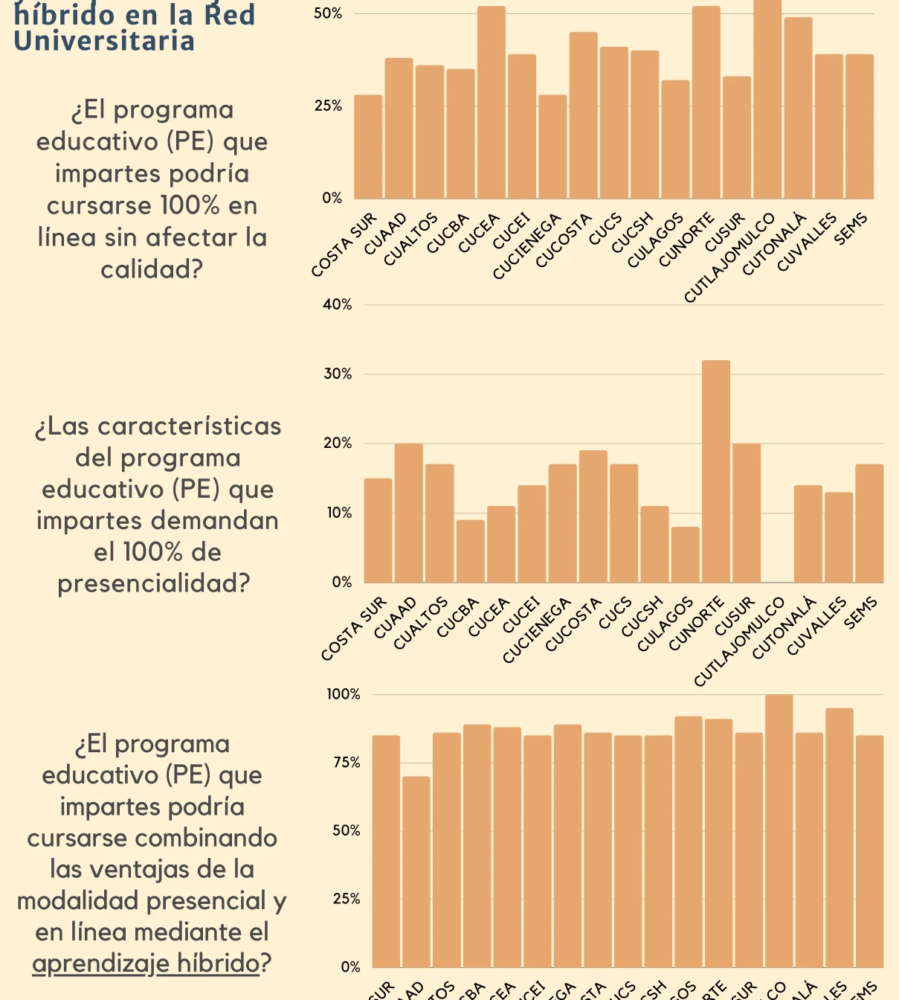


La Universidad de Guadalajara impulsa un modelo de aprendizaje híbrido y activo centrado en el estudiante. Este documento presenta el marco general de esa estrategia: las lecciones de la pandemia, la justificación del cambio y los elementos comunes que guían la transformación en toda la Red Universitaria.


## Lecciones de la pandemia

La pandemia de COVID-19 forzó la adaptación de todos los cursos a modalidad en línea. Ese proceso reveló que las disrupciones pedagógicas —no las tecnológicas— son las que determinan el éxito educativo (Universidad de Guadalajara, 2022). Tres lecciones aprendidas permanecen:

1. **Re-humanizar la educación.** La educación debe promover el crecimiento personal de los estudiantes, no solo el intelectual. La empatía y el reconocimiento integral del estudiante son condiciones previas al aprendizaje.

2. **La atención es un recurso escaso.** En entornos en línea e híbridos la atención de los estudiantes debe gestionarse activamente. Las actividades deben diseñarse para captar y mantener esa atención (Miyagawa & Perdue, 2021).

3. **Aulas globales.** Internet entrelaza lo global y lo local; el aula se convierte en un espacio genuinamente global donde convergen perspectivas, recursos y colaboraciones internacionales.

La pandemia no fue una "revolución tecnológica" pero si hizo evidente la necesidad de impulsar una transformación **pedagógica y organizacional**. Las TIC permiten liberar tiempo en el aula para fortalecer una educación más individualizada, grupal, activa e interactiva. La consigna es *high-tech* con *high-touch* (Universidad de Guadalajara, 2022).

### Opiniones en la Red Universitaria

Una encuesta realizada en los centros universitarios y el Sistema de Educación Media Superior muestra que la mayoría de los docentes considera que sus programas educativos podrían cursarse combinando las ventajas de la modalidad presencial y en línea mediante el aprendizaje híbrido.

## ¿Por qué una transformación pedagógica y digital?

Las universidades en México y en el mundo se han centrado en lo que ocurre fuera del aula —infraestructura, matrícula, acreditaciones— y no en los resultados de los procesos de enseñanza-aprendizaje. Las tendencias y lecciones internacionales muestran que lo que determina el éxito de los estudiantes son las disrupciones de carácter pedagógico, no las meramente tecnológicas (Teich, 2022).

Para ganar la atención de los estudiantes e involucrarlos activamente se requiere transitar del aprendizaje pasivo a la construcción colectiva y activa del conocimiento. Esto implica:

- Centrarse en la **pedagogía**, usando la tecnología de manera adecuada.
- Desarrollar **habilidades socioemocionales** junto con las disciplinares.
- Crear **experiencias de aprendizaje** interactivas, creativas y vinculadas a problemas reales.
- No dejar atrás a ningún estudiante, haciendo coincidir el éxito institucional con el éxito estudiantil.

## Elementos comunes de la estrategia

No existe un esquema único para la transformación pedagógica y digital. Cada centro universitario, departamento o programa de estudios debe diseñar la estrategia que mejor se adapte a sus necesidades. Sin embargo, existen elementos comunes que orientan el proceso (Universidad de Guadalajara, 2022):


  
  Combinaciones flexibles de aprendizaje presencial y en línea.

- [Ver más sobre este elemento]()
  

  
  Las lecciones se revisan fuera del aula; en clase se profundiza colaborativamente.

- [Ver más sobre este elemento]()
  

  
  Los estudiantes se vuelven partícipes de su propio aprendizaje.

- [Ver más sobre este elemento]()
  

  
  Comentarios, sugerencias y evaluación sistemática de y hacia el profesor y entre los estudiantes.

- [Ver más sobre este elemento]()
  

  
  Programación detallada de actividades con objetivos explícitos.

- [Ver más sobre este elemento]()
  

  
  Definición de la filosofía y objetivos de docencia de cada profesor.

- [Ver más sobre este elemento]()
  


Estas orientaciones no son prescriptivas y pueden ser adaptadas a las necesidades de cada contexto dentro de la Red Universitaria.

## Marcos de integración tecnológica

La integración de tecnología en el aula requiere marcos de referencia que eviten el uso superficial de herramientas digitales. Dos modelos guían esta reflexión:

- El **[modelo SAMR]()** (sustitución, aumento, modificación, redefinición) permite evaluar en qué nivel se está usando la tecnología y orientar su uso hacia la transformación del aprendizaje.
- El **[modelo ICAP]()** (pasivo, activo, constructivo, interactivo) vincula los niveles de compromiso cognitivo de los estudiantes con los resultados educativos.

Ambos modelos se relacionan con la [taxonomía de Bloom](), proporcionando un esquema coherente para diseñar actividades que transiten de la memorización hacia la creación y el análisis.

## El papel de la inteligencia artificial

La [IA se integra al ecosistema del aprendizaje híbrido]() como facilitador de experiencias personalizadas y adaptativas. Su contribución abarca la personalización del aprendizaje, la tutoría inteligente, el análisis predictivo y la detección temprana de brechas. La mediación docente sigue siendo el factor determinante: la IA no reemplaza al profesor sino que transforma su rol (Kaplan-Rakowski et al., 2023).

## Visión institucional

El éxito de esta transformación depende de toda la comunidad universitaria y, de manera particular, de la disposición y adaptabilidad de los profesores. El cambio ha de darse en las aulas, con la misión de poner a los estudiantes en el centro y crear experiencias de aprendizaje que desarrollen tanto conocimientos como habilidades para la vida y el trabajo.

## Referencias

- Kaplan-Rakowski, R., Grotewold, K., Hartwick, P., & Papin, K. (2023). Generative AI and Teachers' Perspectives on Its Implementation in Education. *Journal of Interactive Learning Research*, *34*(2), 313–338.
- Miyagawa, S., & Perdue, C. (2021). What Will Remain? *Inside Higher Ed*.
- Teich, A.G. (2022). A New Lens: Viewing Institutional Success as Student Success. *Fierce Education*.
- Universidad de Guadalajara. (2022). *Aprendizaje Híbrido y Activo para el Éxito Estudiantil*. (Documento interno).
