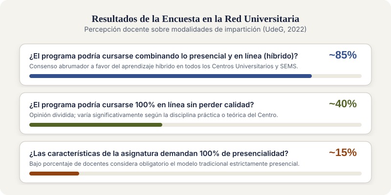
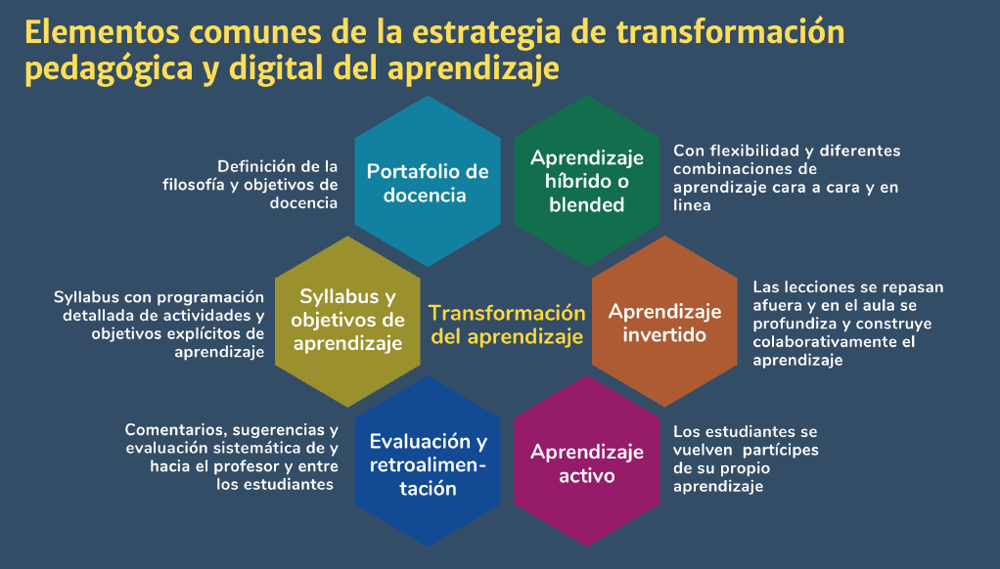

{{< contrato modo="lectura" quien="Docentes de la UdeG que oyen hablar del «modelo híbrido y activo» de la universidad y quieren saber de dónde viene, qué les pide y qué partes ya hacen; también quienes coordinan programas." haras="Vas a entender por qué la universidad apuesta por cambiar la forma de enseñar antes que por comprar tecnología (es lo que dejó la pandemia), y cuáles son los seis elementos que comparte cualquier curso híbrido y activo, del syllabus a la retroalimentación." tendras="Una lista de seis elementos para ubicar tu curso («¿cuáles ya tiene y cuál conviene trabajar primero?», por ejemplo: «tengo plataforma y foros, pero mi syllabus no dice qué se hace antes de cada clase») y el enlace a la página de cada uno." tarda="Ocho minutos de lectura." ejemplo="Empieza con un estudiante de la UdeG que va dos días al aula y el resto de la semana trabaja desde donde esté; su semana abre la página y muestra el modelo en uso." >}}

Un estudiante de la UdeG asiste dos días al aula y el resto de la semana trabaja desde donde esté: revisa materiales en línea, discute en foros y entrega trabajos sin pisar el campus. Esa combinación responde al modelo de aprendizaje híbrido y activo centrado en el estudiante que impulsa la Universidad de Guadalajara, y va más allá del arreglo particular de un profesor. Este documento presenta el marco general de esa estrategia: las lecciones de la pandemia, la justificación del cambio y los elementos comunes que guían la transformación en toda la Red Universitaria. Léelo para ubicar tu curso: qué elementos ya tiene y cuál conviene trabajar primero.

## Lecciones de la pandemia

La pandemia de COVID-19 forzó la adaptación de todos los cursos a modalidad en línea. Ese proceso reveló que lo que determina el éxito educativo son las disrupciones pedagógicas —los cambios de método: cómo se enseña y cómo se aprende— y no las meramente tecnológicas —los cambios de aparato o plataforma— (Universidad de Guadalajara, 2022). Tres lecciones aprendidas permanecen:

1. **Re-humanizar la educación.** La educación debe promover el crecimiento personal de los estudiantes, no solo el intelectual. La empatía y el reconocimiento integral del estudiante son condiciones previas al aprendizaje.

2. **La atención es un recurso escaso.** En entornos en línea e híbridos la atención de los estudiantes debe gestionarse activamente. Las actividades deben diseñarse para captar y mantener esa atención (Miyagawa & Perdue, 2021).

3. **Aulas globales.** Internet entrelaza lo global y lo local; el aula se convierte en un espacio genuinamente global donde convergen perspectivas, recursos y colaboraciones internacionales.

La pandemia no fue una "revolución tecnológica" pero sí hizo evidente la necesidad de impulsar una transformación **pedagógica y organizacional**. Las TIC permiten liberar tiempo en el aula para fortalecer una educación más individualizada, grupal, activa e interactiva. El lema es *high-tech* con *high-touch*: tanta tecnología como sea útil, pero sin perder el contacto humano (Universidad de Guadalajara, 2022).

### Opiniones en la red universitaria

Una encuesta realizada en los centros universitarios y el Sistema de Educación Media Superior muestra que la mayoría de los docentes considera que sus programas educativos podrían cursarse combinando las ventajas de la modalidad presencial y en línea mediante el aprendizaje híbrido.

**Recorrido en texto:** ante la pregunta de si los programas podrían cursarse combinando lo presencial y lo en línea, la respuesta es un consenso amplio (~85 %); la opción cien por ciento en línea divide (~40 %, y varía según la disciplina); y solo una minoría (~15 %) considera obligatoria la presencialidad estricta. La lectura: la comunidad docente ve el híbrido como el camino viable, no el en línea total. Cuando la discusión distingue entre presencialidad enriquecida, modalidades híbridas y formación totalmente en línea, conviene precisar de qué se está hablando: la página [¿Qué es la educación digital?]() ordena esa taxonomía de modalidades y los términos que este marco da por supuestos.

## ¿Por qué una transformación pedagógica y digital?

Las universidades en México y en el mundo se han centrado en lo que ocurre fuera del aula —infraestructura, matrícula, acreditaciones— y no en los resultados de los procesos de enseñanza-aprendizaje. Las tendencias y lecciones internacionales muestran que lo que determina el éxito de los estudiantes son las disrupciones de carácter pedagógico, no las meramente tecnológicas (Teich, 2022).

Para ganar la atención de los estudiantes e involucrarlos activamente se requiere transitar del aprendizaje pasivo a la construcción colectiva y activa del conocimiento. Esto implica:

- Centrarse en la **pedagogía**, usando la tecnología de manera adecuada.
- Desarrollar **habilidades socioemocionales** junto con las disciplinares.
- Crear **experiencias de aprendizaje** interactivas, creativas y vinculadas a problemas reales.
- No dejar atrás a ningún estudiante, haciendo coincidir el éxito institucional con el éxito estudiantil.

## Elementos comunes de la estrategia

No existe un esquema único para la transformación pedagógica y digital. Cada centro universitario, departamento o programa de estudios debe diseñar la estrategia que mejor se adapte a sus necesidades. Sin embargo, existen elementos comunes que orientan el proceso (Universidad de Guadalajara, 2022). Léelos como una lista para ubicar tu curso: cuáles ya tiene y cuál conviene trabajar primero:


  
  Combinaciones flexibles de aprendizaje presencial y en línea.

- [Ver más sobre este elemento]()
  

  
  Las lecciones se revisan fuera del aula; en clase se profundiza colaborativamente.

- [Ver más sobre este elemento]()
  

  
  Los estudiantes se vuelven partícipes de su propio aprendizaje.

- [Ver más sobre este elemento]()
  

  
  Comentarios, sugerencias y evaluación sistemática de y hacia el profesor y entre los estudiantes.

- [Ver más sobre este elemento]()
  

  
  Programación detallada de actividades con objetivos explícitos.

- [Ver más sobre este elemento]()
  

  
  Definición de la filosofía y objetivos de docencia de cada profesor.

- [Ver más sobre este elemento]()
  


Estas orientaciones no son prescriptivas y pueden ser adaptadas a las necesidades de cada contexto dentro de la Red Universitaria.

## Marcos de integración tecnológica

La integración de tecnología en el aula requiere marcos de referencia que eviten el uso superficial de herramientas digitales. Dos modelos guían esta reflexión:

- El **[modelo SAMR]()** (sustitución, aumento, modificación, redefinición) permite evaluar en qué nivel se está usando la tecnología y orientar su uso hacia la transformación del aprendizaje.
- El **[modelo ICAP]()** (pasivo, activo, constructivo, interactivo) vincula los niveles de compromiso cognitivo de los estudiantes con los resultados educativos.

Ambos modelos se relacionan con la [taxonomía de Bloom](), proporcionando un esquema coherente para diseñar actividades que transiten de la memorización hacia la creación y el análisis.

## El papel de la inteligencia artificial

La [IA se integra al ecosistema del aprendizaje híbrido]() como facilitador de experiencias personalizadas y adaptativas. Su contribución abarca la personalización del aprendizaje, la tutoría inteligente, el análisis predictivo y la detección temprana de brechas. La mediación docente sigue siendo el factor determinante: la IA no reemplaza al profesor sino que transforma su rol (Kaplan-Rakowski et al., 2023).

## Visión institucional

El éxito de esta transformación depende de toda la comunidad universitaria y, de manera particular, de la disposición y adaptabilidad de los profesores. El cambio ha de darse en las aulas, con la misión de poner a los estudiantes en el centro y crear experiencias de aprendizaje que desarrollen tanto conocimientos como habilidades para la vida y el trabajo.

## Explora los temas del modelo


  
  
  
  
  
  
  




- Kaplan-Rakowski, R., Grotewold, K., Hartwick, P., & Papin, K. (2023). Generative AI and Teachers' Perspectives on Its Implementation in Education. *Journal of Interactive Learning Research*, *34*(2), 313–338.
- Miyagawa, S., & Perdue, C. (2021). What Will Remain? *Inside Higher Ed*.
- Teich, A.G. (2022). A New Lens: Viewing Institutional Success as Student Success. *Fierce Education*.
- Universidad de Guadalajara. (2022). *Aprendizaje Híbrido y Activo para el Éxito Estudiantil*. Documento institucional de circulación interna, sin versión pública disponible; se cita como antecedente del marco institucional de aprendizaje híbrido.

