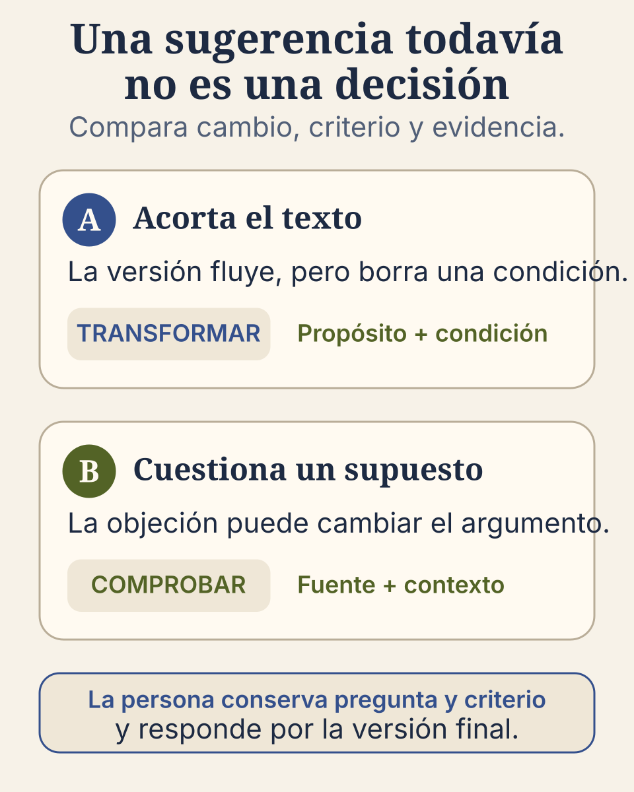

{{< contrato modo="lectura" quien="Estudiantes y docentes que ya revisan un borrador con una IA y reciben cambios que suenan bien pero no saben si aceptarlos; también quien diseña una actividad y quiere saber qué pedirle al grupo para ver si decidió o sólo copió." haras="Vas a entender, con el caso de Renata, por qué una sugerencia de la IA todavía no es una decisión y qué cuatro acciones siguen siendo tuyas: formular lo que buscas, contrastar la sugerencia con algo externo (una fuente, lo que pide la tarea), decidir qué conservas y responder por la versión final." tendras="Una pregunta para aplicar a cualquier cambio que te propongan («¿qué cambió, con qué regla lo decidí y qué fuente sostiene la versión final?») y una tabla de dos filas para registrar sólo los cambios importantes (por ejemplo: «Acortar la explicación · la IA propuso una versión más fluida · recuperé la condición que se perdía · guardo versión anterior, versión final y razón»)." tarda="Unos quince minutos de lectura; veinticinco si haces el ejercicio interactivo del final." ejemplo="Empieza por el caso de Renata, en los dos primeros párrafos: dos sugerencias que suenan bien y dos decisiones distintas." >}}

Renata prepara una explicación sobre un problema de su asignatura. Ya escribió un primer
borrador y puede señalar la idea central. Al revisarlo con un sistema de IA generativa recibe dos
sugerencias plausibles. La primera vuelve el texto más fluido, pero elimina la condición que
hace válido el argumento. La segunda pregunta si una afirmación cambia cuando se considera
otro contexto. Esa objeción revela un supuesto que Renata no había comprobado.

Las dos respuestas parecen útiles. Ninguna decide por sí sola qué debe cambiar. Renata
necesita volver a lo que quería explicar, revisar la fuente que ya estaba usando y explicar por
qué acepta, transforma o descarta cada aporte. Ese trabajo permite hablar de co-creación sin convertir la colaboración
con una herramienta en obediencia.

## Una sugerencia todavía no es una decisión

Un sistema puede proponer una formulación, una pregunta, una objeción o una manera distinta de
organizar el material. La contribución puede influir de verdad en el recorrido. Sin embargo,
la persona conserva cuatro acciones que no conviene esconder:

1. **formula**: aclara qué intenta comprender o producir, qué límites tiene la tarea y qué
   características tendría una aportación útil, antes de pedir una respuesta;
2. **contrasta**: comprueba la propuesta con algo que no proviene de la propia respuesta —una
   fuente, conocimiento disciplinar, el contexto de la tarea u otra perspectiva—;
3. **decide**: conserva, transforma o descarta cada aporte por una razón que puede explicarse;
4. **responde**: se hace cargo del resultado y puede reconstruir el recorrido —qué aportó la
   herramienta, qué se comprobó y qué decisiones fueron humanas—.

Renata no acepta la primera sugerencia porque “suena mejor”. La contrasta con lo que pedía la tarea
(explicar bajo qué condición vale el argumento) y observa que la condición eliminada era necesaria. Conserva una frase más breve, pero
restituye la condición con sus propias palabras. En la segunda sugerencia no copia la
objeción: consulta la fuente que ya estaba usando, encuentra que el contexto sí cambia la
interpretación y reescribe su explicación. Al final puede responder por ambas decisiones sin
volver a la conversación.

Este recorrido supone que Renata ya puede reconocer la idea central y una condición de
validez. Cuando una persona todavía no puede hacerlo, pedirle que “verifique” por su cuenta no
resuelve el problema: la actividad necesita ejemplos comentados, reglas visibles de qué cuenta como buena
respuesta (por ejemplo: «conserva la condición que hace válido el argumento») y acompañamiento
antes de incorporar una respuesta generada.

La figura no muestra una ruta correcta por color ni una calificación. Muestra que un mismo
aporte puede recibir tratamientos distintos. La pregunta útil es «¿qué cambió, con qué regla lo decidí
y qué fuente sostiene la versión final?», y no «¿la IA ayudó?». Este mismo
contraste puede recorrerse de forma interactiva: la actividad
[Compara dos sugerencias](../../../actividades/comparar-sugerencias/) pone delante un borrador
y dos ayudas, y pide decidir qué hacer con cada una antes de mostrar qué cambia en el texto.

## Co-crear no significa repartir la responsabilidad

La expresión **co-creación persona–IA** nombra un ciclo en el que una respuesta del sistema
entra al trabajo intelectual y la persona la interroga, contrasta y transforma. No significa
que ambos participantes comprendan o respondan de la misma manera. La herramienta influye;
la persona mantiene la responsabilidad por lo que entrega.

El término **agenciamiento persona–IA** amplía la mirada. Además de la persona y el sistema,
incluye la actividad, las fuentes, lo que la tarea exige (por ejemplo, conservar la condición
de validez), el tiempo disponible, las reglas del curso y las condiciones de acceso. Todos esos elementos pueden orientar lo que sucede, pero no
tienen la misma capacidad de comprender, decidir o responder por una consecuencia.

Este uso retoma de manera acotada el concepto de *agencement* de Deleuze y Guattari: una
relación entre elementos heterogéneos que, al conectarse, modifica lo que pueden producir. En
esta guía no se emplea para atribuir comprensión o responsabilidad moral a la IA, sino para no
separar el resultado de las condiciones que lo hicieron posible. [La pieza del blog sobre
agenciamiento persona–IA]() desarrolla ese linaje
filosófico; aquí se traduce en decisiones observables para aprender y enseñar.

En el caso de Renata, el resultado no depende solo de “una buena conversación”. También
depende del primer borrador, la instrucción de la tarea que exige conservar la condición, la fuente que permite
comprobar el supuesto y la decisión de no confundir fluidez con exactitud. Nombrar esa
configuración ayuda a mirar el proceso completo sin presentar al sistema como autor moral ni
a la estudiante como simple operadora.

La **dirección epistémica** es la capacidad de decidir qué cuenta como una respuesta
pertinente y fundada: qué pregunta se intenta resolver, qué fuentes se aceptan como respaldo y qué versión
puede sostenerse. La conserva Renata cuando usa la respuesta como material para pensar y no
como sustituto de su juicio. La figura siguiente representa el ciclo —formular, contrastar,
decidir y responder— y dos desenlaces posibles, no dos efectos automáticos de la tecnología.


La persona y la IA aportan cosas distintas al trabajo conjunto: la IA propone variantes y
señales; la persona conserva el juicio y lo que quería decir. El recorrido —formular, contrastar,
decidir y responder— gira alrededor de una pregunta: ¿quién comprueba y decide?

| Decisión de la persona | Qué ocurre con la respuesta | Desenlace |
|---|---|---|
| Comprueba la respuesta y toma la decisión. | Una objeción o un ejemplo inesperado obliga a revisar las propias ideas antes de aceptarla. | **La IA ayuda a pensar.** |
| Acepta la respuesta sin revisar. | La respuesta se copia o se valida sin comprenderla ni comprobarla. | **La IA sustituye el pensamiento**, y la persona deja de practicar. |

La decisión sigue siendo humana: conservarla convierte el trabajo conjunto en aprendizaje;
cederla convierte la ayuda en sustitución.


Aquí, **ganancia cognitiva** significa que la interacción amplía lo que la persona puede
comprender, explicar o transferir. La **descarga cognitiva** consiste en trasladar una operación
a un apoyo externo. Esa descarga puede ser útil en tareas rutinarias; se vuelve un problema
educativo cuando sustituye precisamente la comparación, la comprobación o la argumentación
que la actividad pretendía desarrollar.

El siguiente ejercicio pone a prueba esa distinción con un caso breve: una explicación
convincente con dos afirmaciones sin respaldo. Las cinco rutas de respuesta son plausibles;
solo una conserva la dirección epistémica completa. El ejercicio no se califica y no registra el
intento: su función es ensayar la decisión antes de enfrentarla en un trabajo real.


### Versión textual del ejercicio

Una IA propone una explicación clara sobre un problema de tu disciplina, pero dos afirmaciones
no están respaldadas por las fuentes citadas. ¿Qué ruta permite conservar la dirección
epistémica y convertir el hallazgo en una mejor iteración?

- **Explicitar qué cuenta como buena respuesta (por ejemplo: «cada afirmación tiene una fuente
  que la respalda») → verificar las afirmaciones en las fuentes → decidir qué conservar
  o rechazar y por qué → reformular la pregunta y el texto.** Esta es la ruta que conserva la
  dirección epistémica: esa regla orienta el contraste, el contraste informa una decisión y
  la decisión transforma la siguiente iteración.
- **Corregir el estilo de la respuesta → conservar sus ideas centrales → añadir las referencias
  sugeridas al final.** No resuelve el problema de fondo: las afirmaciones siguen sin
  contrastarse y las referencias no se validan; una respuesta más pulida no es necesariamente
  una respuesta mejor fundada.
- **Consultar a tres sistemas → elegir la respuesta que más se repita → reformularla con
  palabras propias.** La coincidencia entre sistemas no sustituye una fuente ni el juicio de la
  disciplina: una mayoría de respuestas puede repetir el mismo error.
- **Pedir a la IA que evalúe su propia respuesta → aceptar sus correcciones → entregar el
  resultado con una nota de uso.** La revisión automática puede aportar pistas, pero delegarle
  también el juicio final deja la decisión fuera de la persona; documentar el uso no basta
  si la decisión sigue delegada.
- **Guardar la conversación completa → seleccionar el fragmento más convincente → explicar que
  la IA ayudó a producirlo.** El registro muestra qué ocurrió, pero no demuestra contraste ni
  explica con qué razones se aceptó o rechazó una propuesta: trazabilidad y dirección
  epistémica se relacionan, pero no son equivalentes.


## Qué permiten afirmar los dos estudios

Dos estudios recientes respaldan esta cautela, aunque no establecen una regla universal. En
un estudio exploratorio que comparó a 36 estudiantes durante ocho semanas, el grupo que trabajó
colaborativamente con ChatGPT obtuvo mejores resultados de desempeño y conciencia sobre IA,
pero el grupo sin ChatGPT obtuvo mejores resultados de pensamiento crítico (Ji et al., 2025).
Otro estudio analizó 40 encuestas, seis conversaciones y dos entrevistas. Las conversaciones
distinguieron un uso pasivo, dirigido por la respuesta de la IA, de una colaboración con mayor
actividad de la persona; las dos entrevistas mostraron que una guía estructurada ayudó a llegar
a la resolución: formular y aplicar una conclusión (Nasr et al., 2025). Por el tamaño y el
contexto de ambas investigaciones, conviene leerlas como resultados de su contexto: apoyan el diseño
con reglas visibles y acompañamiento, no la promesa de que toda co-creación produzca aprendizaje.

## El rastro útil es pequeño y significativo

Documentar co-creación no exige entregar una transcripción completa. Un registro breve puede
mostrar mejor el aprendizaje:

| Cambio considerado | Qué aportó el sistema | Qué hizo la persona | Qué se guarda |
|---|---|---|---|
| Acortar la explicación | Una versión más fluida | Renata recuperó la condición que se había perdido | Versión anterior, versión final y razón |
| Revisar un supuesto | Una objeción contextual | Consultó una fuente y cambió el argumento | Fuente, decisión y fragmento revisado |

Este registro permite observar juicio y revisión. Guardar cada clic, en cambio, puede añadir
ruido, exponer información innecesaria y desplazar la atención hacia el uso de la herramienta.
Conviene conservar solo aquello que permite reconstruir una decisión relevante.

## La alternativa sin IA conserva el mismo aprendizaje

Renata también podría recibir dos cambios preparados por el profesorado o intercambiar su
borrador con otra persona. La ruta cambia, pero lo que se entrega se mantiene: una comparación,
una comprobación, una versión revisada y una razón. Al comparar las rutas, conviene comprobar
que la alternativa exige el mismo pensamiento y no se convierte en sanción para quien no
puede o no desea usar IA.

Puede ser razonable no usar la herramienta cuando el material contiene datos sensibles,
cuando no ofrece condiciones de uso aceptables o cuando la ayuda realizaría justamente el
trabajo que se intenta aprender. La decisión de no usarla también expresa agencia si responde
a lo que la tarea busca y a las condiciones reales.

## Cuatro preguntas para conservar la dirección

Estas preguntas recorren las mismas cuatro acciones de la guía y de la figura:

1. **Formular:** ¿qué intentaba comprender o producir antes de pedir ayuda, y con qué límites?
2. **Contrastar:** ¿qué fuente, regla o ejemplo —externo a la respuesta— permite comprobarla?
3. **Decidir:** ¿qué aporte no se sostiene y cuál conviene conservar o transformar, por qué razón?
4. **Responder:** ¿puedo reconstruir el recorrido y hacerme cargo de la versión final?

## De dónde viene esta secuencia

[La propuesta de Orientaciones]() es el documento de referencia del que proviene esta secuencia;
todavía no es una norma institucional vigente. En esta página se vuelve una secuencia de
cuatro acciones —formular, contrastar, decidir y responder— que distingue qué aportó la
herramienta, comprueba cómo influyó y conserva la responsabilidad por la decisión. [La guía para el profesorado]() lo traduce en una comparación
anotada y una conclusión revisada que hacen visible un cambio significativo sin delegar la
explicación final.

## Cierre

Una herramienta puede introducir una posibilidad que cambie el recorrido.
Hay co-creación educativa cuando la persona la comprueba, la transforma y puede responder por
la decisión; no cuando el acabado oculta el trabajo que dejó de realizar.

La [lección 4 del curso de diseño inverso y cocreación con IA](/formacion-docente/diseno-inverso-cocreacion-ia/04-cocreacion-persona-ia/) retoma esta dirección humana para delimitar qué propone la IA y qué decide la persona dentro de una actividad completa.



- Deleuze, G., y Guattari, F. (1987). *A thousand plateaus: Capitalism and schizophrenia* (B. Massumi, trad.). University of Minnesota Press. (Trabajo original publicado en 1980).
- Ji, Y., Zhan, Z., Li, T., Zou, X., y Lyu, S. (2025). Human–machine cocreation: The effects of ChatGPT on students' learning performance, AI awareness, critical thinking, and cognitive load in a STEM course toward entrepreneurship. *IEEE Transactions on Learning Technologies, 18*, 402–415. [https://doi.org/10.1109/TLT.2025.3554584](https://doi.org/10.1109/TLT.2025.3554584)
- Nasr, N. R., Tu, C.-H., Werner, J., Bauer, T., Yen, C.-J., y Sujo-Montes, L. (2025). Exploring the impact of generative AI ChatGPT on critical thinking in higher education: Passive AI-directed use or human–AI supported collaboration? *Education Sciences, 15*(9), 1198. [https://doi.org/10.3390/educsci15091198](https://doi.org/10.3390/educsci15091198)



## Cómo continuar

La co-creación permite observar quién conserva la dirección. El siguiente paso es mirar qué
trabajo realiza la persona con las ideas. Continúa con [Qué hace activa una experiencia de
aprendizaje]().
