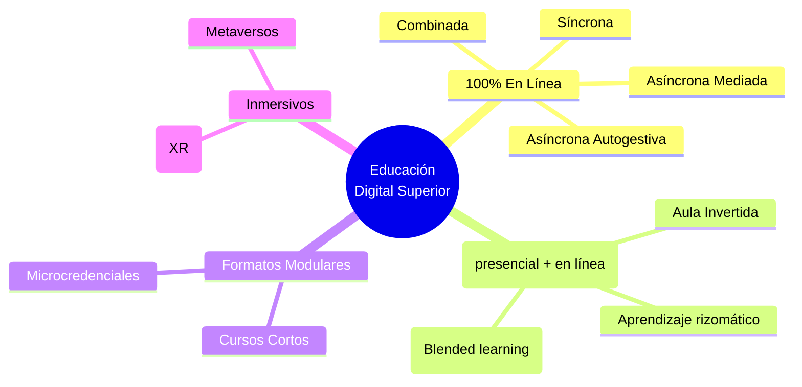

Cuando hablamos de **educación digital** en la educación superior contemporánea, no nos referimos simplemente a la transferencia del aula tradicional a una pantalla mediante plataformas de videoconferencia. Nos referimos a un **ecosistema de prácticas pedagógicas** mediadas por tecnología, donde la relación del estudiante con el conocimiento, con sus pares y con los docentes se rediseña para potenciar el análisis crítico, la autonomía y el aprendizaje activo.

La educación digital trasciende el uso procedimental de herramientas; implica el diseño de experiencias, espacios y secuencias didácticas donde la tecnología es una condición constitutiva y no un mero accesorio. En este paradigma, el aprendizaje opera en una lógica de red: los nodos se interconectan creando agenciamientos donde el estudiante no solo apropia contenidos, sino que los cuestiona y produce.

  <h4 class="text-blue-700 dark:text-blue-300 m-0 text-lg flex items-center">
    <svg class="w-5 h-5 mr-2" fill="none" stroke="currentColor" viewBox="0 0 24 24"><path stroke-linecap="round" stroke-linejoin="round" stroke-width="2" d="M13 16h-1v-4h-1m1-4h.01M21 12a9 9 0 11-18 0 9 9 0 0118 0z"></path></svg>
    Punto Clave
  </h4>
  
La educación digital desplaza el foco del "entregable final" hacia las decisiones epistémicas y los procesos. Evaluamos cómo el estudiante llega a una respuesta, las fuentes que filtra y las interacciones que establece.

 <!-- Placeholder para ilustrar -->

---

## Taxonomía de Formas de Educación Digital

A medida que las tecnologías maduran, la clasificación de las modalidades se vuelve un entramado complejo. A continuación, proponemos una taxonomía estructurada para la educación superior que clarifica las variantes más relevantes hoy en día.

### 1. Totalmente en Línea (E-learning)
Se caracteriza porque el 100% de la carga lectiva y del diseño instruccional ocurre en el ecosistema digital, sin dependencia de espacios físicos institucionales compartidos.

*   **Síncrona:** La docencia ocurre en tiempo real. Aunque existe la distancia física, el docente y el estudiante coinciden temporalmente (videoconferencias inmersivas, aulas virtuales, laboratorios en vivo).
*   **Asíncrona Autogestiva:** Los módulos están diseñados para ser consumidos y resueltos al propio ritmo del estudiante. La intervención docente suele limitarse a retroalimentación posterior, predominando la lectura de materiales interactivos y evaluaciones automatizadas.
*   **Asíncrona Mediada (Con un tutor en el lazo):** Se cursa en diferido, pero existen hitos, foros, debates en diferido y retroalimentación iterativa donde la presencia cognitiva del docente es alta aunque no compartan el mismo espacio temporal.
*   **Combinada (Síncrona + Asíncrona):** Un diseño balanceado que alterna sesiones directas para discusión y trabajo en equipo con lapsos autogestivos para lecturas y producción.

### 2. Aprendizaje Híbrido (Blended / Mixto)
Combina el aprendizaje presencial con los componentes digitales, donde ambos espacios se integran pedagógicamente y no son repeticiones del uno en el otro.

*   **Blended Tradicional:** Se intercambia parte del tiempo de encuentro presencial por interacciones y contenidos en línea compensatorios (ej. 50% de las clases ocurren en la facultad, 50% a través del campus virtual).
*   **Aula Invertida (Flipped Classroom):** El contenido expositivo, que exige menor carga cognitiva inicial, se aborda fuera del aula (videos, IA, simuladores). El espacio presencial se reserva rigurosamente para el *aprendizaje activo*, debates éticos, ABP y resolución de problemas.
*   **Híbrido Flexible (HyFlex):** Otorga al estudiante la elección continua y modular de asistir en persona, sincrónicamente en línea o de forma asíncrona sesión a sesión, bajo el principio de que los resultados de aprendizaje deben ser equivalentes sin importar el canal.

### 3. Modelos Modulares y Micro-Certificación
Las arquitecturas curriculares cambian de titulación macro a vías personalizadas que acreditan competencias precisas.

*   **Microcredenciales:** Rutas de aprendizaje breves y validadas a través de insignias digitales (*badges*). Pueden cursarse bajo cualquier modalidad (híbrida o en línea). Su fuerza recae en la comprobación atómica de saberes (ej. "Ingeniería de Prompts para Ciencias de la Salud") enlazables *(stackable)* para lograr credenciales mayores.
*   **MOOCs y SPOCs:** Cursos masivos (*Massive Open Online Courses*) y sus variantes a pequeña escala orientadas (*Small Private Online Courses*), utilizados frecuentemente en la educación continua y como refuerzos autogestivos dentro del currículo formal.

### 4. Entornos e Interfaces Inmersivas (Fronteras)
Modalidades en constante evolución impulsadas por interacciones tridimensionales y simulaciones de punta.

*   **Educación Inmersiva (Realidad Extendida - XR):** Ambientes basados en Realidad Virtual, Aumentada y Mixta. Primordial en los saberes instrumentales (medicina, ingeniería), pues permite el "aprender haciendo" ante variables clínicas o de diseño en ambientes seguros mediante avatares y simulaciones.
*   **Aprendizaje Distribuido y Web 3.0 / Metaversos Educativos:** Prácticas donde los entornos espaciales digitales se combinan con sistemas de acreditación mediante *blockchain*, descentralizando la universidad y empoderando al estudiante como dueño de sus portafolios hipermedia.

  <h4 class="text-amber-700 dark:text-amber-300 m-0 text-lg flex items-center">
    <svg class="w-5 h-5 mr-2" fill="none" stroke="currentColor" viewBox="0 0 24 24"><path stroke-linecap="round" stroke-linejoin="round" stroke-width="2" d="M12 9v2m0 4h.01m-6.938 4h13.856c1.54 0 2.502-1.667 1.732-3L13.732 4c-.77-1.333-2.694-1.333-3.464 0L3.34 16c-.77 1.333.192 3 1.732 3z"></path></svg>
    Alerta Docente
  </h4>
  
Independientemente de la estrategia adoptada, evitar la simple "distribución espectral". Un modelo autogestivo donde el docente asume que la IA se encargará ciegamente del alumno, traiciona el verdadero propósito del encuadre digital.

---

### Diagrama General de la Taxonomía

A continuación, visualizamos este encuadre interconectado:

**Reflexión Final:** Elegir en nuestro diseño instruccional una modalidad sobre otra no es una mera cuestión presupuestal o logística. Responde a qué **competencias formativas** e interactividad epistémica queremos construir con nuestra clase.
