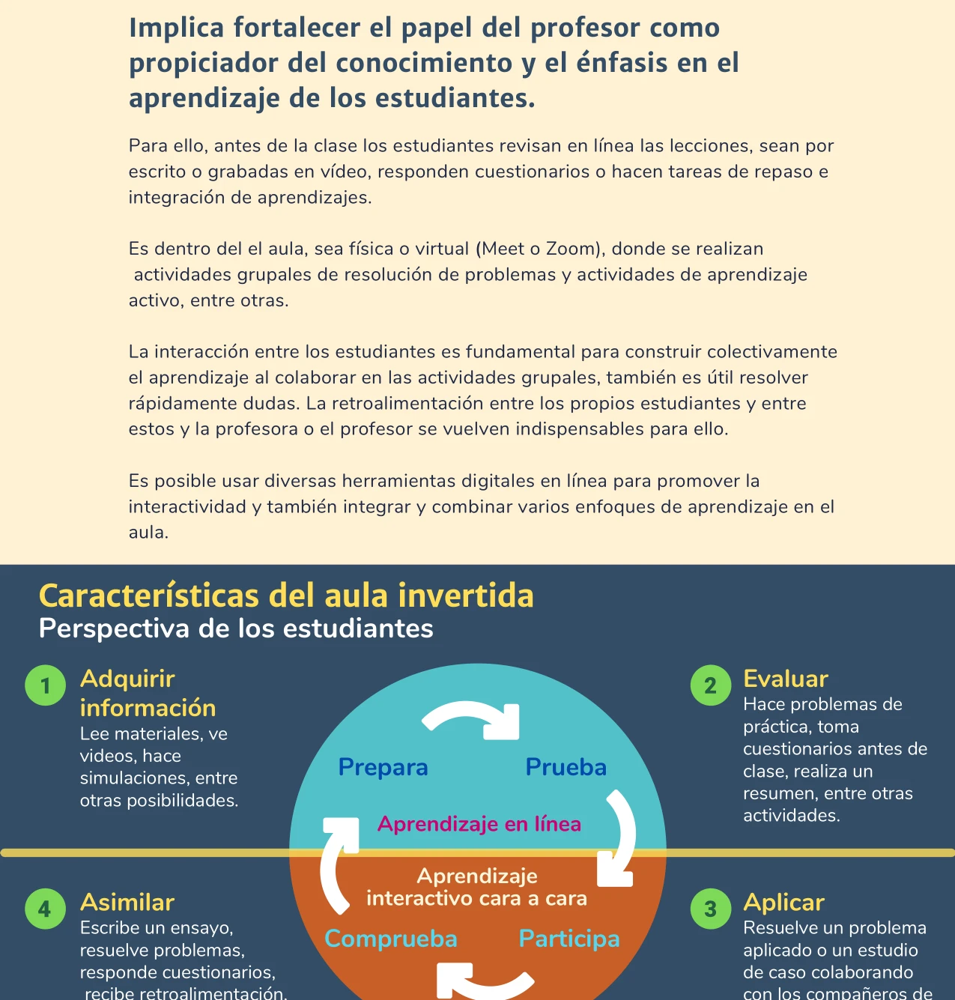
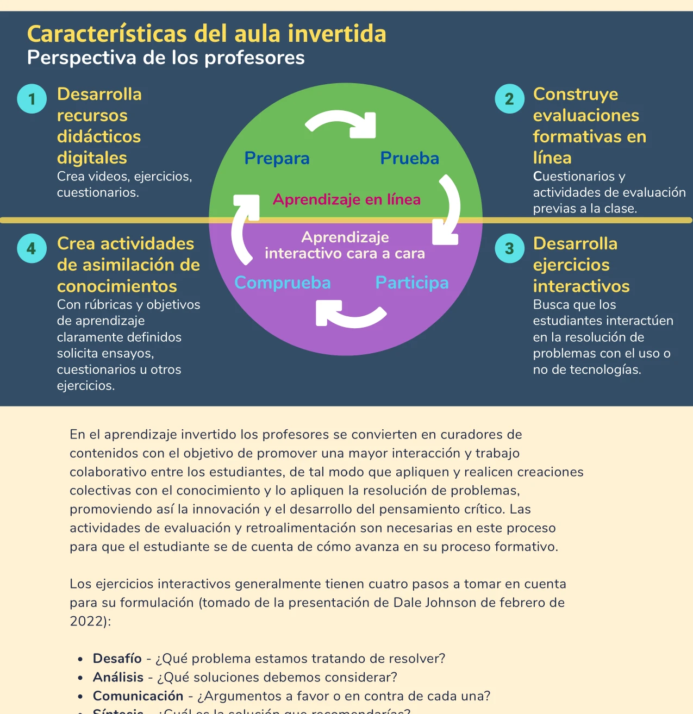


El aula invertida (*flipped classroom*) fortalece el papel del profesor como propiciador del conocimiento y coloca el énfasis en el aprendizaje de los estudiantes. La instrucción directa se traslada fuera del aula; el tiempo presencial se reserva para actividades de profundización y aplicación.


## En qué consiste

Antes de la clase los estudiantes revisan en línea las lecciones, ya sean por escrito o grabadas en video, responden cuestionarios o realizan tareas de repaso e integración. Es dentro del aula —sea física o virtual (Meet, Zoom)— donde se realizan actividades grupales de resolución de problemas y [aprendizaje activo]() (Reidsema et al., 2017; Santiago & Bergmann, 2018).

La interacción entre los estudiantes es fundamental para construir colectivamente el aprendizaje al colaborar en actividades grupales. La retroalimentación entre los propios estudiantes y entre estos y el profesor se vuelve indispensable. Es posible usar diversas herramientas digitales en línea para promover la interactividad y combinar varios enfoques de aprendizaje en el aula.

## Perspectiva del estudiante

El ciclo de aprendizaje del estudiante en el aula invertida sigue cuatro fases:

| Fase | Momento | Actividad |
|------|---------|-----------|
| **1. Adquirir información** | Antes de clase (en línea) | Lee materiales, ve videos, hace simulaciones |
| **2. Evaluar** | Antes de clase (en línea) | Resuelve problemas de práctica, responde cuestionarios, elabora resúmenes |
| **3. Aplicar** | Durante la clase (cara a cara) | Resuelve un problema aplicado o un estudio de caso colaborando con compañeros |
| **4. Asimilar** | Después de clase | Escribe un ensayo, resuelve problemas, responde cuestionarios, recibe retroalimentación |

Las fases 1 y 2 (*prepara* y *prueba*) ocurren en el entorno de **aprendizaje en línea**. Las fases 3 y 4 (*participa* y *comprueba*) ocurren en el espacio de **aprendizaje interactivo cara a cara**.

## Perspectiva del profesor

El profesor también tiene un ciclo de cuatro fases correspondiente:

| Fase | Actividad |
|------|-----------|
| **1. Desarrollar recursos didácticos digitales** | Crea videos, ejercicios y cuestionarios para el trabajo previo a la clase |
| **2. Construir evaluaciones formativas en línea** | Diseña cuestionarios y actividades de evaluación que los estudiantes completan antes de la sesión |
| **3. Desarrollar ejercicios interactivos** | Diseña actividades donde los estudiantes interactúen en la resolución de problemas, con o sin tecnología |
| **4. Crear actividades de asimilación** | Diseña actividades con rúbricas y objetivos de aprendizaje definidos: ensayos, cuestionarios, ejercicios |

En el aula invertida los profesores se convierten en curadores de contenidos con el objetivo de promover una mayor interacción y trabajo colaborativo entre los estudiantes, de tal modo que apliquen y realicen creaciones colectivas con el conocimiento y lo apliquen a la resolución de problemas (Universidad de Guadalajara, 2022; Talbert, 2017).

## Diseño de ejercicios interactivos

Los ejercicios interactivos generalmente siguen cuatro pasos (adaptado de la presentación de Dale Johnson, Arizona State University, 2022):

1. **Desafío**: ¿Qué problema estamos tratando de resolver?
2. **Análisis**: ¿Qué soluciones debemos considerar?
3. **Comunicación**: ¿Argumentos a favor o en contra de cada una?
4. **Síntesis**: ¿Cuál es la solución que recomendarías?

Este esquema promueve la innovación y el desarrollo del pensamiento crítico. Las actividades de [evaluación y retroalimentación]() son necesarias en cada fase para que el estudiante se dé cuenta de cómo avanza en su proceso formativo.

## Relación con la taxonomía de Bloom

El aula invertida reconfigura la relación con la [taxonomía de Bloom](). En el modelo tradicional, el tiempo presencial se dedica a los niveles inferiores (recordar, entender) mediante conferencias del profesor, y los niveles superiores (aplicar, analizar, evaluar, crear) quedan como tarea que el estudiante enfrenta solo.

En el aula invertida esta relación se invierte:

- **Antes de la clase** (en línea): los estudiantes trabajan los niveles de *recordar* y *entender* revisando videos y materiales.
- **Durante la clase** (presencial): el tiempo se dedica a actividades de *aplicar*, *analizar*, *evaluar* y *crear*, con el apoyo del profesor y la colaboración entre pares.

## Relación con el aprendizaje híbrido

El aula invertida es un componente central del [aprendizaje híbrido](). Proporciona la estructura que organiza la relación entre el trabajo asincrónico en línea y el tiempo presencial. A medida que los estudiantes desarrollan mayor autonomía, la proporción de trabajo en línea puede incrementarse progresivamente.

## Referencias

- Capone, R., De Caterina, P., & Mazza, G. (2017). *Blended Learning, Flipped Classroom and Virtual Environment: Challenges and Opportunities for the 21st Century Students*.
- Reidsema, C., Kavanagh, L., Hadgraft, R., & Smith, N. (Eds.). (2017). *The Flipped Classroom*. Springer Singapore.
- Santiago, R., & Bergmann, J. (2018). *Aprender al revés: Flipped Learning 3.0 y metodologías activas en el aula*. Ediciones Paidós.
- Talbert, R. (2017). *Flipped Learning: A Guide for Higher Education Faculty*. Stylus Publishing.
- Universidad de Guadalajara. (2022). *Aprendizaje Híbrido y Activo para el Éxito Estudiantil*. (Documento interno).
