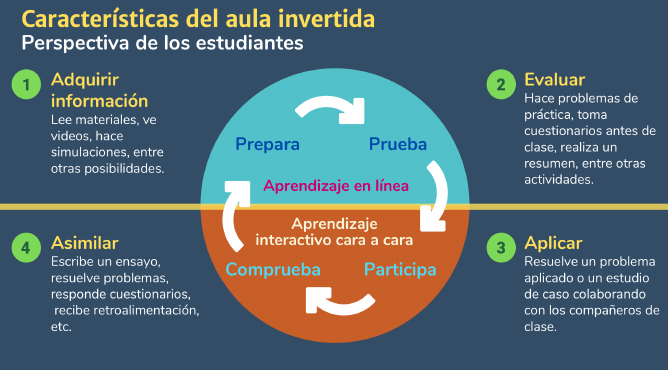
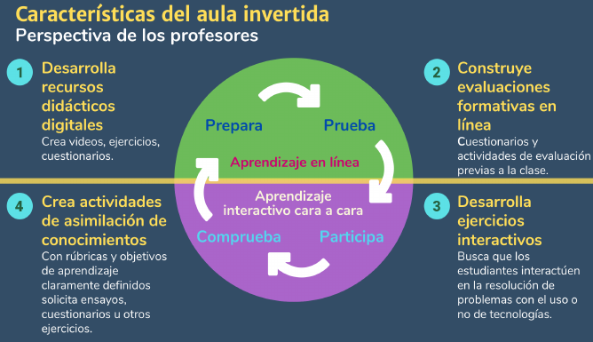

{{< contrato quien="Docentes que dan la explicación en clase y dejan los problemas de tarea, y ven que el grupo llega a la sesión sin haber leído nada y se va sin haber practicado." haras="Vas a tomar una semana de tu materia y repartir su contenido en las cuatro fases del ciclo: qué revisa el grupo antes (un video o una lectura), qué responde antes (un cuestionario corto), qué resuelve en clase contigo (un caso o un problema por equipos) y qué entrega después (un reporte breve)." tendras="Una tabla de cuatro filas con la semana repartida (por ejemplo: «Antes: video de 8 minutos y cuestionario de 5 preguntas · En clase: caso por equipos ‘¿qué prueba conviene para comparar estos dos grupos?’ · Después: reporte breve con retroalimentación»). Es la fila que pegas en tu planeación." tarda="Diez minutos para leer el ciclo y la semana de estadística; veinte para repartir una semana tuya." ejemplo="Abajo está la semana de un curso de estadística ya repartida en las cuatro fases. Léela primero y después llena la tabla con una semana tuya en «Arma una semana tuya»." >}}

## Una semana de estadística, ya repartida

Un docente de estadística repartió así la semana en que enseña a comparar dos grupos:

| Fase | Cuándo | Lo que hace el grupo |
|---|---|---|
| 1. Adquirir información | Antes de clase, en línea | Ve un video de ocho minutos y lee dos textos cortos sobre pruebas de comparación. |
| 2. Evaluar | Antes de clase, en línea | Responde un cuestionario de cinco preguntas que la plataforma califica sola. |
| 3. Aplicar | En el salón, por equipos | Resuelve un estudio de caso: «¿qué prueba conviene para comparar estos dos grupos?». |
| 4. Asimilar | Después de clase | Entrega un reporte breve individual y recibe retroalimentación comentada. |

Lo que antes ocupaba la sesión (la explicación de las pruebas) se movió al video y al cuestionario; la sesión quedó para el caso, donde el docente ve a cada equipo decidir. Esa tabla de cuatro filas es lo que esta página te pide armar con una semana tuya.

## En qué consiste

El aula invertida (*flipped classroom*) traslada la explicación fuera del aula y reserva el tiempo presencial para practicar y aplicar con el docente presente. Antes de la clase los estudiantes revisan en línea las lecciones, ya sean por escrito o grabadas en video, responden cuestionarios o realizan tareas de repaso e integración. Es dentro del aula —sea física o virtual (Meet, Zoom)— donde se realizan actividades grupales de resolución de problemas y [aprendizaje activo]() (Reidsema et al., 2017; Santiago & Bergmann, 2018).

La interacción entre los estudiantes es fundamental para construir colectivamente el aprendizaje al colaborar en actividades grupales. La retroalimentación entre los propios estudiantes y entre estos y el profesor se vuelve indispensable. Es posible usar diversas herramientas digitales en línea para promover la interactividad y combinar varios enfoques de aprendizaje en el aula.

## Perspectiva del estudiante

El ciclo de aprendizaje del estudiante en el aula invertida sigue cuatro fases:

| Fase | Momento | Actividad |
|------|---------|-----------|
| **1. Adquirir información** | Antes de clase (en línea) | Lee materiales, ve videos, hace simulaciones |
| **2. Evaluar** | Antes de clase (en línea) | Resuelve problemas de práctica, responde cuestionarios, elabora resúmenes |
| **3. Aplicar** | Durante la clase (cara a cara) | Resuelve un problema aplicado o un estudio de caso colaborando con compañeros |
| **4. Asimilar** | Después de clase | Escribe un ensayo, resuelve problemas, responde cuestionarios, recibe retroalimentación |

Las fases 1 y 2 (*prepara* y *prueba*) ocurren en el entorno de **aprendizaje en línea**. Las fases 3 y 4 (*participa* y *comprueba*) ocurren en el espacio de **aprendizaje interactivo cara a cara**.

La semana de estadística de arriba recorre exactamente estas cuatro fases: video y lecturas (1), cuestionario (2), caso por equipos (3) y reporte con retroalimentación (4).

## Perspectiva del profesor

El profesor también tiene un ciclo de cuatro fases correspondiente:

| Fase | Actividad |
|------|-----------|
| **1. Desarrollar recursos didácticos digitales** | Crea videos, ejercicios y cuestionarios para el trabajo previo a la clase |
| **2. Construir evaluaciones formativas en línea** | Diseña cuestionarios y actividades de evaluación que los estudiantes completan antes de la sesión |
| **3. Desarrollar ejercicios interactivos** | Diseña actividades donde los estudiantes interactúen en la resolución de problemas, con o sin tecnología |
| **4. Crear actividades de asimilación** | Diseña actividades con rúbricas y objetivos de aprendizaje definidos: ensayos, cuestionarios, ejercicios |

En el aula invertida los profesores se convierten en curadores de contenidos con el objetivo de promover una mayor interacción y trabajo colaborativo entre los estudiantes, de tal modo que apliquen y realicen creaciones colectivas con el conocimiento y lo apliquen a la resolución de problemas (Universidad de Guadalajara, 2022; Talbert, 2017).

Los dos ciclos se engranan: lo que el profesor produce en sus fases 1 y 2 es exactamente lo que el estudiante consume en las suyas, y lo que el estudiante hace en el aula (su fase 3) solo es posible si el profesor diseñó antes el ejercicio interactivo (su fase 3). Si una fase del ciclo del profesor falta, el ciclo del estudiante se rompe en el mismo punto.

## Arma una semana tuya

Toma una semana de tu materia, la que más te pese explicar, y llena las cuatro filas como en el caso de estadística:

1. **Antes, para adquirir información:** anota qué verá o leerá el grupo (un video de menos de diez minutos, una lectura corta) y dónde lo encuentra.
2. **Antes, para evaluar:** escribe las cinco preguntas o el ejercicio corto que responderán antes de llegar, y cómo sabrás quién lo hizo.
3. **En clase, para aplicar:** describe el caso o problema que resolverán por equipos contigo presente; escríbelo como pregunta («¿qué prueba conviene…?»).
4. **Después, para asimilar:** di qué entregan (un reporte breve, un problema resuelto) y qué retroalimentación recibirán.

Si una fila te queda vacía, ahí es donde el ciclo se te rompe: casi siempre es la fila 3, porque la sesión sigue ocupada por la explicación. Esa tabla de cuatro filas es tu planeación de la semana.

## Diseño de ejercicios interactivos

Los ejercicios interactivos generalmente siguen cuatro pasos (adaptado de la presentación de Dale Johnson, Arizona State University, 2022):

1. **Desafío**: ¿Qué problema estamos tratando de resolver?
2. **Análisis**: ¿Qué soluciones debemos considerar?
3. **Comunicación**: ¿Argumentos a favor o en contra de cada una?
4. **Síntesis**: ¿Cuál es la solución que recomendarías?

Usa estos cuatro pasos para escribir el caso de tu fila 3: el desafío es la pregunta que planteas, y las otras tres son lo que el equipo hace en el salón. Las actividades de [evaluación y retroalimentación]() son necesarias en cada fase para que el estudiante se dé cuenta de cómo avanza en su proceso formativo.

## Relación con la taxonomía de Bloom

El aula invertida reconfigura la relación con la [taxonomía de Bloom](). En el modelo tradicional, el tiempo presencial se dedica a los niveles inferiores (recordar, entender) mediante conferencias del profesor, y los niveles superiores (aplicar, analizar, evaluar, crear) quedan como tarea que el estudiante enfrenta solo.

En el aula invertida esta relación se invierte:

- **Antes de la clase** (en línea): los estudiantes trabajan los niveles de *recordar* y *entender* revisando videos y materiales.
- **Durante la clase** (presencial): el tiempo se dedica a actividades de *aplicar*, *analizar*, *evaluar* y *crear*, con el apoyo del profesor y la colaboración entre pares.

## Relación con el aprendizaje híbrido

El aula invertida es un componente central del [aprendizaje híbrido](). Proporciona la estructura que organiza la relación entre el trabajo asincrónico en línea y el tiempo presencial. A medida que los estudiantes desarrollan mayor autonomía, puedes subir la proporción de trabajo en línea: por ejemplo, pasar de una semana invertida al mes a una unidad completa.

## Referencias

- Capone, R., De Caterina, P., & Mazza, G. (2017). *Blended Learning, Flipped Classroom and Virtual Environment: Challenges and Opportunities for the 21st Century Students*.
- Reidsema, C., Kavanagh, L., Hadgraft, R., & Smith, N. (Eds.). (2017). *The Flipped Classroom*. Springer Singapore.
- Santiago, R., & Bergmann, J. (2018). *Aprender al revés: Flipped Learning 3.0 y metodologías activas en el aula*. Ediciones Paidós.
- Talbert, R. (2017). *Flipped Learning: A Guide for Higher Education Faculty*. Stylus Publishing.
- Universidad de Guadalajara. (2022). *Aprendizaje Híbrido y Activo para el Éxito Estudiantil*. Documento institucional de circulación interna, sin versión pública disponible; se cita como antecedente del marco institucional de aprendizaje híbrido.
