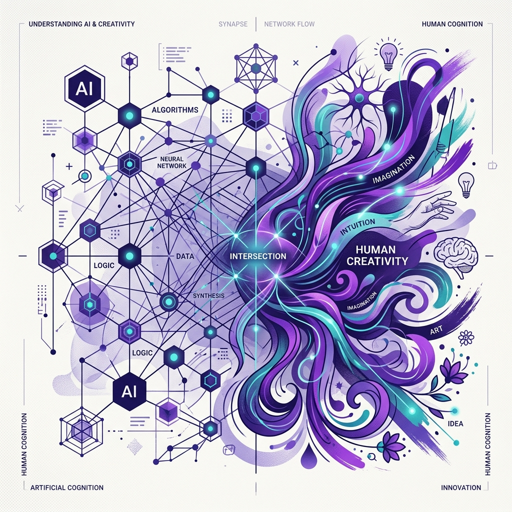

## El cambio en la autoría humana

La aparición de la inteligencia artificial (IA) capaz de crear imágenes, textos o música desafía la idea clásica de que la creatividad pertenece de forma exclusiva a los seres humanos (Kamei, 2026). Tradicionalmente, se asume que el arte requiere siempre consciencia e intención por parte de un creador. En la actualidad, las herramientas analizadas en el [Observatorio de IA](/observatorio/), como los sistemas de generación visual o los robots artísticos como Ai-Da, logran producir obras complejas sin tener mente propia ni consciencia subjetiva (Kamei, 2026). 

Esto indica que la creatividad ahora debe entenderse de un modo diferente. Más que un talento aislado, pasa a ser un proceso distribuido en el que participan la infraestructura del programa informático, las inmensas bases de datos y la persona que da las instrucciones o interactúa con el sistema (Kamei, 2026). Este tipo de interacciones modulan profundamente la experimentación que ocurre en escenarios como el [Laboratorio de Prácticas](/laboratorio/).

## La pérdida de la confianza y el problema de los "deepfakes"

La proliferación de tecnologías de generación audiovisual realista, comúnmente llamadas *deepfakes*, cambia el modo en que juzgamos la veracidad de la información visual. Históricamente, las fotografías y los videos han servido como evidencia documental de la realidad (Kamei, 2026). Hoy en día, la IA es capaz de simular la realidad con tanta precisión que diluye la diferencia entre un hecho real y uno fabricado. 

Esta pérdida de la fiabilidad visual y el aumento de la manipulación afecta los productos y recursos digitales. Como destaca Kamei (2026), el problema de fondo no es solamente que estas herramientas faciliten el engaño, sino que destruyen el criterio general de certeza, causando que incluso las evidencias reales puedan descartarse como falsas. Esta transformación exige que las estrategias integradas en la [Formación docente continua](/formacion-docente/) orienten esfuerzos a enseñar alfabetización crítica para mitigar esta crisis de información.

## El trabajo detrás de la IA y los derechos de autor

Es frecuente percibir la IA como una herramienta que trabaja de manera autónoma, ocultando el esfuerzo y labor que requiere para funcionar. No obstante, Kamei (2026) resalta que estos sistemas concentran capas invisibles de trabajo humano que abarcan desde el desarrollo de software hasta la recopilación meticulosa y evaluación de datos. 

Este método de producción genera conflictos serios frente al marco legal actual de derechos de autor. Las leyes estipulan que una obra derivará de un único autor identificable; sin embargo, los algoritmos operan combinando conocimientos del acervo cultural y el trabajo de miles de autores sin intención directa. Debido a esta complejidad técnica y falta de transparencia sobre la procedencia de los contenidos que alimentan a los algoritmos, resulta imposible adjudicar la propiedad intelectual a una sola entidad bajo criterios tradicionales (Kamei, 2026). Como respuesta, los sistemas normativos deben adoptar métodos más flexibles enfocados a rastrear el ensamble de datos en lugar de atribuir la autoría pura.

## Referencias

Kamei, M. (2026). AI-Generated art and media: Ethical quandaries and creativity beyond anthropocentrism. *Journal of Informatics Education and Research*, *6*(2), 53-66.
