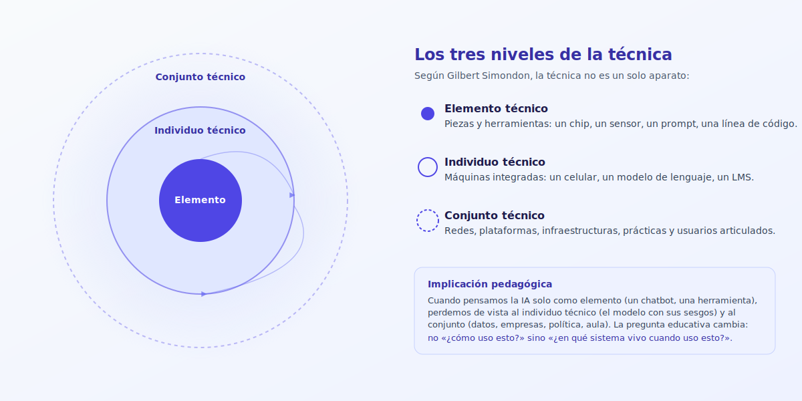
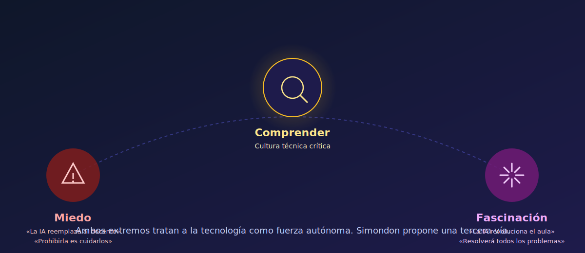


El debate sobre la inteligencia artificial en la universidad suele oscilar entre dos preguntas pobres: ¿la permitimos o la prohibimos?, ¿es una amenaza o una revolución? Este estudio propone una tercera pregunta, más difícil y más fértil: ¿en qué **mundoambiente** técnico estamos aprendiendo y enseñando, y qué cultura necesitamos para habitarlo con criterio?


## El falso debate: herramienta o amenaza

Durante una década, los discursos sobre tecnología educativa se plantearon casi siempre en clave instrumental. La pregunta era cómo usar el celular, el LMS, la plataforma o el asistente generativo: bien o mal, con criterio o sin él, para innovar o para facilitar el fraude. La tecnología aparecía como una herramienta externa, neutra en sí misma, a la que la pedagogía tenía que domesticar.

El problema es que esa pregunta ya no describe lo que ocurre. Los objetos digitales contemporáneos —y la IA generativa de forma particular— no son objetos que usamos de manera puntual y luego dejamos: son entornos en los que vivimos, estudiamos, trabajamos y nos relacionamos. Pensar la IA como herramienta es, hoy, una descripción empobrecida del fenómeno (Costa, 2021). El enfoque que la [política institucional de IA](/recursos/politica-ia-udeg/) de la UDG lleva al terreno operativo empieza mucho antes, en una decisión conceptual: qué es, para nosotros, una tecnología.

Faro Digital y autoras como Mariana Moyano llevan años insistiendo en un punto análogo: las tecnologías digitales no son neutras y no dependen exclusivamente del uso que les damos. Como toda invención, cargan una intención desde su diseño; detrás de cada interfaz hay decisiones económicas, políticas y culturales que orientan el comportamiento de quienes la utilizan (Faro Digital, 2024). Preguntar por la IA en el aula sin preguntar por quién la diseña, con qué objetivo y qué relaciones sociales produce es esquivar la mitad del problema.

## De la herramienta al mundoambiente

La filósofa e investigadora argentina Flavia Costa propone una imagen útil para nombrar lo que ha cambiado: las tecnologías digitales, y en especial las IA generativas, funcionan como **mundoambiente**. No son un objeto discreto al que nos acercamos, sino el entorno en el que tramitamos identidades, angustias, vínculos, aprendizajes y decisiones cotidianas (Costa, 2021).

Costa propone además que las IA operan como **metatecnologías**: tecnologías de propósito general que regulan y organizan a otras tecnologías. Un modelo de lenguaje no es solo un producto; es una capa que atraviesa la búsqueda, la redacción, la traducción, la evaluación, la atención al estudiante y la producción de materiales. Por eso, sacar el celular del aula no resuelve la cuestión: los estudiantes y docentes siguen viviendo en ese mundoambiente fuera del aula —y, cada vez más, dentro, aunque no se use el celular (Faro Digital, 2024).

Trasladado a la universidad, el desplazamiento conceptual obliga a revisar varias de las discusiones instaladas. El debate sobre [plagio y autenticidad en la era de la IA](/ia-educacion/etica-y-transparencia/plagio-autenticidad-era-ia/), por ejemplo, deja de ser solo un asunto de detección y políticas disciplinarias cuando se entiende que la IA es parte del ecosistema en el que los estudiantes leen, escriben y piensan todos los días. El problema pedagógico no es cómo blindar la evaluación contra un contaminante externo; es cómo enseñar y valorar el aprendizaje en un entorno donde la IA es parte constitutiva del trabajo intelectual.

## Simondon: los tres niveles de la técnica

Para dar densidad a esta reorientación, conviene volver a Gilbert Simondon (1958/2007). Su *Modo de existencia de los objetos técnicos* es una de las tentativas más sistemáticas para pensar la técnica sin reducirla ni a instrumento ni a amenaza. Simondon propone distinguir tres niveles en los objetos técnicos, porque cada nivel pide preguntas distintas.

El **elemento técnico** es la pieza o herramienta: un chip, un sensor, una línea de código, un prompt. El **individuo técnico** es la máquina integrada: un celular, un modelo de lenguaje, una plataforma LMS. El **conjunto técnico** es la red de relaciones en la que esa máquina vive: los centros de datos, los equipos que la diseñan, los marcos legales, los mercados, las prácticas pedagógicas y los usuarios (Simondon, 1958/2007).

La relevancia educativa del esquema es inmediata. Cuando un programa de formación docente se concentra únicamente en el elemento —«aprender a usar esta herramienta»— omite las preguntas que suceden en los otros niveles. ¿Cómo está construido el individuo técnico? ¿Qué sesgos arrastra? ¿Qué incentivos económicos estructuran el conjunto del que forma parte? La alfabetización crítica de la que hablamos en [Alfabetización crítica en IA](/ia-educacion/etica-y-transparencia/alfabetizacion-critica-ia/) se vuelve operativa en el momento en que una propuesta didáctica recorre los tres niveles, en vez de quedarse en el nivel del botón.

## Lo transindividual: aprender es aprender a vivir juntos

Simondon tiene otro concepto clave para la educación: lo **transindividual**. Las personas no existen como individuos aislados que después se conectan: nos constituimos siempre en relación con otros, con los entornos y con las técnicas que empleamos (Simondon, 1958/2007). Los objetos técnicos, lejos de ser externos, condensan historia, conocimiento y relaciones sociales; cuando aprendemos a usarlos, estamos entrando en una forma colectiva de vivir.

Aplicado a la IA, lo transindividual explica por qué resulta insuficiente reducir el problema a la competencia individual —cada quien que aprenda a escribir mejores prompts—. Los modelos de lenguaje articulan miles de millones de textos humanos; usar uno implica insertarse en una infraestructura cultural compartida. En los términos de Costa (2021), habitamos una **Sociedad Artificial** en la que nuestras prácticas cognitivas están intermediadas por capas técnicas que fueron decididas por otros. La pregunta pedagógica se amplía: ¿qué significa formar sujetos autónomos en un entorno que ya no es privado, ni individual, ni neutro?

Aquí conviene retomar una intuición que orienta las [prácticas de aprendizaje activo con IA](/laboratorio/practicas/aprendizaje-activo-ia/) del Laboratorio: las actividades más fértiles son las que convierten la IA en objeto de reflexión colectiva, no solo en asistente individual. El debate socrático, el análisis de sesgos o la comparación entre modelos —todas metodologías documentadas en ese mismo Laboratorio— funcionan porque sacan la interacción con la IA del espacio privado y la ponen en el espacio de lo común. Aprender se vuelve, otra vez, aprender a vivir juntos con las máquinas que construimos.

## Miedo y fascinación: dos caras del mismo error

La época oscila entre dos afectos igualmente simplificadores. Por un lado, el **miedo**: la IA reemplazará al docente, arruinará el pensamiento crítico, destruirá la evaluación, sustituirá a los profesionales. Por otro, la **fascinación**: la IA personalizará el aprendizaje, resolverá la desigualdad, llegará donde el docente no llega, hará obsoleta la pedagogía tradicional.

Simondon diagnosticaba este oscilar ya en los años cincuenta. Su hipótesis: ambos extremos comparten un error común —tratan a la tecnología como si fuera una fuerza autónoma, ajena a la cultura que la produjo (Simondon, 1958/2007). Ese malentendido, la **alienación** frente a las máquinas, se origina en que la cultura moderna separó la técnica del resto de la vida cultural: filosofía, arte, política y ciencia por un lado; máquinas por otro. Al quedar fuera del pensamiento común, las máquinas aparecen como esclavas —objetos brutos— o como amos —entidades con voluntad propia—. Las dos imágenes son falsas y pedagógicamente paralizantes.

La propuesta de Simondon es distinta: ni temerlas ni fetichizarlas, sino comprender cómo funcionan y qué lugar ocupan en la sociedad que estamos construyendo. A eso llama **cultura técnica**: un saber integrado donde lo técnico, lo filosófico y lo social se piensan juntos.


**Implicación didáctica.** En un curso universitario, la oscilación entre miedo y fascinación suele aparecer en los primeros cinco minutos de conversación sobre IA. Nombrarla explícitamente —y pedir a los estudiantes que identifiquen en qué extremo se ubican— suele ser un buen punto de partida para una actividad de alfabetización crítica. El objetivo no es llevar a nadie a un término medio tibio, sino abrir la tercera vía: comprender.


## La universidad como técnica a defender

Si la IA es un mundoambiente, la universidad también lo es: una institución, una técnica histórica y social acumulada a lo largo de siglos. Jan Masschelein y Maarten Simons, retomados por Daniel Brailovsky, proponen pensar la escuela como **entre-paréntesis**: un tiempo y espacio específicos donde las lógicas del mercado y la utilidad inmediata se suspenden para hacer posible el estudio (Masschelein & Simons, 2014; Brailovsky, 2019). La universidad pública comparte ese gesto.

Ese marco evita un malentendido frecuente. Preocuparse por la IA no tiene por qué derivar en un recelo generalizado hacia las tecnologías, ni en una defensa nostálgica de la universidad «de antes». Todo lo contrario: nombrar a la universidad como técnica nos obliga a cuidarla con el mismo criterio con el que Simondon pedía cuidar las máquinas. Es una técnica frágil, históricamente costosa, sujeta a la presión del mercado y de las modas. Es, también, uno de los pocos lugares donde la conversación intergeneracional sobre la tecnología todavía puede suceder con tiempo, con método y con apuesta pública (Faro Digital, 2026).

Por eso, los datos educativos más difíciles de la coyuntura —ausentismo creciente, malestar emocional, violencia simbólica viral— no deberían leerse como una prueba de que la universidad está obsoleta. Son, más bien, la señal de que los mundoambientes digitales en los que viven nuestros estudiantes están produciendo angustias que no encuentran adultos de referencia (Faro Digital, 2026; Dussel, 2020). Que esa conversación suceda dentro de la universidad es precisamente la apuesta.

## Hacia una cultura técnica crítica en el aula

¿Qué implicaciones tiene este giro para la enseñanza universitaria? No se trata de sumar una unidad temática sobre filosofía de la técnica a cada materia, ni de pedir a cada docente que haya leído a Simondon. Se trata, más bien, de un desplazamiento de preguntas que puede operar en cualquier asignatura y en cualquier nivel.

Donde la didáctica instrumental pregunta «¿cómo uso este modelo para esta tarea?», una cultura técnica crítica pregunta también: ¿quién lo diseñó, con qué datos, bajo qué incentivos? ¿Qué relaciones sociales reproduce su uso cotidiano? ¿A quién deja afuera? ¿Qué le pasa a mi pensamiento cuando lo delego? Este último interrogante conecta con el estudio sobre [la paradoja de la descarga cognitiva](/observatorio/estudios/paradoja-descarga-cognitiva/): la IA libera capacidad mental, pero lo que se hace con esa capacidad liberada define si hay aprendizaje o erosión.

En términos didácticos concretos, la cultura técnica crítica se traduce en una serie de desplazamientos pequeños pero acumulativos. Dejar de tratar al prompt como un tecnicismo y empezar a tratarlo como un género discursivo con reglas, sesgos y efectos. Documentar qué modelo y qué versión generó cada salida, del mismo modo en que se documenta una fuente bibliográfica. Leer los «términos de servicio» como se lee un pacto social. Comparar dos modelos frente al mismo problema para que el estudiante vea el artefacto, no solo el resultado. Integrar, en las rúbricas, no solo «usó IA» o «no usó IA», sino «qué decidió delegar, qué conservó, qué rediscutió» —lo que en el [marco ético institucional](/ia-educacion/etica-y-transparencia/marco-etico-ia-educacion-superior/) denominamos agenciamiento del estudiante.

Ninguno de estos movimientos requiere tecnología nueva. Requiere, en cambio, un cambio de mirada: pasar del uso al funcionamiento, del funcionamiento al conjunto, y del conjunto a la sociedad en la que ese conjunto tiene sentido. Esa es, en síntesis, la cultura técnica que Simondon proponía hace más de sesenta años y que Flavia Costa actualiza para la época del algoritmo.

## Amar las máquinas: una propuesta pedagógica

Simondon cerraba su reflexión con una provocación difícil de traducir: hay que **amar** a las máquinas. No en sentido romántico, sino cultural: reconocer que los objetos técnicos contienen realidad humana —son resultado de invención, trabajo y pensamiento colectivo— y que relacionarnos con ellos implica un cuidado análogo al que tenemos con las obras de cultura (Simondon, 1958/2007).

La figura que propone es la del **director de orquesta**: no un usuario de instrumentos, sino alguien que organiza el conjunto, que escucha las tensiones entre las partes, que toma decisiones sobre el tempo colectivo. Trasladada a la universidad, la imagen sugiere un rol docente distinto al del técnico de plataforma o al del árbitro de la integridad académica. Un docente que, con su grupo, orquesta la relación con las máquinas del mundoambiente: ni las ignora, ni las adora, ni las teme; las entiende y enseña a entenderlas.

Este enfoque es, también, la apuesta de fondo del Observatorio: no ofrecer recetas sobre qué herramienta usar esta semana, sino aportar marcos para pensar qué está pasando con la técnica y con nosotros. En un momento institucional donde la IA se discute con urgencia, la contribución más duradera que una universidad puede hacer no es la de una nueva norma; es la de formar ciudadanas y ciudadanos con cultura técnica crítica —capaces, justamente, de decidir qué normas queremos darnos.

## Referencias

Brailovsky, D. (2019). *Pedagogía (entre paréntesis)*. Centro de Publicaciones Educativas y Material Didáctico.

Costa, F. (2021). *Tecnoceno: Algoritmos, biohackers y nuevas formas de vida*. Taurus.

Dussel, I. (2020). La formación docente y los desafíos de la pandemia. *Revista Educación, Formación e Investigación*, *6*(10), 11-25.

Faro Digital. (2024, julio). *Celulares en la escuela: ¿por qué la tendencia global es sacarlos de las aulas?* [Publicación en redes sociales]. farodigital.org

Faro Digital. (2026, abril). *Ausentismo, amenazas virales y la técnica escuela*. farodigital.org

Masschelein, J., & Simons, M. (2014). *Defensa de la escuela: Una cuestión pública*. Miño y Dávila.

Simondon, G. (2007). *El modo de existencia de los objetos técnicos*. Prometeo. (Obra original publicada en 1958)
