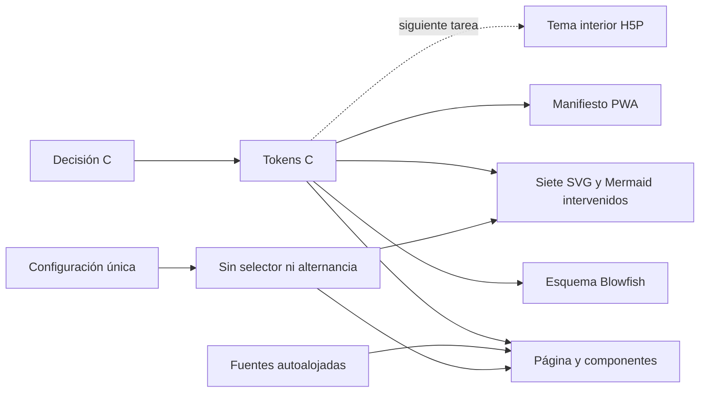

# Identidad C única en Hugo

## Resultado

La dirección **C · Almagre interactivo**, aprobada en UDGIA-001, ya funciona como
identidad única del sitio Hugo en una rama local.

- no existe selector de apariencia;
- el sistema operativo no cambia la paleta;
- una preferencia oscura guardada por una visita anterior se elimina sin borrar otros
  datos locales;
- la página, los siete SVG adaptativos y los Mermaid intervenidos usan el vocabulario C;
- la implementación funciona tanto en la raíz de un dominio como bajo
  `/aprendizaje-ia/`, la forma esperada de GitHub Pages;
- no se modificaron `main`, el despliegue ni Moodle.

Vista previa local:

<http://127.0.0.1:1315/>

## Sistema aplicado

La superficie usa papel `#f5f3ee`; la tinta principal es marina `#18223c`. Los acentos
semánticos son almagre `#b12028`, olivo `#536326`, ocre `#914411` y riesgo `#8b2635`.
El color nunca es la única señal: los gráficos conservan títulos, etiquetas, posición,
trazo y jerarquía.

La tipografía se autoaloja:

| Función | Familia |
|---|---|
| Jerarquía editorial | Piazzolla |
| Lectura continua | Inter |
| Navegación, etiquetas y datos | Archivo Narrow |

## Gráficos corregidos

La primera revisión independiente detectó que retirar la media query oscura no bastaba:
siete SVG todavía conservaban la paleta Ocean y algunos pares de contraste eran
insuficientes. Se corrigieron semánticamente:

1. dilema de habilidades;
2. continuo del aprendizaje híbrido;
3. tabla ICAP;
4. correspondencia SAMR–Bloom;
5. Bloom invertida;
6. diseño inverso;
7. encuesta de la Red Universitaria.

También se reemplazaron los estilos Ocean que aún sobrescribían el Mermaid de la
Taxonomía de Bloom. El contraste mínimo de los pares críticos verificados en gráficos es
**6:1**.

## Compatibilidad con GitHub Pages

La revisión encontró dos supuestos de raíz que habrían fallado en una publicación bajo
subruta:

- las fuentes del bundle CSS;
- las imágenes y enlaces absolutos del shortcode `card`.

Ambos se volvieron relativos a la base del sitio. También se añadió un manifiesto propio
con `start_url` y `scope` relativos, fondo papel C e iconos resolubles bajo la subruta.

## QA

| Prueba | Resultado |
|---|---|
| Build Hugo | 895 páginas, sin errores |
| Rutas representativas | 11 rutas con HTTP 200 |
| Preferencias emuladas | 33 comprobaciones con sistema claro y 33 con sistema oscuro |
| Capturas comparativas | hashes idénticos en artículo SVG, Mermaid y página de transformación |
| Cambio durante una sesión | tokens y geometría idénticos antes y después |
| Breakpoints | 375, 768 y 1280 px, sin overflow |
| Apariencia heredada | `appearance=dark` eliminada; nunca aparece `html.dark` |
| Selector | ausente en escritorio y móvil |
| SVG | 7 XML válidos, sin media query oscura, colores restringidos a C |
| Mermaid Bloom | sin colores Ocean residuales |
| Contraste de cuerpo | 14.21:1 |
| Contraste mínimo en gráficos | 6:1 |
| Fuentes | 6 WOFF2 locales, HTTP 200 |
| Manifiesto | papel C, iconos HTTP 200 |
| Tarjetas | 7/7 enlaces e imágenes dentro de la base, destinos e imágenes HTTP 200, acentos C |
| Privacidad | cero solicitudes fuera de la base del sitio |
| Consola | cero errores y cero excepciones |
| GitHub Pages bajo `/aprendizaje-ia/` | matriz completa aprobada |

La automatización reproducible vive en `tools/qa-single-theme.mjs`.

## Revisión independiente

El revisor principal, distinto del escritor, emitió inicialmente `REQUEST CHANGES` por
tres problemas reales: gráficos aún Ocean, contraste insuficiente y un QA de subruta que
no demostraba la carga de las tarjetas. Después de corregir código, gráficos y pruebas,
emitió **ACCEPT** sobre evidencia reconstruida:

- 66/66 páginas HTTP 200 en raíz y 66/66 bajo `/aprendizaje-ia/`;
- 7/7 tarjetas dentro de la base, cargadas y con imagen/destino HTTP 200;
- paleta C y contraste verificados desde las fuentes;
- cero solicitudes externas, errores de consola o excepciones de página.

Una segunda revisión técnica también emitió `ACCEPT`. Ningún revisor escribió en el
worktree, `main`, Moodle o el grafo.

## Límites y siguiente paso

Esta tarea fija la base transversal C, pero no intenta rediseñar en bloque cada ilustración
histórica. Los SVG hero y otros esquemas sin bifurcación de apariencia permanecen
inventariados para una migración visual explícita; la dirección canónica para intervenirlos
ya es C. Tampoco incorpora todavía el runtime H5P: cada iframe necesitará recibir estos
mismos roles desde una fuente de tokens compartida.

La implementación quedó registrada en el commit local `025d926` de
`codex/UDGIA-002-identidad-c-unica`. No se hizo push, merge, despliegue ni cambio en
Moodle.

Antes de cualquier integración quedan dos pasos:

1. revisión de Rubén en la vista previa;
2. autorización separada para integrar o desplegar.
