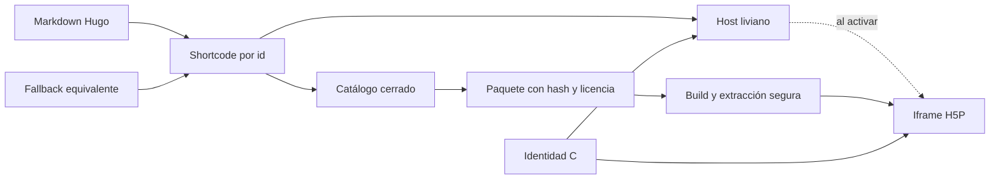
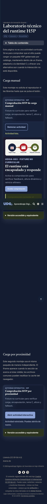
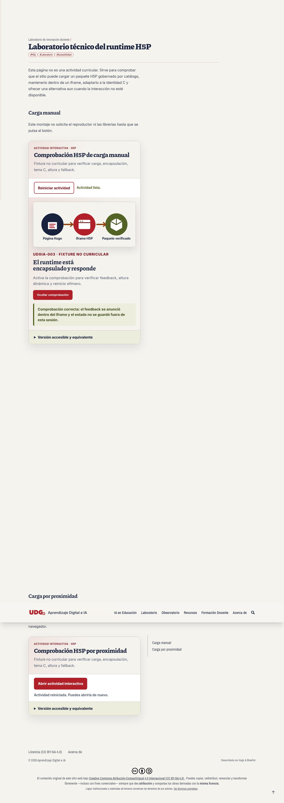

# Runtime H5P gobernado para Hugo

## Resultado

El sitio Hugo ya puede reproducir objetos H5P autoalojados, estilizados con la identidad
C y sin depender de Moodle. UDGIA-003 incorpora la infraestructura y una única fixture
técnica; no adelanta los seis objetos pedagógicos previstos para UDGIA-004.

La implementación se desarrolló en una rama y un worktree aislados; después de cerrar sus
revisiones se integró por fast-forward a `main` y se publicó. El estado técnico vigente
corresponde a `7eabaab`; GitHub Actions `30238618180` completó build, deploy y sonda pública.
Moodle no se modificó.

## Contrato de publicación

El shortcode solo acepta un `id` presente en `data/h5p/catalog.json`; no admite URL
arbitraria. Cada montaje exige una alternativa textual equivalente y permite dos modos:

- `manual`: no descarga el reproductor hasta que la persona activa el botón;
- `visible`: lo carga por proximidad mediante `IntersectionObserver`.

El script del host se emite una vez por página. Cada actividad se encapsula en su propio iframe
con título, `sandbox`, altura dinámica y mensajes validados por origen, ventana e
identificador de instancia. Dos montajes pueden operar y reiniciarse de forma
independiente; los activos comunes reutilizan la caché.

Si JavaScript falla, se agota el tiempo de carga o se imprime la página, permanece una
versión accesible en HTML. Las páginas sin H5P no solicitan ningún byte del runtime.

## Gobierno y reproducibilidad

`h5p-standalone` está fijado exactamente en `3.8.2`, con integridad npm y SHA-256 del
tarball registrados. El `package-lock.json` fija también las herramientas de extracción
y QA.

El pipeline:

1. comprueba el hash del `.h5p`;
2. rechaza rutas absolutas, `..`, entradas cifradas, duplicadas o desnormalizadas,
   enlaces simbólicos y paquetes que excedan los límites;
3. confina la fuente a `h5p/packages/`, valida la procedencia y compara las licencias
   declaradas en catálogo, contenido y biblioteca principal;
4. verifica las dependencias y archivos declarados;
5. genera un manifiesto con tamaño y SHA-256 de cada archivo;
6. compara byte por byte el runtime regenerado con el versionado.

GitHub Actions ejecutará `npm ci --ignore-scripts`, la verificación reproducible y la QA
funcional completa con Chromium antes del build de Hugo. El reproductor consume el `dist`
precompilado, de modo que no necesita scripts de instalación de dependencias. La fixture
original separa licencia de contenido **CC BY-SA 4.0**, biblioteca **MIT**, créditos del
SVG y licencia **MIT** del reproductor.

## Seguridad y límite explícito de confianza

Un paquete H5P contiene código JavaScript, no solo contenido. El iframe exterior usa
`allow-scripts allow-same-origin` porque el reproductor necesita cargar JSON, CSS,
bibliotecas y medios desde el mismo sitio. Esa combinación no aísla código hostil ni
convierte un paquete no confiable en seguro: el control decisivo es aceptar únicamente paquetes revisados,
registrados y bloqueados por hash.

Por ello esta versión:

- no ofrece carga de archivos por autores o visitantes;
- no ejecuta contenido obtenido por URL;
- no conecta con cuentas, cookies, xAPI, LRS, intentos, calificaciones o almacenamiento
  persistente;
- usa una CSP autocontenida que bloquea conexiones y recursos externos; el arranque
  precompilado de H5P exige por ahora `script-src 'unsafe-inline'` dentro del documento
  encapsulado;
- deja como deuda de arquitectura un origen separado si en el futuro se acepta contenido
  arbitrario o de terceros no auditados.

## Presentación

El host y la actividad usan papel, tinta marina, almagre, olivo y los roles semánticos de
la identidad C. Dentro del iframe se cargan Piazzolla e Inter autoalojadas, se reasignan
las variables del tema H5P, se conserva foco visible y se respeta
`prefers-reduced-motion`. La fixture combina texto, un esquema SVG, control y
retroalimentación estilizada.

Las dos capturas del gate son:

**Vista móvil · 375 px**

**Vista de escritorio · 1280 px**

## Portabilidad de publicación

GitHub Pages es el destino vigente, no un requisito del runtime. El build produce un
artefacto estático que puede alojarse en un servidor oficial UDGPlus en raíz o subruta,
si página, player, fuentes y contenidos H5P permanecen bajo el mismo origen.

El contrato de MIME, HTTPS, rutas, query strings, iframe/CSP, caché, Range, publicación
atómica, retención y rollback verificable está en
[`servidor-web-udgplus.md`](../deployment/servidor-web-udgplus.md). La sonda
`tools/h5p/probe-deployment.mjs` permite comprobar cualquier URL después de publicar; el
workflow actual la ejecuta también contra GitHub Pages. El dominio, la subruta y la
plataforma institucional definitivos quedan como parámetros de infraestructura, no
valores codificados en Hugo o H5P.

La sonda pasó sobre un artefacto Hugo 0.155.2 servido en
`http://127.0.0.1:8765/aprendizaje-ia/`: rutas, MIME, query, 404, carga diferida, dos
montajes, teclado, altura, impresión, storage, CSP negativa, integridad de los 43 archivos
inventariados y ausencia de red externa/escrituras. También detectó correctamente las
cuatro carencias deliberadas del servidor temporal de Python: sin Range, caché inmutable
ni cabeceras `nosniff`/`Referrer-Policy`.

La misma sonda pasó al primer intento sobre el despliegue público
`https://arqueon.github.io/aprendizaje-ia/` el [[2026-07-26]] (marca UTC:
`2026-07-27T05:06:03Z`). Verificó los 43 archivos y 1,323,696 bytes del runtime, `Range`
con `206` y `Content-Range: bytes 0-0/22842`, CSP negativa, dos montajes, teclado,
impresión, storage intacto y cero cookies, escrituras o solicitudes externas. GitHub Pages
no ofrece en todas las respuestas la caché anual recomendada, `nosniff` y
`Referrer-Policy`; la sonda los registró como tres advertencias, no como fallos del
artefacto. El servidor oficial UDGPlus deberá configurarlos conforme al contrato.

## QA

| Prueba | Resultado |
|---|---|
| Runtime reproducible | PASS, 43 archivos inventariados más manifiesto |
| Tamaño lógico | 1,323,696 bytes (1.26 MiB) |
| Fixture | una actividad no curricular, `noindex` y ausente de listados |
| Carga diferida | solo `host.js` y `host.css` antes de activar |
| Dos montajes | independientes; reiniciar uno no altera el otro |
| Caché | una llegada de red para `player/main.bundle.js` |
| Altura dinámica | móvil 473→585→445 px; escritorio 481→598→481 px; sin scroll interior |
| Breakpoints | 320, 375, 768 y 1280 px sin overflow |
| Teclado | activación y feedback con Enter |
| Movimiento reducido | transición anulada |
| Fallback | disponible sin JS, ante error deliberado, tras reintento y en impresión |
| Axe | cero violaciones serias o críticas en documento y contenido H5P |
| Privacidad | cero solicitudes externas/WebSockets, escrituras, cookies o cambios en storage; Service Workers bloqueados y estado no restaurado |
| CSP | script y `fetch` externos bloqueados; cero respuestas externas |
| Seguridad ZIP | hash erróneo, traversal, ruta absoluta y symlink rechazados |
| Gobierno de catálogo | id, fuente, licencia de contenido/biblioteca, adaptador y procedencia inválidos rechazados |
| Base URL | PASS en raíz y `/aprendizaje-ia/` |
| Hosting portable | PASS en subruta estática; integridad byte a byte, CSP negativa y rollback definidos |
| Redirección hostil | rechazo antes de contactar un `Location` externo |
| Alteración en servidor | cambio deliberado de `themes/udg-c.css` rechazado por SHA-256 |
| GitHub Pages | `30238618180` success; build, deploy y sonda pública PASS al primer intento |
| Hugo 0.155.2 | 902 páginas, PASS en raíz y subruta |
| Hugo 0.164.0 | 902 páginas, PASS en raíz y subruta |
| Moodle | `moodle_changed: false` |

La evidencia estructurada está en
[`qa-runtime.json`](evidence/udgia-003/qa-runtime.json) para Hugo 0.164.0 y en
[`qa-runtime-hugo-0.155.2.json`](evidence/udgia-003/qa-runtime-hugo-0.155.2.json)
para la versión fijada en CI. La automatización está en `tools/h5p/qa-runtime.mjs`.

## Revisión independiente

El revisor principal, distinto del escritor, emitió primero `REQUEST CHANGES` sobre
`46313f1`. Pidió demostrar el fallback ante error, ausencia de persistencia, compatibilidad
dual de Hugo, gobierno del catálogo, altura bidireccional, ejecución bajo CSP real y una
puerta CI sin fallos enmascarados. Tras revisar el commit exacto `92e1b53`, emitió
**ACCEPT** y dio por cerrados los ocho hallazgos.

Una segunda revisión de seguridad también emitió **ACCEPT** para la fixture original y el
catálogo cerrado. Ambos revisores trabajaron en solo lectura y confirmaron que `main` y
`origin/main` permanecen en `b0a2d85`, sin merge, push, despliegue ni cambios Moodle.

La ampliación para hosting UDGPlus recibió primero `REQUEST CHANGES`: faltaban control
previo de cada redirección, timeout, comparación del artefacto remoto, prueba CSP negativa,
semántica estricta de caché/Range, evidencia post-deploy y rollback concreto. El commit
`b4eb38b` cerró el conjunto y recibió **ACCEPT** del revisor principal y de la segunda
revisión de seguridad. Tras ese dictamen se reforzó además la guarda con bloqueo de Service
Workers/WebSockets y se rechazaron combinaciones de caché contradictorias. La prueba Range
de un archivo audiovisual real corresponde a la puerta que incorpore el primer H5P con
audio o video; hasta entonces la ausencia de `206` bloquea esa familia, no el runtime base.

El primer intento de publicación (`30238391998`) se detuvo antes de desplegar porque el ZIP
de la fixture variaba entre el entorno local y el runner. `7eabaab` eliminó dependencias de
ICU, zona horaria, permisos y zlib al fijar orden, fecha, modo y entradas sin compresión; el
mismo SHA-256 `a53f444…` se reprodujo en UTC, México y UTC+14. El revisor principal emitió
**ACCEPT** sobre esa corrección. La segunda ejecución (`30238618180`) cerró correctamente
las tres fases y conservó como evidencia el artefacto
`udgia-h5p-deployment-7eabaabee8fa90ea8cc61cd850ce70fd22e69ae6`.

Las deudas no bloqueantes quedan explícitas para la siguiente puerta:

- resolver fuentes mediante `realpath`/`lstat` antes de aceptar paquetes externos;
- instrumentar llamadas a Storage y sembrar la clave `requestQueue` usada por H5P Core;
- mover el runtime a otro origen antes de admitir JavaScript de terceros no auditado;
- añadir BOM, registro de parches, revisión y cierre recursivo para bibliotecas complejas;
- actualizar las acciones de GitHub cuando existan versiones compatibles que eliminen la
  advertencia deprecatoria de Node.js 20 del runner;
- repetir la matriz funcional y de privacidad para cada tipo pedagógico de UDGIA-004.

## Fuentes técnicas

- [H5P Standalone 3.8.2](https://github.com/tunapanda/h5p-standalone/releases/tag/v3.8.2)
- [Especificación de paquetes H5P](https://h5p.org/documentation/developers/h5p-specification)
- [Panorama técnico de H5P](https://h5p.org/technical-overview)
- [Licencias en H5P](https://h5p.org/licensing)
- [Sandbox de `iframe`](https://developer.mozilla.org/en-US/docs/Web/HTML/Reference/Elements/iframe)
- [Content Security Policy](https://developer.mozilla.org/en-US/docs/Web/HTTP/Guides/CSP)

## Siguiente gate

UDGIA-003 está listo para que Rubén decida si autoriza su integración y publicación.
Después, UDGIA-004 podrá incorporar el primer conjunto pedagógico por catálogo, con una
adaptación visual por tipo H5P, fallback equivalente, procedencia, licencia y QA propios.
`moodle-dev.arqueonautis.org` seguirá siendo el entorno Moodle de referencia;
`arqueonautis.org/moodle` permanece fuera de este proyecto.
