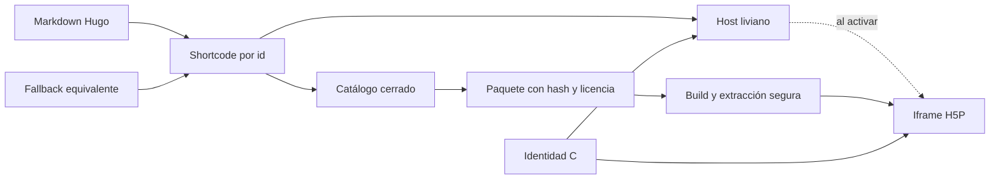

# Runtime H5P gobernado para Hugo

## Resultado

El sitio Hugo ya puede reproducir objetos H5P autoalojados, estilizados con la identidad
C y sin depender de Moodle. UDGIA-003 incorpora la infraestructura y una única fixture
técnica; no adelanta los seis objetos pedagógicos previstos para UDGIA-004.

La implementación queda en una rama y un worktree aislados. No se integró en `main`, no
se publicó y no se modificó Moodle.

## Contrato de publicación

El shortcode solo acepta un `id` presente en `data/h5p/catalog.json`; no admite URL
arbitraria. Cada montaje exige una alternativa textual equivalente y permite dos modos:

- `manual`: no descarga el reproductor hasta que la persona activa el botón;
- `visible`: lo carga por proximidad mediante `IntersectionObserver`.

El script del host se emite una vez por página. Cada actividad vive en su propio iframe
con título, `sandbox`, altura dinámica y mensajes validados por origen, ventana e
identificador de instancia. Dos montajes pueden operar y reiniciarse de forma
independiente; los activos comunes reutilizan la caché.

Si JavaScript falla, se agota el tiempo de carga o se imprime la página, permanece una
versión accesible en HTML. Las páginas sin H5P no solicitan ningún byte del runtime.

## Gobierno y reproducibilidad

`h5p-standalone` está fijado exactamente en `3.8.2`, con integridad npm y SHA-256 del
tarball registrados. El `package-lock.json` fija también las herramientas de extracción
y QA.

El pipeline:

1. comprueba el hash del `.h5p`;
2. rechaza rutas absolutas, `..`, entradas cifradas, duplicadas o desnormalizadas,
   enlaces simbólicos y paquetes que excedan los límites;
3. verifica la biblioteca principal, sus dependencias, archivos declarados y licencia;
4. genera un manifiesto con tamaño y SHA-256 de cada archivo;
5. compara byte por byte el runtime regenerado con el versionado.

GitHub Actions ejecutará `npm ci --ignore-scripts` y `npm run h5p:verify` antes del
build de Hugo. El reproductor consume el `dist` precompilado, de modo que no necesita
scripts de instalación de dependencias. La fixture original separa licencia de contenido
**CC BY-SA 4.0**, biblioteca **MIT**, créditos del SVG y licencia **MIT** del
reproductor.

## Seguridad y límite explícito de confianza

Un paquete H5P contiene código JavaScript, no solo contenido. El iframe exterior usa
`allow-scripts allow-same-origin` porque el reproductor necesita cargar JSON, CSS,
bibliotecas y medios desde el mismo sitio. Esa combinación no convierte un paquete no
confiable en seguro: el control decisivo es aceptar únicamente paquetes revisados,
registrados y bloqueados por hash.

Por ello esta versión:

- no ofrece carga de archivos por autores o visitantes;
- no ejecuta contenido obtenido por URL;
- no conecta con cuentas, cookies, xAPI, LRS, intentos, calificaciones o almacenamiento
  persistente;
- usa CSP autocontenida y no solicita recursos externos;
- deja como deuda de arquitectura un origen separado si en el futuro se acepta contenido
  arbitrario o de terceros no auditados.

## Presentación

El host y la actividad usan papel, tinta marina, almagre, olivo y los roles semánticos de
la identidad C. Dentro del iframe se cargan Piazzolla e Inter autoalojadas, se reasignan
las variables del tema H5P, se conserva foco visible y se respeta
`prefers-reduced-motion`. La fixture combina texto, un esquema SVG, control y
retroalimentación estilizada.

Las dos capturas del gate son:

- [`h5p-375.jpg`](evidence/udgia-003/h5p-375.jpg);
- [`h5p-1280.jpg`](evidence/udgia-003/h5p-1280.jpg).

## QA

| Prueba | Resultado |
|---|---|
| Runtime reproducible | PASS, 43 archivos inventariados más manifiesto |
| Tamaño lógico | 1,323,224 bytes |
| Comparación con gate UDGIA-001 | 1.33 MB frente a 2.87 MB; 46.4 % |
| Fixture | una actividad no curricular, `noindex` y ausente de listados |
| Carga diferida | solo `host.js` y `host.css` antes de activar |
| Dos montajes | independientes; reiniciar uno no altera el otro |
| Caché | una llegada de red para `player/main.bundle.js` |
| Altura dinámica | 445 px a 375 px; 481 px a 1280 px |
| Breakpoints | 320, 375, 768 y 1280 px sin overflow |
| Teclado | activación y feedback con Enter |
| Movimiento reducido | transición anulada |
| Fallback | disponible sin JS, ante error y en impresión |
| Axe | cero violaciones serias o críticas en documento y contenido H5P |
| Privacidad | cero solicitudes externas, cookies o rutas de seguimiento |
| Seguridad ZIP | hash erróneo, traversal, ruta absoluta y symlink rechazados |
| Base URL | PASS en raíz y `/aprendizaje-ia/` |
| Hugo 0.155.2 | 902 páginas, PASS en raíz y subruta |
| Hugo 0.164.0 | 902 páginas, PASS en raíz y subruta |
| Moodle | `moodle_changed: false` |

La evidencia estructurada está en
[`qa-runtime.json`](evidence/udgia-003/qa-runtime.json) y la automatización en
`tools/h5p/qa-runtime.mjs`.

## Fuentes técnicas

- [H5P Standalone 3.8.2](https://github.com/tunapanda/h5p-standalone/releases/tag/v3.8.2)
- [Especificación de paquetes H5P](https://h5p.org/documentation/developers/h5p-specification)
- [Panorama técnico de H5P](https://h5p.org/technical-overview)
- [Licencias en H5P](https://h5p.org/licensing)
- [Sandbox de `iframe`](https://developer.mozilla.org/en-US/docs/Web/HTML/Reference/Elements/iframe)
- [Content Security Policy](https://developer.mozilla.org/en-US/docs/Web/HTTP/Guides/CSP)

## Siguiente gate

Antes de integrar o publicar hace falta revisión independiente sobre esta rama y VoBo
explícito de Rubén. Después, UDGIA-004 podrá incorporar el primer conjunto pedagógico
por catálogo, con una adaptación visual por tipo H5P, fallback equivalente, procedencia,
licencia y QA propios. `moodle-dev.arqueonautis.org` seguirá siendo el entorno Moodle de
referencia; `arqueonautis.org/moodle` permanece fuera de este proyecto.
