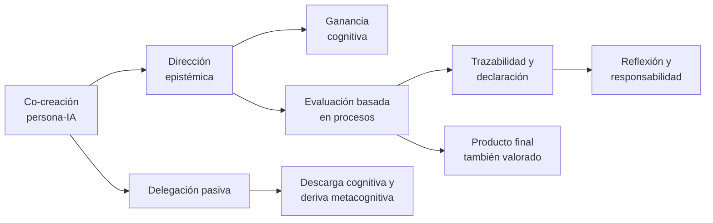

# Mapa de la constelación piloto

**Co-creación + dirección epistémica + evaluación basada en procesos**

**Ecosistema IA-docencia UDGPlus · UDGIA-004A**

**Estado:** aprobado; UDGIA-004B construido y en QA de revisión desde 2026-07-27

**Fecha de corte:** 2026-07-27

## 1. Propósito del piloto

La constelación prueba si Orientaciones, Hugo, Moodle y el futuro curso amplio pueden
compartir un núcleo semántico sin duplicar la misma pieza. El objetivo no es reescribir el
sitio ni producir todavía los seis H5P, sino fijar:

- qué conceptos son canónicos;
- qué artefacto cumple cada función;
- qué recorridos necesitan las tres audiencias;
- qué páginas se conservan, consolidan o conectan;
- qué objetos interactivos comprobarán el contrato;
- qué deudas bloquean la integración.

## 2. Lógica de la constelación

La ruta principal no presenta la documentación como fin en sí mismo. El portafolio sirve
para observar juicio, revisión y aprendizaje; no reemplaza la calidad disciplinar del
producto.

## 3. Distribución de responsabilidades

| Artefacto | Función en la constelación | No debe convertirse en |
|---|---|---|
| Orientaciones | Fuente de conceptos, principios, criterios institucionales y procedencia. | Tutorial paso a paso o catálogo exhaustivo de herramientas. |
| Hugo | Red pública de conceptos, guías, prácticas, casos y rutas por audiencia. | Copia abreviada de las Orientaciones o curso lineal obligatorio. |
| Moodle | Secuencia guiada, práctica, feedback, evaluación, finalización y seguimiento. | Repositorio de textos duplicados sin interacción. |
| `alfabetizacion_en_ia` | Esbozo derivado y semillero del curso amplio; laboratorio de traducción visual. | Curso terminado, fuente institucional o autoridad sobre el contenido. |
| Logseq | Registro de decisiones, cortes, estado externo y relaciones entre versiones. | Fuente pública o almacén de secretos. |

## 4. Inventario del núcleo existente

### 4.1 Orientaciones institucionales

| Sección | Aporte canónico | Función futura |
|---|---|---|
| §2.3 Principios rectores | Transparencia por defecto, evaluación del proceso, equidad, responsabilidad y soberanía. | Fundamento institucional de las rutas. |
| §3.2 Co-producción persona-IA | Co-creación, dirección epistémica, ganancia/descarga y riesgos de perder el control interpretativo. | Fuente canónica de conceptos. |
| §4 Uso pedagógico | Secuenciación, esfuerzo productivo, diseño inverso y aprendizaje activo. | Criterios para docentes. |
| §5 Evaluación basada en procesos | Proceso y producto, evaluación auténtica, instrumentos y trazabilidad. | Fuente canónica de evaluación. |
| §6.1 y §6.4 | Transparencia, declaración, responsabilidad y autoría. | Salvaguardas y declaración de uso. |
| §8.2–8.3 | Literacidades operativa, crítica y de co-creación; progresión detectar–sostener–diseñar. | Arquitectura del curso amplio. |
| §12 Glosario | Definiciones institucionales. | Resolución de conflictos terminológicos. |

**Estado:** existe un lote de trabajo previo sin consolidar. Se resguardó en una rama de
checkpoint separada antes de esta fase. UDGIA-004A no modifica su contenido.

### 4.2 Hugo `aprendizaje-ia`

#### Entradas principales

| Nodo actual | Papel | Diagnóstico |
|---|---|---|
| [Mapa de las tres literacidades](https://arqueon.github.io/aprendizaje-ia/formacion-docente/mapa-literacidades-ia/) | Puerta formativa a L1/L2/L3. | Buen nodo panorámico; la equivalencia rígida con Bloom debe matizarse. |
| [Alfabetización en co-creación](https://arqueon.github.io/aprendizaje-ia/formacion-docente/alfabetizacion-agenciamiento-ia/) | Progresión detectar–sostener–diseñar. | Candidato a nodo formativo canónico de L3. |
| [Principios para la co-creación](https://arqueon.github.io/aprendizaje-ia/formacion-docente/alfabetizacion-co-creacion/) | Cinco competencias visuales. | Se solapa con el nodo anterior; debe conservarse como infografía/aplicación, no como segunda definición canónica. |
| [Agenciamiento persona-IA](https://arqueon.github.io/aprendizaje-ia/ia-educacion/guias/agenciamiento-humano-ia/) | Marco conceptual y consecuencias docentes. | Mantener URL; presentar «co-creación» como término público y «agenciamiento» como fundamento. |
| [Evaluación formativa con IA](https://arqueon.github.io/aprendizaje-ia/ia-educacion/guias/evaluacion-formativa-ia/) | Instrumentos y arquitectura de ciclos. | Debe distinguir evaluación formativa con IA de evaluación basada en procesos. |
| [Portafolios iterativos](https://arqueon.github.io/aprendizaje-ia/laboratorio/practicas/evaluacion-formativa-asistida-ia/) | Práctica documentada/prototipo de proceso. | Verificar qué afirmaciones describen aplicación real y cuáles son escenario. |
| [Ensayo como proceso](https://arqueon.github.io/aprendizaje-ia/ia-educacion/productos-de-aprendizaje/ensayo/) | Caso completo con rutas de estudiante y docente. | Mejor precedente operativo; reutilizar estructura sin convertirla en plantilla universal. |
| [Ganancia cognitiva](https://arqueon.github.io/aprendizaje-ia/recursos/glosario/ganancia-cognitiva/) | Definición breve y conexiones. | Corregir enlaces heredados `/glosario/…` al aplicar el piloto. |

#### Duplicidades que el piloto debe resolver

1. «Alfabetización en co-creación» y «Principios para la co-creación» compiten como
   puerta principal.
2. «Agenciamiento persona-IA» usa como título público un término más especializado que
   las Orientaciones ya reservaron para el fundamento.
3. «Evaluación formativa con IA» y «evaluación basada en procesos» se acercan, pero no son
   equivalentes: la primera describe una función pedagógica; la segunda, qué evidencias
   se valoran.
4. Parte del glosario conserva enlaces de la ubicación anterior.
5. Las etiquetas siguen siendo demasiado numerosas para actuar como vocabulario
   controlado; los identificadores del contrato no deben convertirse automáticamente en
   nuevas etiquetas.

### 4.3 Semillero `alfabetizacion_en_ia`

El prototipo actual es una infografía web/PDF sobre cinco criterios de alfabetización
crítica:

1. evaluación crítica y discernimiento;
2. conciencia sociotécnica y ética;
3. agencia y hábitos mentales;
4. uso selectivo y no utilización;
5. adaptación contextual.

**Aporte:** ofrece un primer esbozo de la capa D y activos visuales iniciales.

**Brecha:** no expresa todavía las tres literacidades, las rutas por audiencia, una
secuencia didáctica, resultados de aprendizaje, actividades, evaluación ni finalización.
Por eso se mantiene como semillero hasta convertirlo en blueprint Markdown.

**Jerarquía aprobada:** el semillero no manda sobre el contenido del ecosistema. Debe
seguir las definiciones y principios que se consoliden en las Orientaciones, la
arquitectura pública y los nodos canónicos de Hugo, y los elementos didácticos relevantes
que ya hayan sido verificados en el Moodle de referencia. Moodle aporta precedentes
importantes, pero todavía incompletos; tampoco se copia como si fuera el curso amplio.

### 4.4 Moodle de referencia

El registro vivo más reciente describe cinco secciones, 34 módulos, 12 páginas, 15 H5P,
tres cuestionarios, glosario, base de datos final y foro. Para esta constelación interesan:

| Elemento | Aporte al piloto | Estado de uso |
|---|---|---|
| M3 · co-creación y aprendizaje activo | Ciclo de co-creación, catálogo y decisiones de diseño. | Referencia didáctica de solo lectura. |
| M4 · evaluación por procesos | Evidencias, proyecto final y cierre. | Referencia didáctica de solo lectura. |
| Lecturas iniciales `cmid 11` y `cmid 13` | Explicación visual de co-creación y evaluación del proceso. | Reutilizar estructura, no copiar especialización docente. |
| Glosario `cmid 27` | 21 términos enlazados. | Comparar con vocabulario v0.1. |
| Bibliografía `cmid 28` | Fuentes curadas de las Orientaciones. | Fuente auxiliar; verificar recuperación. |
| Proyecto final `cmid 30` | Objetivo, diseño híbrido, uso de IA, evidencias y retroalimentación. | Precedente para el portafolio de proceso. |
| Ensayo `cmid 36` | Siete etapas y separación estudiante/docente. | Caso ya sincronizado con Hugo. |
| H5P de M3/M4 | Course Presentation, Dialog Cards, Image Hotspots, Summary, decisiones y documentación. | Inventario de patrones; no copiar paquetes sin procedencia/hash. |
| `H5P.BloomObjectiveBuilder` `cmid 60` | Biblioteca propia reutilizable. | Requiere licencia, idiomas, imagen interior y fuente canónica. |

Dos hallazgos siguen fuera de alcance operativo:

- `cmid 71` parece ajeno al curso y no debe ocultarse, moverse ni eliminarse sin respaldo y
  autorización;
- el corte vivo de 15 H5P difiere del corte histórico de 16 y debe auditarse sin reescribir
  la historia.

## 5. Nodos canónicos del piloto

| ID | Formulación canónica | Nodo público principal | Aplicación |
|---|---|---|---|
| `concept.cocreacion-persona-ia` | Orientaciones §3.2 | Guía de co-creación/agenciamiento | Dialog Cards y Course Presentation |
| `pattern.direccion-epistemica` | Orientaciones §3.2 y glosario | Integrada en guía y literacidad L3 | Image Hotspots y decisiones con feedback |
| `literacy.cocreacion` | Orientaciones §8.2–8.3 | Alfabetización en co-creación | Progresión detectar–sostener–diseñar |
| `outcome.ganancia-cognitiva` | Orientaciones §3.2 y §9.1 | Glosario de ganancia cognitiva | Contraste entre decisiones/versiones |
| `assessment.basada-en-procesos` | Orientaciones §5 | Guía de evaluación y caso del ensayo | Evidencias, rúbrica y reflexión |
| `evidence.trazabilidad` | Orientaciones §5.4 | Guía/práctica de portafolios | Mapa de evidencias y Documentation Tool |
| `practice.declaracion-uso-ia` | Orientaciones §6.1 | Plantilla del ensayo | Cierre y declaración |
| `practice.portafolio-proceso` | Orientaciones §5 + casos Hugo/Moodle | Ensayo y portafolios iterativos | Proyecto final y fallback accesible |

## 6. Rutas por audiencia

### 6.1 Estudio

1. Comprendo qué es co-crear y qué no es delegar.
2. Reconozco cuándo conservo o pierdo la dirección epistémica.
3. Practico con una decisión acotada y recibo feedback explicativo.
4. Documento fuentes, versiones y decisiones relevantes.
5. Entrego producto, portafolio mínimo, declaración y reflexión.

**Salida observable:** puede explicar y defender qué decidió, verificó, transformó o
rechazó.

### 6.2 Enseño/diseño

1. Defino el resultado de aprendizaje y el esfuerzo que debe permanecer humano.
2. Decido si la IA amenaza, no afecta o habilita ese resultado.
3. Diseño una secuencia antes–durante–después con puntos de control.
4. Especifico evidencias mínimas y alternativa sin IA.
5. Evalúo proceso y producto con criterios separados.
6. Reviso privacidad, equidad, procedencia y carga documental.

**Salida observable:** publica una actividad en la que la función de la IA, el rastro
esperado y los criterios de evaluación son explícitos.

### 6.3 Coordino/gobierno

1. Parto de los principios rectores y del vocabulario común.
2. Distingo qué corresponde a institución, programa y asignatura.
3. Garantizo formación, apoyos, privacidad, equidad y alternativa.
4. Recojo evidencia de implementación sin convertir anécdotas en política.
5. Reviso criterios, recursos y responsabilidades en un ciclo definido.

**Salida observable:** puede aprobar, condicionar o detener un piloto mediante criterios
trazables.

## 7. Enlaces tipados de la constelación

| Origen | Relación | Destino |
|---|---|---|
| literacidad de co-creación | `requiere` | literacidades operativa y crítica |
| co-creación persona-IA | `requiere` | dirección epistémica |
| dirección epistémica | `fundamenta` | evaluación basada en procesos |
| ganancia cognitiva | `contrasta` | descarga cognitiva |
| evaluación basada en procesos | `aplica` | trazabilidad y portafolio |
| ensayo como proceso | `ejemplifica` | portafolio y declaración |
| práctica de portafolios iterativos | `ejemplifica` | evaluación basada en procesos |
| Orientaciones §5 | `fundamenta` | guía pública de evaluación |
| guía pública | `continua` | práctica Moodle con feedback |
| evidencia de implementación | `fundamenta` | revisión periódica, solo tras verificación |

## 8. Seis pruebas H5P producidas en UDGIA-004B

UDGIA-004A definió su propósito. UDGIA-004B produjo los seis paquetes en la rama de
revisión; todavía no se han integrado ni publicado en `main`.

| ID propuesto | Tipo | Decisión o práctica | Fallback equivalente |
|---|---|---|---|
| `cocreacion-versiones-slider` | Image Slider | Comparar dos versiones e identificar qué cambió por juicio humano. | Dos imágenes con tabla de diferencias y preguntas. |
| `direccion-epistemica-hotspots` | Image Hotspots | Explorar un mapa de decisiones, evidencias y riesgos. | Lista estructurada por regiones del mapa. |
| `cocreacion-conceptos-cards` | Dialog Cards | Distinguir concepto, ejemplo y contraejemplo. | Tarjetas HTML desplegables. |
| `evaluacion-proceso-decision` | Single Choice Set o Multimedia Choice | Elegir evidencia pertinente y recibir feedback explicativo. | Preguntas con respuestas razonadas visibles. |
| `cocreacion-evaluacion-recorrido` | Course Presentation | Recorrer el ciclo completo y practicar en puntos de control. | Guía lineal con las mismas consignas y soluciones. |
| `objetivos-bloom-udgplus` | BloomObjectiveBuilder revisado | Formular un objetivo y decidir qué asistencia de IA es pertinente. | Formulario/plantilla HTML descargable. |

Cada objeto requerirá imagen interior, texto jerarquizado, alternativa, procedencia,
licencia, hash, adaptador visual, presupuesto de peso y matriz propia de QA.

## 9. Page bundles y ownership para la producción

La siguiente subfase debe asignar un solo escritor por bundle:

| Bundle o dominio | Intervención prevista |
|---|---|
| Nueva portada de constelación | Crear una entrada por audiencia e intención, con mapa y lista accesible. |
| Mapa de literacidades | Corregir la equivalencia rígida con Bloom y enlazar el contrato. |
| Alfabetización en co-creación | Convertir en nodo formativo canónico de L3. |
| Principios para la co-creación | Reubicar como pieza visual/aplicación del nodo canónico. |
| Guía de agenciamiento | Conservar URL y explicar «agenciamiento» como fundamento de co-creación. |
| Guía de evaluación | Separar evaluación formativa, basada en procesos y auténtica. |
| Caso del ensayo | Usar como precedente, sin reestructurarlo salvo enlaces/metadata. |
| Runtime y catálogo H5P | Un único propietario técnico durante todo el gate. |

Ningún agente auxiliar debe editar el checkout principal, el grafo o Moodle.

## 10. Resguardos y brechas antes de producir

### Resuelto

- UDGIA-001 fijó la identidad C · Almagre interactivo.
- UDGIA-002 aplicó y publicó la identidad única.
- UDGIA-003 publicó el runtime H5P gobernado y la fixture técnica.
- El WIP actual de Orientaciones cuenta con un checkpoint local separado.

### Pendiente

- Añadir reglas estables equivalentes a los tres repositorios antes de distribuir escritura.
- Resolver las siete referencias faltantes de Orientaciones antes de otra publicación.
- Revisar el WIP de Orientaciones por commits temáticos; el checkpoint no equivale a
  aprobación editorial.
- Corregir enlaces heredados del glosario dentro del alcance de los bundles afectados.
- Auditar `cmid 71` y la diferencia 15/16 H5P antes de cualquier limpieza Moodle.
- Mantener Moodle en solo lectura hasta que una tarea posterior incluya autorización,
  respaldo, aplicación, QA y rollback.

## 11. Puerta de salida de UDGIA-004A

UDGIA-004A queda lista para revisión cuando:

1. el contrato y el vocabulario no contradicen las Orientaciones vigentes;
2. cada artefacto tiene una responsabilidad distinta;
3. existen rutas coherentes para estudiante, docente y coordinación;
4. las duplicidades públicas están identificadas sin redirecciones prematuras;
5. los seis H5P tienen propósito y fallback, pero aún no se han producido;
6. el WIP del documento rector permanece intacto y recuperable;
7. Moodle no ha cambiado.

El VoBo se recibió el 2026-07-27 con una aclaración: `alfabetizacion_en_ia` es apenas un
esbozo derivado. La subfase activa es **UDGIA-004B · portada de la constelación, metadatos
piloto y primer conjunto pedagógico H5P**. El repositorio canónico de fuentes y paquetes
H5P quedó fijado en `aprendizaje-ia`; la entrega se describe en
`UDGIA-004B-entrega-constelacion-piloto.md` y requiere revisión antes de integrar.
