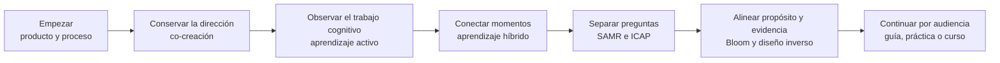

# UDGIA-021 — arquitectura de la columna conceptual piloto

**Estado:** propuesta para auditoría de alineación  
**Base:** inventario UDGIA-021, contrato editorial UDGIA-004A, Orientaciones `1cb38d9`
y Pasaporte del curso amplio `6059398`  
**Alcance:** seis familias del lote L1; no modifica páginas públicas.

## 1. Decisión arquitectónica

La columna no será un segundo curso lineal dentro de Hugo. Será un recorrido público que
permite entrar desde una necesidad, comprender una relación, observar un caso y continuar a
una guía, práctica o tarea del curso.

Cada familia tendrá **una sola página canónica**. Las demás piezas se conservarán únicamente
si cumplen otra función verificable: aplicación, guía, práctica, caso, definición breve o
profundización. Una URL existente no se elimina ni redirige durante el piloto; primero se
prepara la muestra, se comprueba su función y se solicita VoBo de integración.

La pregunta que sostiene el recorrido es:

> ¿Qué necesita hacer una persona, además de usar una herramienta, para que la IA ayude a
> aprender y enseñar?

## 2. Secuencia y razón de continuidad

La secuencia no declara prerrequisitos rígidos. Cada página debe ser localmente comprensible
y ofrecer enlaces hacia atrás. La continuidad sirve para una primera visita, no para obligar
a leer todo el sitio en orden.

## 3. Matriz de páginas canónicas

| Familia | Página canónica y título público de trabajo | Función | Marco rector | Papel en el curso amplio |
|---|---|---|---|---|
| Entrada general | `ia-educacion/constelaciones/cocreacion-evaluacion/` — **Empezar con IA para aprender y enseñar** | Sitúa producto/proceso, responsabilidad y selector por audiencia | Orientaciones §§2, 3, 5 y 6 | Prepara evaluación crítica, co-creación y uso selectivo |
| Agenciamiento y co-creación | `formacion-docente/alfabetizacion-agenciamiento-ia/` — **Conservar la dirección del trabajo con IA** | Nodo formativo canónico de literacidad de co-creación | §§3.1–3.6, 4.1, 5 y 8.2–8.3 | Profundiza “Agenciamiento y co-creación persona-IA” y prepara proyecto documentado |
| Aprendizaje activo | `formacion-docente/aprendizaje-activo/` — **Qué hace activa una experiencia de aprendizaje** | Distingue acción visible de generación, contraste y revisión de ideas | §§2.2, 4.2–4.6 y 5.1–5.4 | Apoya la ruta docente de “Adaptabilidad disciplinar” |
| Aprendizaje híbrido | `formacion-docente/aprendizaje-hibrido/` — **Conectar momentos para que el aprendizaje avance** | Explica integración funcional, no reparto de medios | §§4.2–4.6 y 8.1–8.5 | Apoya el diseño situado de la ruta docente sin fijar modalidad del curso |
| SAMR e ICAP | `formacion-docente/modelos-samr-icap/` — **Dos preguntas distintas sobre una misma actividad** | Contrasta transformación de tarea y conducta cognitiva, sin equivalencias | §4 y §5; ICAP como lente didáctica, no principio institucional | Apoya “Adaptabilidad disciplinar” y el proyecto integrador |
| Bloom y diseño inverso | `formacion-docente/taxonomia-bloom-diseno-inverso/` — **Partir de lo que quieres observar** | Alinea propósito, evidencia, experiencia y asistencia; Bloom no es escalera universal | §§4.2–4.6 y 5.1–5.4 | Apoya la ruta docente y el proyecto integrador; reutiliza el constructor gobernado |

## 4. Disposición de páginas relacionadas

### 4.1 Entrada general

- **Canónica:** `ia-educacion/constelaciones/cocreacion-evaluacion/index.md`.
- **Conservar como apoyo panorámico:** `formacion-docente/mapa-literacidades-ia/index.md`,
  después de retirar correspondencias rígidas con Bloom y de situarlo después de una
  explicación, no como puerta obligatoria.
- **No crear otra portada de recorrido:** la entrada existente ya tiene la mejor estructura
  narrativa del lote y una imagen de referencia.

### 4.2 Agenciamiento y co-creación

- **Canónica:** `formacion-docente/alfabetizacion-agenciamiento-ia/index.md`.
- **Aplicación/visual:** `formacion-docente/alfabetizacion-co-creacion/index.md`; conservar
  solo aportes únicos y convertirla en aplicación de la página canónica, no segunda
  definición de la literacidad.
- **Fundamento docente:** `ia-educacion/guias/agenciamiento-humano-ia/index.md`; conservar la
  URL y presentar “agenciamiento” como fundamento conceptual de la co-creación, no como
  nombre público rival.
- **Glosario:** las entradas de co-creación, dirección epistémica, ganancia y descarga
  cognitiva resuelven consultas breves y regresan a la canónica.
- **Interacción posible:** auditar los H5P gobernados existentes; un comparador de versiones
  solo se conserva si la prosa previa y el fallback permiten la misma decisión.

### 4.3 Aprendizaje activo

- **Canónica:** `formacion-docente/aprendizaje-activo/index.md`.
- **Guía aplicada:** `ia-educacion/guias/aprendizaje-activo-con-ia/index.md`.
- **Banco de prácticas:** `laboratorio/practicas/aprendizaje-activo-ia/index.md` y técnicas
  específicas después de clasificarlas por conducta y evidencia real.
- **Glosario:** `recursos/glosario/aprendizaje-activo/index.md`; definición breve subordinada,
  sin portada individual obligatoria.
- **Corrección central:** sustituir “procesos superiores” y correspondencias automáticas por
  conductas observables. Una actividad no es activa por participación, gamificación o chat.
- **Interacción posible:** escenario que obliga a elegir una reformulación de consigna y
  justificar qué generará la persona; fallback HTML completo.

### 4.4 Aprendizaje híbrido

- **Canónica:** `formacion-docente/aprendizaje-hibrido/index.md`.
- **Cuarentena:** `ia-educacion/integracion-curricular/ia-aprendizaje-hibrido/index.md`; no se
  enlaza al curso en su estado actual. Sus afirmaciones sobre personalización, tutoría,
  analítica y detección se verifican antes de rescatar aportes únicos.
- **Práctica relacionada:** `laboratorio/practicas/aula-invertida/index.md`; aula invertida es
  un patrón posible, no sinónimo de aprendizaje híbrido. El bundle debe resolver sus dos
  candidatos `featured`.
- **Glosario:** `recursos/glosario/aprendizaje-hibrido/index.md`; definición breve subordinada.
- **Corrección central:** la calidad proviene de la continuidad funcional entre momentos y
  de condiciones de acceso equivalentes, no de marchar hacia más asincronía o autonomía.
- **Visual preferido:** secuencia antes–durante–después que muestre qué producto recibe y
  transforma cada momento; no una cuadrícula de videollamada.

### 4.5 SAMR e ICAP

- **Canónica:** `formacion-docente/modelos-samr-icap/index.md`.
- **Glosario:** `recursos/glosario/modelo-samr/index.md`; consulta breve y enlace de regreso.
- **Corrección central:** eliminar la correspondencia directa SAMR–Bloom y clasificar ICAP
  por recibir, manipular, generar o co-construir. Una conversación con IA puede apoyar una
  actividad constructiva, pero no demuestra interacción ICAP entre aprendices.
- **Decisión de permanencia:** la página conjunta se conserva solo porque su valor debe ser
  el contraste entre dos preguntas. Si la muestra no logra explicarlo sin confusión, se
  dividirá la exposición, pero no se crearán dos URL nuevas antes del lector en frío.
- **Visual preferido:** un mismo caso en dos paneles: “qué cambió en la tarea” y “qué hizo la
  persona con las ideas”. No usar escaleras ni bloques equivalentes.

### 4.6 Bloom y diseño inverso

- **Canónica:** `formacion-docente/taxonomia-bloom-diseno-inverso/index.md`.
- **Glosario en cuarentena:** `recursos/glosario/taxonomia-de-bloom/index.md`; no se enlaza
  hasta retirar la secuencia rígida, la obligación de “subir a la cúspide” y la atribución de
  los niveles inferiores a la IA.
- **Interacción existente:** `H5P.BloomObjectiveBuilder` puede apoyar una formulación solo si
  el caso previo ya explica propósito, evidencia y criterio, y si el fallback ofrece el mismo
  resultado sin H5P.
- **Corrección central:** clasificar la demanda contra la tarea y su evidencia, no por el
  verbo; la pirámide es un mapa inicial, no una ruta universal ni una equivalencia con SAMR.
- **Visual preferido:** cadena propósito → evidencia → experiencia → asistencia, acompañada
  por un caso de desalineación; evitar pirámides luminosas.

### 4.7 Tres piezas transversales que completan L1

Las seis familias organizan el recorrido, pero no absorben mecánicamente las otras tres
piezas del lote. Cada una conserva una función distinta:

- `formacion-docente/pensamiento-critico-ia-generativa/index.md` será **puente de
  indagación** entre la entrada y la literacidad crítica. No será una séptima definición de
  alfabetización ni una lista general de riesgos; debe enseñar una práctica de contraste y
  conducir a una decisión o guía.
- `ia-educacion/etica-y-transparencia/alfabetizacion-critica-ia/index.md` será
  **profundización conceptual** de la literacidad crítica, vinculada con Orientaciones §6 y
  la muestra “Cuando el contexto cambia la decisión”. No sustituirá la entrada general ni la
  literacidad de co-creación.
- `formacion-docente/taller-diseno-actividades-ia-backward/index.md` será **aplicación
  docente** de Bloom y diseño inverso. Su resultado es revisar una actividad completa y
  decidir la asistencia pertinente; no repetir la exposición conceptual de la canónica.

Con estas asignaciones, las 15 piezas de L1 quedan clasificadas como canónica, apoyo,
aplicación, profundización, glosario o cuarentena. Ninguna queda sin función y ninguna
obliga a crear una URL nueva.

## 5. Contrato de enlaces de cada página canónica

Cada muestra deberá preparar —sin integrar todavía— un bloque público con estas seis
preguntas:

1. **¿Qué situación ayuda a mirar?** Entrada narrativa.
2. **¿Qué criterio institucional desarrolla?** Sección precisa de Orientaciones, con enlace
   a la fuente vigente cuando exista una ruta pública autorizada.
3. **¿A quién ayuda y para qué?** Audiencia e intención en lenguaje público.
4. **¿Qué guía permite actuar?** Una guía docente o estudiantil pertinente, no una lista.
5. **¿Qué papel cumple en el curso?** Prepara, acompaña o profundiza una tarea nombrada por
   su título público; nunca copiar códigos internos.
6. **¿Cómo continuar?** Un enlace principal tipado y una alternativa solo cuando responda a
   otra necesidad clara.

Relaciones permitidas: `fundamenta`, `amplia`, `aplica`, `ejemplifica`, `contrasta`,
`requiere` y `continua`. “Relacionado” no llega a la muestra pública.

## 6. Evidencias del piloto

| Resultado del Pasaporte | Evidencia | Dónde debe producirse |
|---|---|---|
| Distingue las familias y sus límites | Explicación en palabras propias del caso recurrente, con ejemplo y límite | Lector en frío de la columna y muestra SAMR/ICAP |
| Decide sobre IA con criterio | Decisión justificada: propósito, ayuda, trabajo no delegable, evidencia y alternativa | Muestra de entrada/co-creación y escenario accesible |
| Sabe continuar | Recorrido desde una pregunta real hasta una guía/práctica y explicación del enlace | Entrada general y cierres de las seis muestras |

## 7. Límites del piloto

- No se fijan modalidad, calendario ni carga del curso amplio.
- No se promete discusión o colaboración en un sitio asincrónico.
- No se crea H5P ni imagen por cuota.
- No se elimina, redirige ni modifica una URL pública en esta fase.
- No se reescribe contenido hasta que A1–A5 hayan sido auditadas y cerradas.
- Las muestras quedan fuera de `content/`, pasan dos rondas y lector en frío, y requieren
  otro VoBo antes de integrarse.
- `push`, publicación, Moodle y despliegue no forman parte de la autorización recibida.
