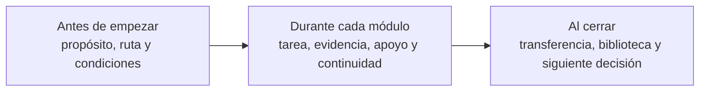

# UDGIA-021 — arquitectura del kit de orientación del curso

**Estado:** arquitectura interna autorizada; no fija población, modalidad, calendario ni carga.  
**Destino futuro:** curso amplio `alfabetizacion_en_ia`; no se integra desde este repositorio.  
**Principio:** orientar no es añadir una página de bienvenida, sino hacer visible qué hará la
persona, cómo se relacionan los recursos y cómo reconocerá que puede continuar.

## 1. Qué problema resuelve

El curso reúne Orientaciones, guías, páginas Hugo, tareas y evidencias. Sin una mediación
explícita, una persona puede confundir:

- una página de Hugo con una actividad obligatoria;
- una recomendación institucional con una instrucción evaluada;
- una interacción H5P con evidencia de aprendizaje;
- un recurso de profundización con un prerrequisito;
- la ruta de estudiantado con la de profesorado;
- el uso opcional de IA con un requisito para participar.

El kit resuelve esas confusiones antes de la primera tarea y repite señales breves en cada
módulo.

## 2. Arquitectura en tres momentos

### Antes de empezar

1. **Bienvenida y promesa pública.** Qué podrá decidir/producir la persona y qué no promete
   el curso. Evitar comenzar con temario, códigos o política extensa.
2. **Cómo se relaciona el ecosistema.** Orientaciones dan criterios; guías ayudan a actuar;
   Hugo permite comprender y profundizar; el curso organiza tareas y evidencias.
3. **Selector de ruta.** Núcleo común, estudiantado y profesorado. La elección es una entrada,
   no una etiqueta permanente; cada ruta muestra qué comparte y dónde puede cruzarse.
4. **Condiciones de participación.** Modalidad, calendario, carga y acompañamiento aparecen
   únicamente cuando estén verificados con la primera población.
5. **Uso de IA y ruta sin IA.** Qué apoyos son opcionales, qué trabajo no se delega, qué datos
   no compartir y qué alternativa produce la misma evidencia.
6. **Accesibilidad y ayuda.** Formatos equivalentes, navegación por teclado, materiales
   descargables y canal responsable por definir.
7. **Cómo documentar el proceso.** Conservar solo decisiones, cambios, fuentes y razones
   pertinentes; no transcriptos completos ni vigilancia.

### Durante cada módulo

Cada módulo abre con una ficha pública, sin códigos internos:

| Señal | Pregunta que responde |
|---|---|
| **Venimos de…** | ¿Qué ya quedó establecido? |
| **Ahora resolverás…** | ¿Qué tensión concreta se trabaja? |
| **Al terminar podrás…** | ¿Qué decisión o producto observable se espera? |
| **Necesitarás…** | ¿Qué prerrequisito existe y dónde está el puente? |
| **Tiempo y ritmo** | ¿Cuánto tarda y qué dato sigue no verificado? |
| **Tu evidencia** | ¿Qué producirás y con qué criterio reconocerás avance? |
| **IA opcional** | ¿En qué ayuda, qué no decide y cuál es la alternativa? |
| **Recursos del sitio** | ¿Qué página prepara, acompaña o profundiza la tarea? |
| **Cómo continuar** | ¿Qué quedó abierto y por qué sigue lo que sigue? |

Los recursos Hugo se abren en contexto mediante una frase de función: “Lee esta página para
comparar…”, “Consulta este ejemplo si necesitas…”, “Profundiza después de producir…”. Nunca se
presentan como una lista de enlaces “complementarios”.

### Al cerrar

1. **Recuperación del arco.** Qué podía hacer la persona al inicio y qué decisión puede tomar
   ahora.
2. **Transferencia.** Un caso con superficie distinta y menos apoyo.
3. **Selección de evidencias.** Producto, cambio significativo, fuente/verificación y razón;
   el mínimo pertinente, no un expediente exhaustivo.
4. **Declaración de uso de IA.** Clara, proporcional y ligada al trabajo; no confesional.
5. **Vuelta a Hugo.** Tres salidas como máximo: aplicar, profundizar o consultar.
6. **Siguiente decisión.** Continuar, practicar otra variante o detenerse y pedir apoyo.

## 3. Componentes del kit

### 3.1 Mapa del ecosistema

Un diagrama breve y su lista equivalente:

- **Orientaciones:** por qué y bajo qué criterios se decide.
- **Guías:** cómo actuar como estudiante o docente.
- **IA y Aprendizaje:** dónde comprender, comparar y profundizar.
- **Curso:** dónde realizar tareas, producir evidencia y recibir acompañamiento.

El mapa no muestra repositorios, identificadores, commits ni estados de producción.

### 3.2 Selector por necesidad

Entradas iniciales:

- **Quiero comprender antes de usar IA.** Entrada común y evaluación crítica.
- **Quiero decidir si conviene usarla.** Uso selectivo, contexto, privacidad y alternativa.
- **Quiero mejorar cómo aprendo.** Ruta de estudiantado con ejemplos y documentación mínima.
- **Quiero diseñar una actividad.** Ruta docente con propósito, evidencia, secuencia y apoyo.
- **Quiero profundizar un concepto.** Columna Hugo y glosario contextual.

El selector es HTML accesible; no guarda la elección ni bloquea otras rutas.

### 3.3 Tarjeta de tarea

Plantilla pública:

> **Situación.** [Qué ocurre y por qué merece atención.]  
> **Tu propósito.** [Qué podrás decidir o producir.]  
> **Primero.** [Activación o intento propio.]  
> **Después.** [Contraste, práctica o revisión.]  
> **Entrega o conserva.** [Evidencia mínima.]  
> **Sabrás que avanzaste si…** [Criterio observable.]  
> **Si usas IA…** [Ayuda concreta, datos a cuidar y trabajo no delegable.]  
> **Si no la usas…** [Ruta equivalente.]  
> **Si necesitas apoyo…** [Puente.]  
> **Continúa con…** [Razón del siguiente paso.]

### 3.4 Señales de ruta

Cuatro etiquetas públicas estables, siempre acompañadas de una frase:

- **Para comprender:** explicación y ejemplo antes de actuar.
- **Para decidir:** escenario y criterios con consecuencias.
- **Para practicar:** tarea completa con apoyo.
- **Para profundizar:** límite, controversia o fuente; nunca requisito oculto.

### 3.5 Glosario contextual

Cada término aparece explicado dentro de la tarea. El enlace al glosario abre una definición
breve, ejemplo, contraste y regreso a la página canónica. No se pide estudiar el glosario en
orden ni completar tarjetas antes de comprender el fenómeno.

## 4. Diferencias por audiencia

| Núcleo común | Estudiantado | Profesorado |
|---|---|---|
| Propósito, criterios, verificación, privacidad, uso selectivo y documentación mínima | Primer intento, comparación de versiones, decisión propia, fuentes y reflexión | Resultado, evidencia, secuencia, alternativa, feedback y criterio de evaluación |

Las rutas comparten un caso y el mismo criterio rector. No se duplican explicaciones comunes;
cada bifurcación cambia la tarea y la evidencia, no solo los pronombres.

## 5. Accesibilidad y privacidad

- La ruta completa funciona sin interacción, audio, color, cuenta o IA.
- Los componentes admiten teclado, foco visible y lectura móvil.
- Video o audio requieren transcripción y alternativa equivalente.
- No se solicita copiar conversaciones, prompts, datos personales ni trabajos sensibles en
  herramientas externas.
- Los formularios de trabajo se descargan o procesan localmente por defecto.
- El aviso, responsable, resguardo y conservación del instrumento de población siguen
  pendientes; el kit no inventa esos datos.

## 6. Qué no se puede cerrar todavía

- duración y carga por semana;
- modalidad acompañada, autogestiva o combinada;
- frecuencia y tipo de interacción humana;
- calendario y momentos síncronos;
- canal responsable de apoyo y aviso de privacidad;
- tecnologías de asistencia y dispositivos reales de la primera población.

Estos elementos permanecen marcados como **no verificados** hasta cerrar A8/C7 en el
Pasaporte del curso amplio. La arquitectura puede prepararse; el texto público no debe
presentar supuestos como condiciones reales.

## 7. Prueba de aceptación futura

Una persona que solo reciba el kit debe poder explicar:

1. qué relación existe entre Orientaciones, guías, sitio y curso;
2. qué ruta le conviene y por qué puede cambiarla;
3. qué hará primero en una tarea;
4. qué evidencia conservará y cómo sabrá que avanzó;
5. qué cambia si usa o no usa IA;
6. dónde pedir apoyo y cómo continuar.

La prueba se ejecutará con perfiles reales o simulados una vez que el curso tenga población,
modalidad y prototipo. Este documento no autoriza su integración en Moodle.
