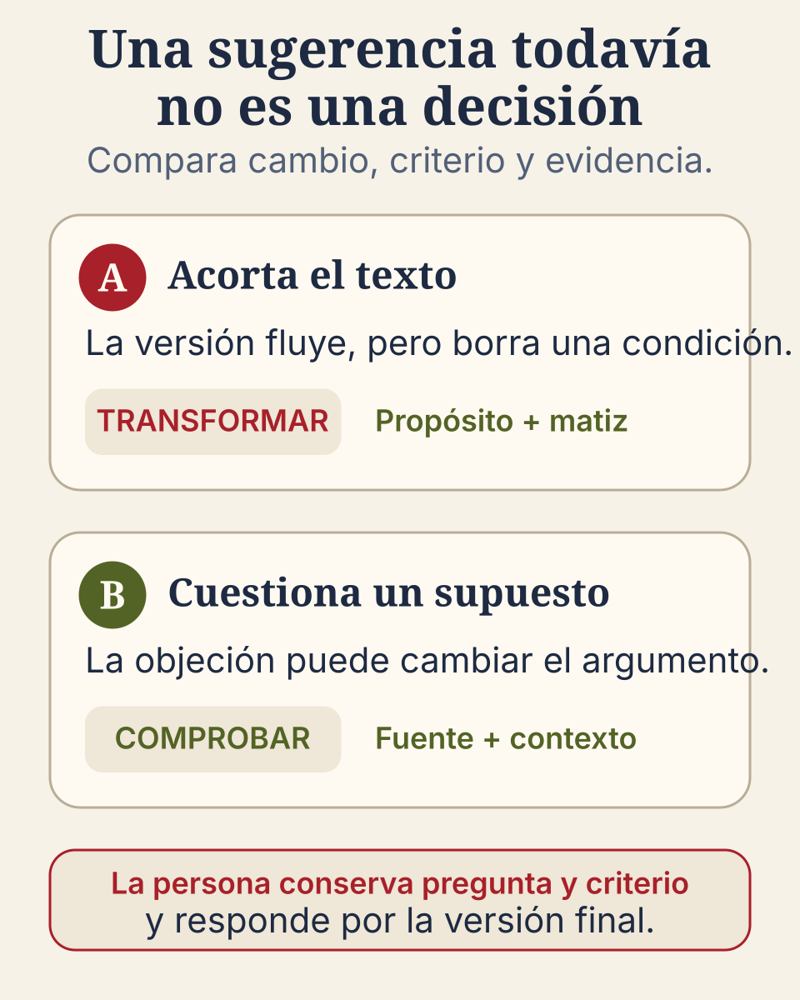

Renata prepara una explicación sobre un problema de su asignatura. Ya escribió un primer
borrador y puede señalar la idea central. Al revisarlo con un sistema de IA generativa recibe dos
sugerencias plausibles. La primera vuelve el texto más fluido, pero elimina la condición que
hace válido el argumento. La segunda pregunta si una afirmación cambia cuando se considera
otro contexto. Esa objeción revela un supuesto que Renata no había comprobado.

Las dos respuestas parecen útiles. Ninguna decide por sí sola qué debe cambiar. Renata
necesita volver al propósito, revisar la evidencia y explicar por qué acepta, transforma o
descarta cada aporte. Ese trabajo permite hablar de co-creación sin convertir la colaboración
con una herramienta en obediencia.

## Una sugerencia todavía no es una decisión

Un sistema puede proponer una formulación, una pregunta, una objeción o una manera distinta de
organizar el material. La contribución puede influir de verdad en el recorrido. Sin embargo,
la persona conserva cuatro movimientos que no conviene esconder:

1. formula la pregunta o reconoce qué problema intenta resolver;
2. compara la propuesta con el propósito y con fuentes pertinentes;
3. decide qué conserva, transforma o descarta;
4. responde por la versión que presenta y puede explicar su decisión.

Renata no acepta la primera sugerencia porque “suena mejor”. Compara la versión con la
consigna y observa que el matiz eliminado era necesario. Conserva una frase más breve, pero
restituye la condición con sus propias palabras. En la segunda sugerencia no copia la
objeción: consulta la fuente que ya estaba usando, encuentra que el contexto sí cambia la
interpretación y reescribe su explicación.

La figura no muestra una ruta correcta por color ni una calificación. Muestra que un mismo
aporte puede recibir tratamientos distintos. La pregunta útil no es “¿la IA ayudó?”, sino
“¿qué cambió, con qué criterio y qué evidencia sostiene la versión final?”.

## Co-crear no significa repartir la responsabilidad

La expresión **co-creación persona–IA** nombra un ciclo en el que una respuesta del sistema
entra al trabajo intelectual y la persona la interroga, contrasta y transforma. No significa
que ambos participantes comprendan o respondan de la misma manera. La herramienta influye;
la persona mantiene la responsabilidad por lo que entrega.

El término **agenciamiento persona–IA** amplía la mirada. Además de la persona y el sistema,
incluye la actividad, las fuentes, los criterios, el tiempo disponible, las reglas del curso
y las condiciones de acceso. Todos esos elementos pueden orientar lo que sucede, pero no
tienen la misma capacidad de comprender, decidir o responder por una consecuencia.

En el caso de Renata, el resultado no depende solo de “una buena conversación”. También
depende del primer borrador, la consigna que exige conservar el matiz, la fuente que permite
comprobar el supuesto y la decisión de no confundir fluidez con exactitud. Nombrar esa
configuración ayuda a mirar el proceso completo sin presentar al sistema como autor moral ni
a la estudiante como simple operadora.

## El rastro útil es pequeño y significativo

Documentar co-creación no exige entregar una transcripción completa. Un registro breve puede
mostrar mejor el aprendizaje:

| Cambio considerado | Qué aportó el sistema | Qué hizo la persona | Evidencia conservada |
|---|---|---|---|
| Acortar la explicación | Una versión más fluida | Recuperó el matiz que se había perdido | Versión anterior, versión final y razón |
| Revisar un supuesto | Una objeción contextual | Consultó una fuente y cambió el argumento | Fuente, decisión y fragmento revisado |

Este registro permite observar juicio y revisión. Guardar cada clic, en cambio, puede añadir
ruido, exponer información innecesaria y desplazar la atención hacia el uso de la herramienta.
Conviene conservar solo aquello que permite reconstruir una decisión relevante.

## La alternativa sin IA conserva el mismo aprendizaje

La actividad también puede ofrecer dos cambios preparados por el profesorado o intercambiar
borradores entre pares. La ruta cambia, pero la evidencia se mantiene: una comparación, una
comprobación, una versión revisada y una razón. Al comparar las rutas, conviene comprobar que
la alternativa exige el mismo pensamiento y no se convierte en sanción para quien no puede o
no desea usar IA.

Puede ser razonable no usar la herramienta cuando el material contiene datos sensibles,
cuando no ofrece condiciones de uso aceptables o cuando la ayuda realizaría justamente el
trabajo que se intenta aprender. La decisión de no usarla también expresa agencia si responde
al propósito y a las condiciones reales.

## Cuatro preguntas para conservar la dirección

Antes de aceptar una sugerencia, prueba estas preguntas:

1. ¿Qué problema intentaba resolver antes de pedir ayuda?
2. ¿Qué cambió exactamente en la propuesta?
3. ¿Qué fuente, criterio o ejemplo permite comprobarla?
4. ¿Qué conservaré, transformaré o descartaré, y por qué?

[La propuesta de Orientaciones]() es el documento de referencia del que proviene este criterio;
todavía no es una norma institucional vigente. En esta página se vuelve una secuencia de
acciones: distinguir qué aportó la herramienta, comprobar cómo influyó y conservar la
responsabilidad por la decisión. [La guía para el profesorado]() lo traduce en una comparación de
versiones que documenta un cambio significativo sin delegar la explicación final.

En pocas palabras: una herramienta puede introducir una posibilidad que cambie el recorrido.
Hay co-creación educativa cuando la persona la comprueba, la transforma y puede responder por
la decisión; no cuando el acabado oculta el trabajo que dejó de realizar.

## Cómo continuar

La co-creación permite observar quién conserva la dirección. El siguiente paso es mirar qué
trabajo realiza la persona con las ideas. Continúa con [Qué hace activa una experiencia de
aprendizaje]().
