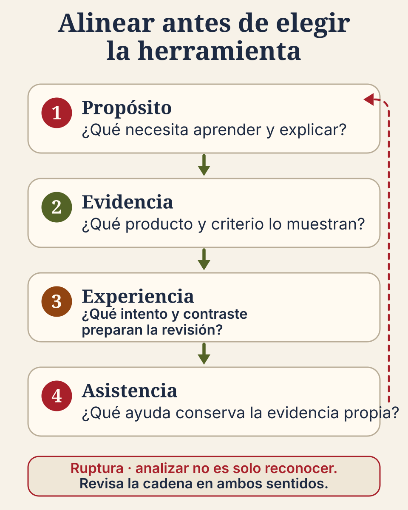

# Partir de lo que quieres observar

Una planeación propone como resultado “analizar los supuestos de dos soluciones”. La
actividad explica ambos procedimientos y la evaluación pregunta cuál opción es correcta. El
verbo **analizar** aparece en el resultado, pero la evidencia solo exige reconocer una
respuesta. El desajuste no se corrige añadiendo una herramienta ni cambiando el verbo: hay que
revisar qué aprendizaje se busca y qué producto permitiría observarlo.

El diseño inverso propone comenzar por el final educativo. Primero se aclara qué necesita
aprender la persona; después, qué evidencia mostraría ese aprendizaje; solo entonces se diseña
la experiencia y se eligen apoyos, incluida la IA cuando resulte pertinente.

## El verbo orienta, pero no clasifica la tarea

La taxonomía revisada de Bloom ofrece un vocabulario para distinguir procesos como recordar,
comprender, aplicar, analizar, evaluar y crear. Es útil para precisar una intención, pero no
obliga a subir una pirámide ni permite juzgar una actividad por una palabra aislada.

“Analiza las soluciones” puede pedir una comparación profunda o una lista superficial.
“Explica” puede limitarse a repetir o exigir relacionar evidencia y conclusión. “Crea” puede
producir un objeto nuevo sin comprensión. Para reconocer la demanda hay que leer juntos el
contenido, las condiciones, el producto y el criterio con que se juzgará.

## Reparar la cadena completa

Volvamos al ejemplo. Si se espera que la persona identifique el supuesto que cambia entre dos
soluciones, la evidencia puede pedir una comparación anotada y una conclusión justificada. La
experiencia necesita preparar ese producto: primer intento, contraste de casos y revisión con
una razón. Solo después se decide qué apoyo conviene.

La cadena no termina en una herramienta. Cada elemento debe sostener la misma operación:

- **Propósito:** identificar el supuesto y explicar cómo cambia la solución.
- **Evidencia:** comparación de dos soluciones y conclusión con razones.
- **Experiencia:** formular un intento, contrastarlo y revisarlo.
- **Asistencia:** fuente, guía, par o IA que ofrece una objeción sin producir la conclusión.

Si la evaluación vuelve a pedir solo reconocer una opción, la cadena se rompe aunque el
resultado tenga un verbo ambicioso y la actividad use tecnología avanzada.

## La IA se decide después del propósito y la evidencia

Un sistema de IA generativa puede proponer un caso contrario, formular una objeción o comentar una
parte delimitada del borrador. Esa ayuda es pertinente si llega en un momento que conserva el
primer intento y deja a la persona comparar, verificar y decidir.

No conviene pedir a la IA la comparación final si precisamente esa comparación es la evidencia
del aprendizaje. Tampoco es necesario usarla cuando los casos preparados y la revisión entre
pares ofrecen el mismo apoyo con menos riesgo, costo o desigualdad. La decisión incluye la
posibilidad de limitar, aplazar o no usar la herramienta.

La ruta sin IA conserva la misma evidencia. Puede ofrecer un contraejemplo preparado,
una fuente adicional o preguntas de revisión. Cambia el apoyo, no la operación cognitiva ni
lo que cuenta como evidencia suficiente.

## Un ejemplo de revisión completa

**Antes:** “Comprender las soluciones”; leer una explicación; elegir la respuesta correcta;
usar IA para resumir.

**Después:** “Comparar dos soluciones e identificar el supuesto que cambia bajo una condición
dada”; entregar comparación y conclusión justificada; formular un primer intento, contrastar
una objeción y revisar; usar IA de forma opcional para proponer la objeción después del intento.

La segunda versión no es buena solo porque es más específica. Es coherente porque propósito,
evidencia, experiencia y ayuda exigen y sostienen la misma comparación. Todavía necesita
ajustarse a la disciplina, el tiempo y las condiciones de acceso del grupo.

## Cuatro preguntas en el orden correcto

1. ¿Qué necesita poder explicar, aplicar, analizar, evaluar o crear la persona?
2. ¿Qué producto y qué criterio permitirán reconocerlo?
3. ¿Qué experiencias preparan esa evidencia con apoyo decreciente?
4. ¿Dónde puede ayudar la IA sin realizar la evidencia no delegable y qué alternativa existe?

La propuesta de Orientaciones es el documento de referencia que desarrolla este orden;
todavía no es una norma institucional vigente. Parte del aprendizaje esperado y de la
evidencia antes de elegir actividades y ayudas. La guía para el profesorado convierte ese
criterio en una revisión completa que puede adaptarse a una disciplina y justificar el papel
de la IA. Bloom aporta lenguaje para describir la demanda; el diseño inverso mantiene
conectados propósito, evidencia y experiencia.

En pocas palabras: no se diseña desde la herramienta ni desde un verbo aislado. Se comienza
por lo que se quiere aprender, se elige una evidencia que realmente lo muestre y se construye
una experiencia —con IA o sin ella— que permita producirla.

## Cómo continuar

Toma una actividad que ya utilices y escribe cuatro líneas: qué quieres observar, qué producto
lo mostraría, qué experiencia lo prepara y qué ayuda puede ofrecerse sin resolver la evidencia.
Si alguna línea exige un aprendizaje distinto, ajusta primero esa ruptura y luego decide la
herramienta. La guía para el profesorado amplía este procedimiento para adaptarlo a una
disciplina.

Si necesitas volver a precisar transformación y conducta, regresa a [Dos preguntas distintas
sobre una misma actividad](/formacion-docente/modelos-samr-icap/).
